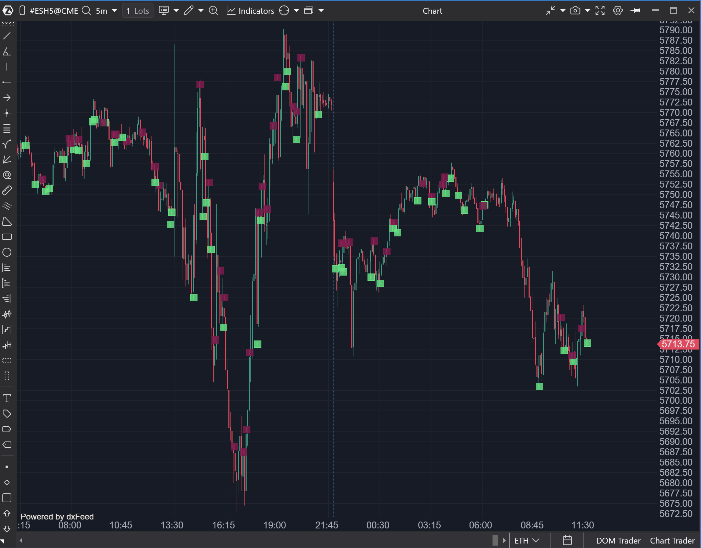

## 🟦 Exhaustion (8/10)

**Nombre del archivo:** [`Exhaustion.cs`](https://github.com/AlbertoAmadorBelchistim/Indicators/blob/Develop/Technical/Exhaustion.cs)  
**Nombre del indicador:** Exhaustion  
**Web oficial:** [ATAS — Exhaustion](https://help.atas.net/support/solutions/articles/72000641184-exhaustion)  
**Compatibilidad:** ATAS versión estable y superiores.  
**Última revisión del código oficial:** 23/04/2025

---

### ⚙️ Parámetros configurables

* **CalcMode**: Fuente de cálculo (Bid, Ask, BidAndAsk, Volume)
* **AmoutOfPrices**: Número de niveles de precios a evaluar (por defecto: 5)
* **VisualType**: Tipo de objeto gráfico (Rectangle, Triangle, etc.)
* **TopColor / BottomColor**: Color para zonas de resistencia/soporte
* **TopClusterColor / BottomClusterColor**: Color de clúster en los niveles seleccionados
* **ShowPriceSelection**: Mostrar o no la zona de selección de clúster
* **Size**: Tamaño del objeto de visualización
* **VisualObjectsTransparency**: Transparencia de los objetos (0 a 100)
* **UseAlerts**: Activar alertas
* **AlertFile**: Sonido asociado a la alerta
* **OnBarCloseAlert**: Alerta solo al cierre de vela

---

### 🧭 Clasificación
📂 VolumeOrderFlow — Detección de agotamiento por clúster en niveles

---

### 🧠 Uso más frecuente

* Detectar **agotamiento de compradores o vendedores** en los extremos de la vela
* Marcar zonas de absorción donde hay subida en volumen o agresión sin continuación
* Generar **alertas visuales y sonoras** si se detecta agotamiento en los últimos niveles

---

### 📊 Nivel de relevancia
🔟 **8 / 10**

✅ Muy útil para operativas en extremos de rango o zonas críticas  
✅ Detecta patrones de falta de continuación tras agresión  
⛔ **Error tipográfico (`AmoutOfPrices`)** en un parámetro clave  
⛔ Lógica de "todo o nada": si no encuentra exactos N niveles, no muestra nada

---

### 🎯 Estrategias de scalping donde se aplica

* **Reversión tras agresión fallida**: el precio rompe un nivel, pero se detecta agotamiento en clúster
* **Entrada en zona de absorción**: si el clúster superior tiene volumen creciente pero no se rompe
* **Alerta táctica en real time**: actuar si aparece señal de agotamiento y se confirma con volumen o delta

---

### ⚙️ Parametrización óptima para scalping (1M, S&P 500)

* **CalcMode**: `BidAndAsk`
* **AmoutOfPrices**: `5`
* **Size**: `10`
* **ShowPriceSelection**: `true`
* **UseAlerts**: `true`
* **VisualObjectsTransparency**: `70`

---

### 🧪 Notas de desarrollo

* Evalúa los últimos niveles del **máximo o mínimo de la vela actual**.
* Recorre el clúster desde el extremo hasta encontrar `AmoutOfPrices` niveles consecutivos con volumen creciente.
* El problema: Solo dibuja si `pvInfos.Count == _amoutOfPrices`. Si encuentra 4 de 5, no dibuja nada.
* El parámetro `AmoutOfPrices` contiene un error tipográfico en el código fuente.
* Las alertas se lanzan si el patrón se forma en la barra activa y cumple las condiciones.

---
---

### ✍️ La opinión de Gemini sobre el Indicador

Este es un indicador conceptualmente **excelente** para scalping, diseñado para detectar absorción o agotamiento en los giros. La idea de buscar *volumen creciente consecutivo* en los últimos N ticks de un extremo es una señal de alta calidad.

Sin embargo, la implementación actual tiene dos fallos significativos que lo califican como "Buggy":

1.  **Error Tipográfico (Bug):** El parámetro principal, `AmoutOfPrices`, contiene un error evidente. Debe renombrarse a `AmountOfPrices`.
2.  **Lógica "Todo o Nada" (Defecto de Diseño):** El indicador solo dibuja algo si encuentra *exactamente* el número de niveles de precios definidos (ej. 5). Si un scalper busca 5 niveles pero el mercado solo ofrece 4 niveles claros de agotamiento, el indicador no muestra *nada*. Esto es un error grave de diseño; esa información parcial (4 niveles) es extremadamente valiosa y está siendo ocultada al trader.

El concepto es de 9/10, pero la implementación actual necesita ser reparada.

---

### 📈 Veredicto: ¿Es útil para Scalping?

**Sí. Es una herramienta de alto potencial, pero requiere reparación.**

Detecta con precisión el agotamiento en los extremos, una señal clave para entradas de reversión o para confirmar el fin de un impulso.

**Acción:** **Reparar (Prioridad Alta).**