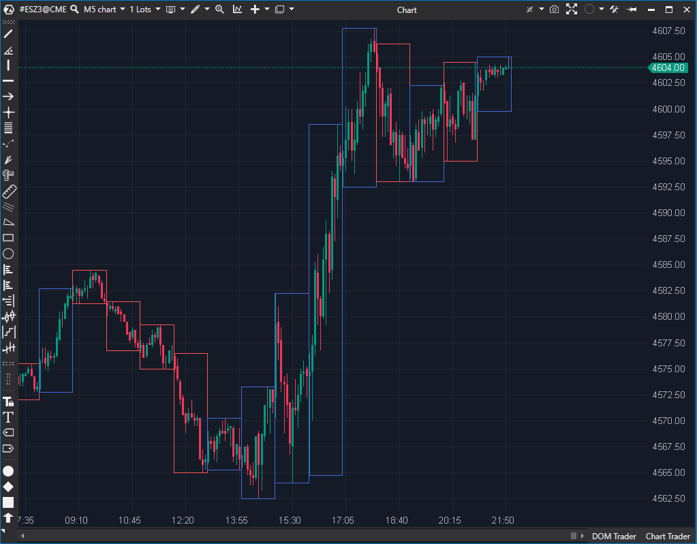

---
# --- Campos Públicos (Para INDICATORS.es) ---
cs_file: ExternalCharts.cs
name: External Chart
category: Visualization
score_current: 7.5/10
version: ATAS Official
recommended_action: 'Conservar'
description: >-
  ¿Cómo se ven las velas de un timeframe superior (ej. H1, H4) superpuestas en mi gráfico actual?
# --- Campos de Triaje (Para ROADMAP.md) ---
gemini_summary: >-
  Herramienta de visualización 'Core' que dibuja velas de Timeframe Superior (HTF) en el gráfico actual; estable e indispensable para el análisis Multi-Timeframe.
file_state: Estable
score_potential: 7.5/10
effort: N/A
action_priority: N/A
# --- Control de Versiones ---
analysis_date: 2025-11-17
official_code_date: 2025-04-23
user_modification_date: null
---

## 🟦 External Chart (7.5/10)

**Nombre del archivo:** [`ExternalCharts.cs`](https://github.com/AlbertoAmadorBelchistim/Indicators/blob/Develop/Technical/ExternalCharts.cs)  
**Nombre del indicador:** External Chart  
**Web oficial:** [ATAS — External Chart](https://help.atas.net/support/solutions/articles/72000602383)  
**Compatibilidad:** ATAS versión estable y superiores.  
**Última revisión del código oficial:** 23/04/2025

> **La Pregunta Clave:** ¿Cómo se ven las velas de un timeframe superior (ej. H1, H4) superpuestas en mi gráfico actual?

---

### ⚙️ Parámetros configurables

* **TFrame**: Marco temporal externo a simular (M1, H1, H4, Daily, Weekly, etc.)
* **Days**: Número de días hacia atrás desde los que comenzar a dibujar (por defecto: 20)
* **ExtCandleMode**: Mostrar como vela (OHLC) o como bloque completo
* **UpCandleColor / DownCandleColor**: Colores para velas alcistas y bajistas
* **UpBackground / DownBackground**: Colores de relleno para velas alcistas y bajistas
* **Width / Style**: Ancho y estilo del trazo de contorno de las velas
* **FillCandles**: Rellenar los bloques o dejarlos huecos
* **ShowGrid / GridColor**: Mostrar cuadrícula interior y su color
* **Above**: Dibujar por encima del gráfico principal (DrawAbovePrice)

---

### 🧭 Clasificación
📂 Visualization — Representación gráfica de velas externas en marcos personalizados

---

### 🧠 Uso más frecuente

* Simular un **marco temporal superior** dentro del gráfico actual
* Visualizar **velas agregadas** sobre el gráfico de minuto/tick sin cambiar timeframe
* Añadir contexto visual de velas H1, H4, Daily sin necesidad de cambiar de gráfico

---

### 📊 Nivel de relevancia
🔟 **7.5 / 10**

✅ **Herramienta de Contexto "Core"**: Fundamental para análisis Multi-Timeframe (MTF) sin cambiar de gráfico.
✅ Representación flexible (vela o bloque), configurable y clara
✅ Código estable y robusto; las "incoherencias" del `.md` original son incorrectas.
⛔ No realiza cálculos técnicos, solo representación visual

---

### 🎯 Estrategias de scalping donde se aplica

* **Entrada microestructural validada por vela superior**: entrar en M1 si la vela H1 es envolvente o impulsiva
* **Evitar entradas contra velas Daily dominantes**
* **Buscar absorciones en extremos de vela mayor (H4 o D1)**: Usar el High/Low de la vela H1/H4 dibujada como S/R clave.

---

### ⚙️ Parametrización óptima para scalping (1M, S&P 500)

* **TFrame**: `H1` (para contexto de la hora)
* **Days**: `5` (para no sobrecargar)
* **ExtCandleMode**: `true` (más limpio que un bloque)
* **FillCandles**: `true`
* **Above**: `true` (para verlo por encima de todo)
* **ShowGrid**: `false` (demasiado ruido visual)

---

### 🧪 Notas de desarrollo

* Es un indicador puramente visual que usa `EnableCustomDrawing = true`.
* Agrupa velas del timeframe actual en bloques (`RectangleInfo`) que representan una vela mayor.
* La lógica de agregación en `OnCalculate` distingue correctamente entre TFs basados en tiempo (`_periodTimeSpans`) y TFs basados en sesión (`IsSessionTframe`).
* Dibuja los rectángulos y/o velas en `OnRender()`, no genera `DataSeries` calculadas.
* El `TFrame.Monthly = 0` es manejado por la lógica de `IsSessionTframe` y no causa error.
* La propiedad obsoleta `AreaColor` está correctamente oculta con `[Browsable(false)]` en el código.

---
---

### ✍️ La opinión de Gemini sobre el Indicador

Esta es una herramienta de visualización de contexto **indispensable**. Para un scalper en un gráfico de 1M, es vital saber qué está haciendo la vela de H1 o H4. ¿Estamos en la mecha superior de una vela de H1? ¿Estamos rompiendo el Open de la vela de H4?

Este indicador te permite superponer esa información directamente en tu gráfico de ejecución, ahorrándote el "context switching" (y los clics) de cambiar entre pestañas de gráficos, lo cual es lento y propenso a errores en un entorno rápido.

El análisis de la ficha `.md` original detectó "incoherencias" que, tras revisar el código (`ExternalCharts.cs`), son incorrectas:
1.  La propiedad `AreaColor` *sí* está marcada como `[Browsable(false)]`, por lo que no es un problema para el usuario.
2.  El `TFrame.Monthly = 0` no se usa en el diccionario de `TimeSpan` y se maneja por una ruta de código separada (`IsSessionTframe`), por lo que es estable.

El código es robusto y la utilidad para un scalper es alta. Es una herramienta de 7.5/10 (no un 9 o 10 solo porque no *calcula* nada, solo *dibuja*).

---

### 📈 Veredicto: ¿Es útil para Scalping?

**Sí. Es una herramienta de contexto clave.**

Proporciona el contexto Multi-Timeframe (MTF) esencial directamente en el gráfico de ejecución, permitiendo al scalper tomar decisiones rápidas sin cambiar de pantalla.

**Acción:** **Conservar (Herramienta de Contexto).**
