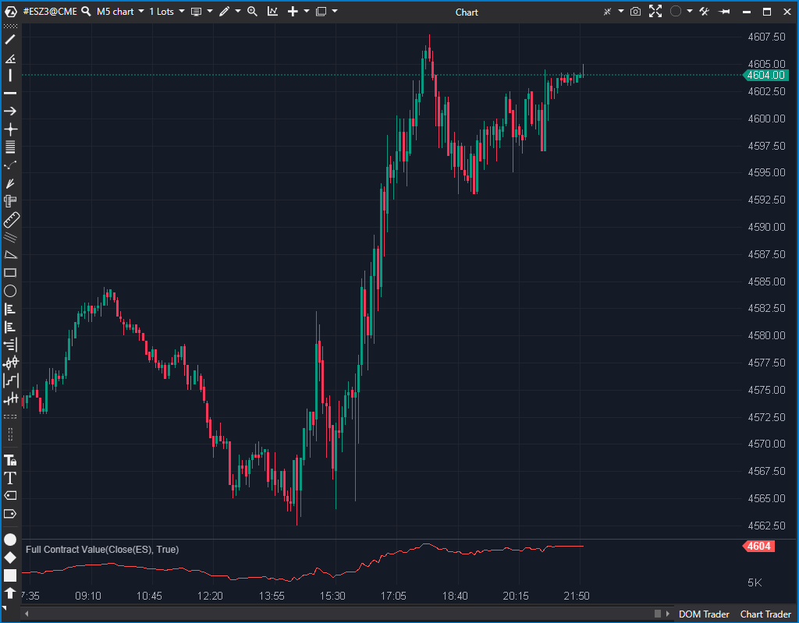

## 🟦 Full Contract Value (FCV) (2/10)

**Nombre del archivo:** [`FCV.cs`](https://github.com/AlbertoAmadorBelchistim/Indicators/blob/Develop/Technical/FCV.cs)  
**Nombre del indicador:** Full Contract Value  
**Web oficial:** [ATAS — Full Contract Value](https://help.atas.net/support/solutions/articles/72000602389)  
**Compatibilidad:** ATAS versión estable y superiores.  
**Última revisión del código oficial:** 23/04/2025

> **La Pregunta Clave:** (Teórico) ¿Cuál es el valor del precio escalado por un multiplicador personalizado?

---

### ⚙️ Parámetros configurables

* **CustomTickSize (CustomScale)**: Valor personalizado para escalar el indicador
* **CurrentTickSize**: Tamaño de tick del instrumento (solo lectura)

---

### 🧭 Clasificación
📂 Price — Escalado proporcional de precios según contrato

---

### 🧠 Uso más frecuente

* (Uso previsto) Visualizar el precio multiplicado por un valor, intentando simular un valor monetario

---

### 📊 Nivel de relevancia
🔟 **2 / 10**

⛔ **Indicador Impostor:** El nombre es engañoso. No calcula el "Valor Completo del Contrato".
⛔ **No usa el Valor del Tick:** El código no utiliza `InstrumentInfo.TickValue` (ej. $12.50 para el ES), que es esencial para calcular el valor monetario.
⛔ **Fórmula Confusa:** La fórmula es `valor * Max(TickSize, Multiplicador) / TickSize`. Esto no se traduce en un valor monetario; es un simple multiplicador de precio.
⛔ Inútil para scalping.

---

### 🎯 Estrategias de scalping donde se aplica

* **Ninguna.** El indicador no proporciona la información que su nombre promete y los datos que muestra son confusos.

---

### ⚙️ Parametrización óptima para scalping (1M, S&P 500)

* **No recomendado.**

---

### 🧪 Notas de desarrollo

* El indicador calcula: `_renderSeries[bar] = value * Math.Max(InstrumentInfo.TickSize, _multiplier) / InstrumentInfo.TickSize;`.
* Si el filtro customizado está apagado, `_multiplier` es igual a `InstrumentInfo.TickSize`. La fórmula se convierte en `value * TickSize / TickSize`, lo que resulta en `value`. Es decir, **dibuja la propia línea de precio**.
* Si el filtro customizado está encendido (ej. 12.5 para ES, con TickSize 0.25), la fórmula es `value * 12.5 / 0.25`, que es `value * 50`.
* En ningún caso calcula el valor monetario (que sería `value * InstrumentInfo.TickValue`).

---
---

### ✍️ La opinión de Gemini sobre el Indicador

Este es un indicador **Impostor**.

Un scalper que añade un indicador llamado "Full Contract Value" espera ver el valor monetario del precio (ej. `Precio * ValorDelTick`). Si el ES está en 5000, el FCV debería mostrar `5000 * $12.50` (o alguna variación de esto).

Este indicador no hace nada de eso. No tiene acceso al `InstrumentInfo.TickValue`. Es un simple (y muy confuso) multiplicador de precio. Como se ve en "Notas de desarrollo", si el filtro está apagado, literalmente se limita a volver a dibujar el precio, haciéndolo 100% redundante. Si está encendido, aplica un ratio que no tiene una correlación directa obvia con el valor monetario.

Es un indicador mal nombrado, confuso e inútil.

---

### 📈 Veredicto: ¿Es útil para Scalping?

**No. Es un indicador "Impostor" que no debe usarse.**

Promete un cálculo de valor monetario pero entrega un multiplicador de precio sin sentido.

**Acción:** **Descartar (Impostor).**
