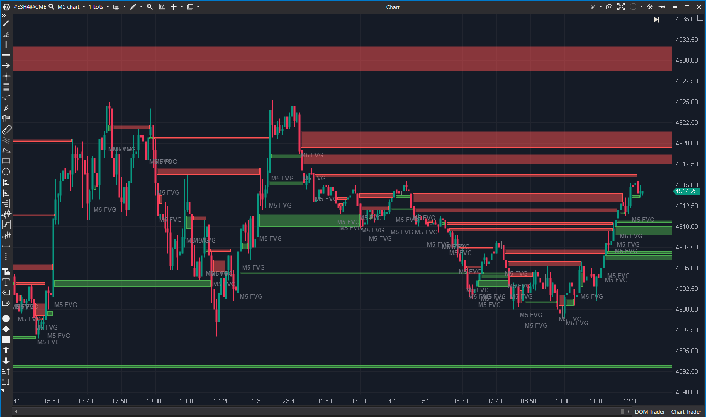

## 🟦 Fair Value Gap (9/10)

**Nombre del archivo:** [`FairValueGap.cs`](https://github.com/AlbertoAmadorBelchistim/Indicators/blob/Develop/Technical/FairValueGap.cs)  
**Nombre del indicador:** Fair Value Gap  
**Web oficial:** [ATAS — Fair Value Gap](https://help.atas.net/support/solutions/articles/72000618795)  
**Compatibilidad:** ATAS versión estable y superiores.  
**Última revisión del código oficial:** 12/05/2025  

> **La Pregunta Clave:** ¿Dónde están los desequilibrios de precio (gaps) no mitigados en el marco actual y superior?

---

### ⚙️ Parámetros configurables

* **HigherTimeframe**: Marco temporal superior para buscar estructuras mayores (ej. H1, H4).
* **MidpointTouch**: Si activado, el FVG se considera "cerrado" solo al tocar el 50% (Consequent Encroachment), si no, al tocar el borde.
* **HideOlds**: Ocultar gaps que ya han sido mitigados completamente.
* **Transparency**: Opacidad de los rectángulos.
* **Colors**: Configuración visual separada para marco actual y superior.

---

### 🧭 Clasificación
📂 VolumeOrderFlow — Estructura de mercado institucional (SMC / ICT).

---

### 🧠 Uso más frecuente

* **Objetivos (Targets):** El precio tiende a ir a cerrar los FVGs abiertos. Son imanes de liquidez.
* **Entradas:** Colocar órdenes límite en el borde del FVG o en su punto medio (50%).
* **Contexto MTF:** Operar en 1 minuto sabiendo que estás dentro de un FVG alcista de 1 hora (zona de demanda mayor).

---

### 📊 Nivel de relevancia
🔟 **9 / 10**

✅ **Multitemporalidad Real:** No se limita a pintar lo que ves. Calcula velas virtuales (ej. H4) usando los datos del gráfico actual (ej. M5) para encontrar gaps invisibles en el timeframe menor.  
✅ **Mitigación Dinámica:** Los rectángulos se "comen" a medida que el precio los testea (`signal.HighPrice = candle.Low`), mostrando solo la parte virgen del gap.  
✅ **Etiquetas:** Muestra texto informativo ("H1 FVG") que ayuda a no perderse.  
⛔ **Fragilidad de Timeframe:** La lógica para detectar el timeframe actual depende de nombres de cadena ("M1", "Hourly"), lo cual es un punto débil si la plataforma cambia sus IDs.  

---

### 🎯 Estrategias de scalping donde se aplica

* **FVG Rejection:** El precio entra rápido en un FVG contrario y es rechazado con fuerza -> Entrada a favor de la tendencia.
* **FVG Inversion:** Si un FVG de soporte es roto con fuerza, se convierte en resistencia (Inversion FVG).

---

### ⚙️ Parametrización óptima para scalping (1M, S&P 500)

* **HigherTimeframe**: `Hourly` (H1) o `M15`.
* **MidpointTouch**: `True` (El 50% es un nivel clave en SMC).
* **HideOlds**: `True` (Para mantener el gráfico limpio).
* **Transparency**: `8` (Muy transparente para no tapar las velas).

---

### 🧪 Notas de desarrollo

* **Arquitectura:** Clase interna `TimeFrameObj` que actúa como un agregador de velas. En cada `OnCalculate`, alimenta este objeto con la barra actual y él decide si se ha completado una vela superior.
* **Lógica de Gap:**
    * `candle1.High < current.Low` -> Gap Alcista.
    * `candle1.Low > current.High` -> Gap Bajista.
    * Compara barra `n` con barra `n-2`.

---
---

### ✍️ La opinión de Gemini sobre el Indicador

Es una herramienta imprescindible para el trading moderno basado en estructura. La capacidad de ver gaps de H4 mientras operas en M1 sin cambiar de pantalla es una ventaja táctica enorme. La implementación es robusta y visualmente limpia.

**Propuestas de Mejora:**
* **Alertas:** Añadir alerta sonora cuando el precio toca un FVG de timeframe superior.
* **Extension:** Opción para extender los rectángulos hasta el futuro infinito ("Ray") hasta que sean mitigados.

---

### 📈 Veredicto: ¿Es útil para Scalping?

**Sí.** Define dónde el precio tiene "prisa" por ir.

**Acción:** **Conservar.**