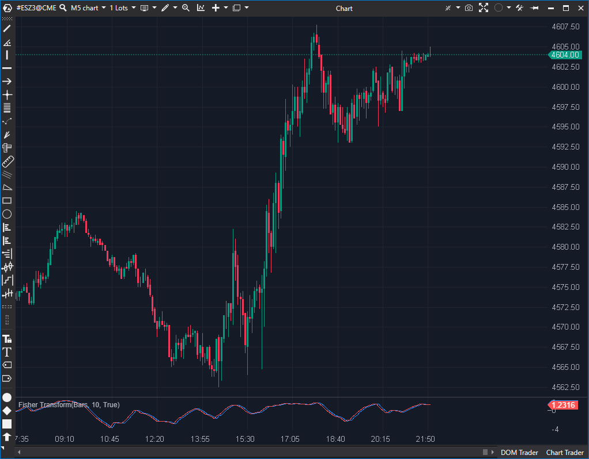

---
# --- Campos Públicos (Para INDICATORS.es) ---
cs_file: FisherTransform.cs
name: Fisher Transform
category: Momentum
score_current: 6.5/10
version: ATAS Official
recommended_action: 'Conservar'
description: >-
  ¿Cuál es el momentum del precio, normalizado por una transformación estadística de Fisher?
# --- Campos de Triaje (Para ROADMAP.md) ---
gemini_summary: >-
  Implementación estándar de un oscilador de momentum rápido; contiene una 'quirk' de cálculo (High/Close) y un bug de performance inofensivo.
file_state: Estable
score_potential: 6.5/10
effort: N/A
action_priority: N/A
# --- Control de Versiones ---
analysis_date: 2025-11-17
official_code_date: 2025-04-23
user_modification_date: null
---

## 🟦 Fisher Transform (6.5/10)

**Nombre del archivo:** [`FisherTransform.cs`](https://github.com/AlbertoAmadorBelchistim/Indicators/blob/Develop/Technical/FisherTransform.cs)  
**Nombre del indicador:** Fisher Transform  
**Web oficial:** [ATAS — Fisher Transform](https://help.atas.net/support/solutions/articles/72000602385)  
**Compatibilidad:** ATAS versión estable y superiores.  
**Última revisión del código oficial:** 23/04/2025

> **La Pregunta Clave:** ¿Cuál es el momentum del precio, normalizado por una transformación estadística de Fisher?

---

### ⚙️ Parámetros configurables

* **Period**: Número de barras para calcular el máximo y mínimo sobre los que se basa la transformación (por defecto: 10)

---

### 🧭 Clasificación
📂 Momentum — Osciladores con normalización estadística para detectar giros

---

### 🧠 Uso más frecuente

* Detectar **zonas de sobrecompra o sobreventa** con base en una transformación estadística
* Anticipar **giros extremos del mercado** con mayor sensibilidad que RSI o estocástico
* Generar señales cuando la línea Fisher cruza su línea de activación (trigger)

---

### 📊 Nivel de relevancia
🔟 **6.5 / 10**

✅ Responde bien a cambios extremos de comportamiento del precio  
✅ Su transformación estadística lo hace más reactivo en los bordes  
⛔ Puede generar muchas señales falsas en rangos estrechos  
⛔ Peculiaridad de cálculo: usa `High` para el máximo pero `Close` para el mínimo

---

### 🎯 Estrategias de scalping donde se aplica

* **Cruce alcista**: cuando Fisher cruza por encima de la línea de activación
* **Cruce bajista**: cuando Fisher cruza por debajo de la línea trigger
* **Entrada tras giro**: en zonas donde Fisher alcanza extremos positivos o negativos y revierte

---

### ⚙️ Parametrización óptima para scalping (1M, S&P 500)

* **Period**: `8` a `10`
* Usar con líneas guía en ±1.5 y 0
* Complementar con Delta o CVD para validar cambios reales de agresión

---

### 🧪 Notas de desarrollo

* Se basa en la transformación estadística de Fisher aplicada a una oscilación de precio.
* Calcula el rango usando `_highest.Calculate(bar, candle.High)` y `_lowest.Calculate(bar, candle.Close)`. Esta mezcla de High y Close es una peculiaridad.
* Aplica la normalización y la fórmula de Fisher, incluyendo un suavizado (`+ 0.5 * Convert.ToDouble(_lastFisher)`).
* Se aplican límites (±0.999) al valor de entrada (`valueSeries`) para evitar un error de `Math.Log`.
* `_triggers[bar]` se rellena con el valor anterior de Fisher (`_lastFisher`) como línea de señal.
* El campo `_lastBar` es un `readonly decimal`, lo que es un bug, pero es inofensivo y solo causa una reasignación redundante de variables en cada tick.

---
---

### ✍️ La opinión de Gemini sobre el Indicador

Esta es una implementación estándar del oscilador Fisher Transform. Es un indicador de momentum "rápido", diseñado para identificar extremos más rápidamente que un RSI o Estocástico.

El código es estable. El análisis del `.md` original detectó correctamente dos "incoherencias":
1.  **Bug Inofensivo:** El campo `_lastBar` es un `readonly decimal` y nunca se actualiza. Esto es un error de programación, pero es inofensivo. Solo significa que el `if (bar != _lastBar)` siempre es verdadero, causando una re-asignación de variables innecesaria en cada tick. No rompe la lógica del cálculo.
2.  **Peculiaridad de Cálculo:** El indicador usa `candle.High` para el `sMax` pero `candle.Close` para el `sMin`. Esto es una elección de diseño inusual, pero es consistente y no es un "error" per se.

El indicador funciona como se espera y es una herramienta de momentum válida.

---

### 📈 Veredicto: ¿Es útil para Scalping?

**Sí.**

Es un oscilador de momentum "ciego" (solo precio) válido. Es bueno para scalpers que buscan señales de giro muy rápidas, pero debe usarse con confirmación (como todo oscilador).

**Acción:** **Conservar.**
