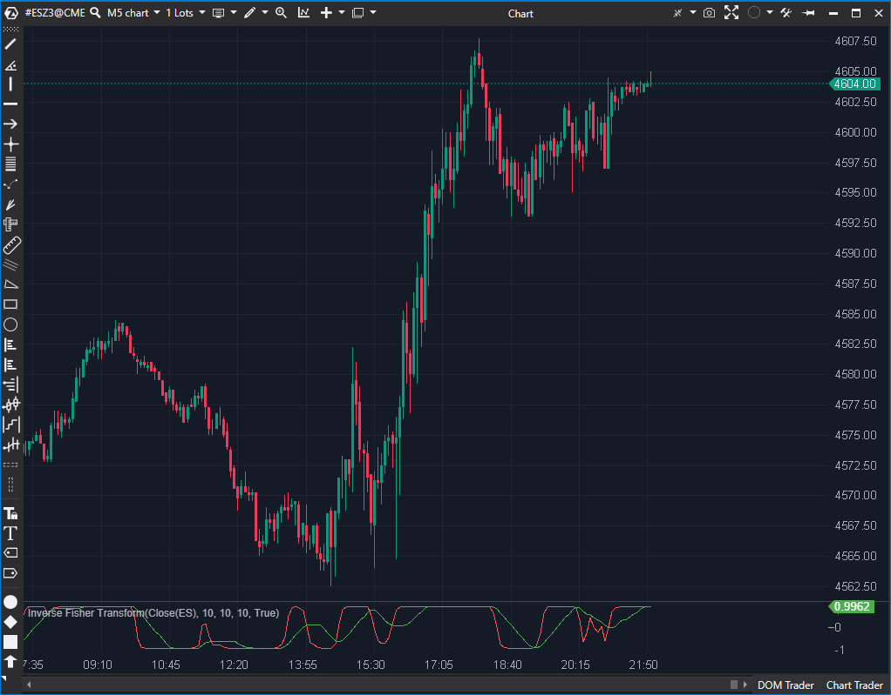

---
# --- Campos Públicos (Para INDICATORS.es) ---
cs_file: FisherTransformInverse.cs
name: Inverse Fisher Transform
category: Momentum
score_current: 6.5/10
version: ATAS Official
recommended_action: 'Conservar'
description: >-
  ¿Cuál es el momentum del precio, suavizado y normalizado por una transformación inversa de Fisher?
# --- Campos de Triaje (Para ROADMAP.md) ---
gemini_summary: >-
  Implementación estable de un oscilador de momentum 'doble-suavizado' (WMA + SMA); una alternativa más lenta al Fisher Transform.
file_state: Estable
score_potential: 6.5/10
effort: N/A
action_priority: N/A
# --- Control de Versiones ---
analysis_date: 2025-11-17
official_code_date: 2025-04-23
user_modification_date: null
---

## 🟦 Inverse Fisher Transform (6.5/10)

**Nombre del archivo:** [`FisherTransformInverse.cs`](https://github.com/AlbertoAmadorBelchistim/Indicators/blob/Develop/Technical/FisherTransformInverse.cs)  
**Nombre del indicador:** Inverse Fisher Transform  
**Web oficial:** [ATAS — Inverse Fisher Transform](https://help.atas.net/support/solutions/articles/72000602407)  
**Compatibilidad:** ATAS versión estable y superiores.  
**Última revisión del código oficial:** 23/04/2025

> **La Pregunta Clave:** ¿Cuál es el momentum del precio, suavizado y normalizado por una transformación inversa de Fisher?

---

### ⚙️ Parámetros configurables

* **HighLowPeriod**: Número de barras para calcular el máximo y mínimo local (por defecto: 10)
* **WmaPeriod**: Periodo para suavizado WMA del valor transformado
* **SmaPeriod**: Periodo para suavizado final de la señal (línea smoothed)

---

### 🧭 Clasificación
📂 Momentum — Transformaciones estadísticas suavizadas para detectar zonas extremas

---

### 🧠 Uso más frecuente

* Detectar zonas de **sobrecompra y sobreventa** suavizadas
* Identificar **transiciones suaves** entre fases del mercado
* Visualizar giros extremos con menor sensibilidad al ruido que el Fisher directo

---

### 📊 Nivel de relevancia
🔟 **6.5 / 10**

✅ Ideal para operadores visuales que buscan transiciones suaves  
✅ Reduce señales falsas gracias al doble suavizado  
⛔ Tiene más retardo (lag) que un oscilador directo  
⛔ Redundante si ya se usa `FisherTransformInverseRsi`.

---

### 🎯 Estrategias de scalping donde se aplica

* **Cruce por zona extrema**: si el IFT supera +0.9 o -0.9 y gira → señal de reversión
* **Confirmación de tendencia suave**: si el valor se mantiene alto/bajo de forma sostenida
* **Filtro direccional**: aceptar trades largos sólo si IFT > 0, cortos si IFT < 0

---

### ⚙️ Parametrización óptima para scalping (1M, S&P 500)

* **HighLowPeriod**: `10`
* **WmaPeriod**: `3`
* **SmaPeriod**: `5`
* Líneas guía en `+0.8`, `-0.8`, `0`

---

### 🧪 Notas de desarrollo

* Calcula un valor estocástico normalizado (`eps`) basado en el `value` (precio) contra el Max/Min de `HighLowPeriod`.
* Aplica un suavizado WMA a `eps` -> `epsSmoothed`.
* Aplica la **transformación inversa de Fisher** a `epsSmoothed` para obtener `_ift[bar]`.
* Finalmente, aplica un suavizado SMA a `_ift[bar]` para obtener la línea de señal `_iftSmoothed[bar]`.
* Maneja correctamente el caso de `high == low` para evitar división por cero.

---
---

### ✍️ La opinión de Gemini sobre el Indicador

Esta es otra implementación estándar de un oscilador de momentum. Es un "doble suavizado", lo que lo hace más lento y suave que el `FisherTransform` estándar. Utiliza un WMA para el primer suavizado y un SMA para el segundo.

Es una herramienta estable y funcional. Su principal inconveniente es que es conceptualmente muy similar al `FisherTransformInverseRsi`, y un scalper probablemente solo necesitaría uno de los dos. Este se basa en el precio (estocástico), mientras que el otro se basa en el RSI. Es una cuestión de preferencia.

---

### 📈 Veredicto: ¿Es útil para Scalping?

**Moderadamente.**

Es un oscilador "ciego" (solo precio) válido, pero su doble suavizado introduce un lag que puede ser excesivo para el scalping más rápido. Es una alternativa más suave al MACD o al Estocástico.

**Acción:** **Conservar.**
