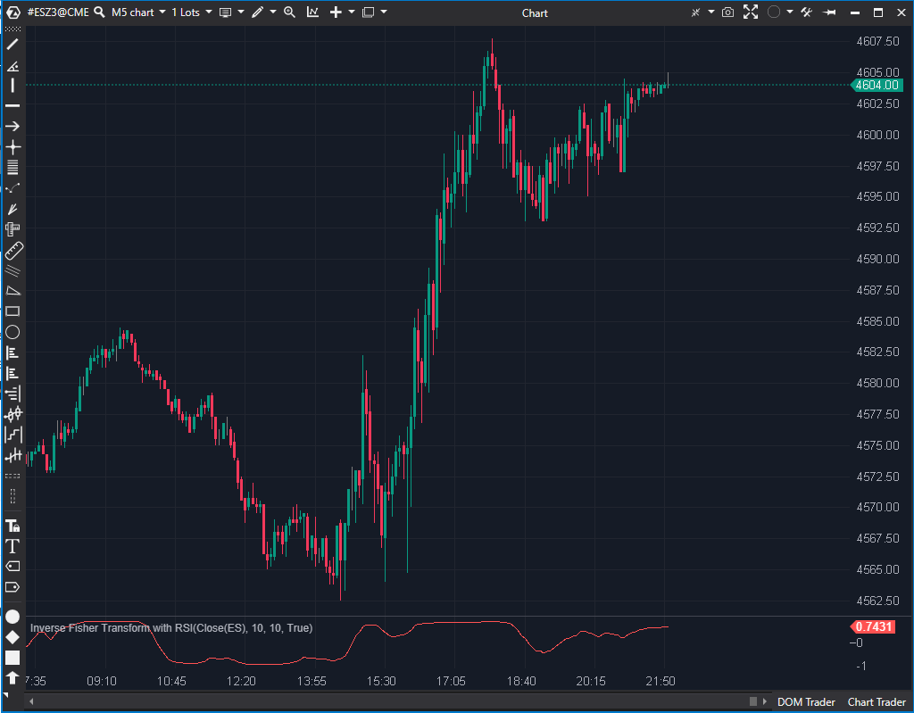

---
# --- Campos Públicos (Para INDICATORS.es) ---
cs_file: FisherTransformInverseRsi.cs
name: Inverse Fisher Transform with RSI
category: Momentum
score_current: 6.5/10
version: ATAS Official
recommended_action: 'Conservar'
description: >-
  ¿Cuál es el momentum, basado en un RSI suavizado y normalizado por una transformación inversa de Fisher?
# --- Campos de Triaje (Para ROADMAP.md) ---
gemini_summary: >-
  Implementación estable de un oscilador de momentum 'suave' (RSI + WMA + IFT); el nombre del parámetro 'HighLowPeriod' es confuso pero el UI es correcto.
file_state: Estable
score_potential: 6.5/10
effort: N/A
action_priority: N/A
# --- Control de Versiones ---
analysis_date: 2025-11-17
official_code_date: 2025-04-23
user_modification_date: null
---

## 🟦 Inverse Fisher Transform with RSI (6.5/10)

**Nombre del archivo:** [`FisherTransformInverseRsi.cs`](https://github.com/AlbertoAmadorBelchistim/Indicators/blob/Develop/Technical/FisherTransformInverseRsi.cs)  
**Nombre del indicador:** Inverse Fisher Transform with RSI  
**Web oficial:** [ATAS — Inverse Fisher Transform with RSI](https://help.atas.net/support/solutions/articles/72000602408)  
**Compatibilidad:** ATAS versión estable y superiores.  
**Última revisión del código oficial:** 23/04/2025

> **La Pregunta Clave:** ¿Cuál es el momentum, basado en un RSI suavizado y normalizado por una transformación inversa de Fisher?

---

### ⚙️ Parámetros configurables

* **HighLowPeriod (RSI Period)**: Periodo para el RSI base (por defecto: 10)
* **WmaPeriod**: Periodo para el suavizado del RSI mediante WMA (por defecto: 10)

---

### 🧭 Clasificación
📂 Momentum — Osciladores suavizados con transformación estadística basada en RSI

---

### 🧠 Uso más frecuente

* Detectar **reversiones con menor ruido** al transformar el RSI suavizado
* Identificar **zonas extremas** de forma más nítida que con el RSI clásico
* Suavizar las señales de impulso para reducir falsos positivos

---

### 📊 Nivel de relevancia
🔟 **6.5 / 10**

✅ Menos ruido que un RSI puro o una Fisher directa  
✅ Excelente como filtro de contexto en entornos volátiles  
⛔ Puede tener retraso si el suavizado es alto  
⛔ Confusión en el nombre del parámetro `HighLowPeriod` en el código

---

### 🎯 Estrategias de scalping donde se aplica

* **Reversión en zonas extremas**: entrada si el valor de IFT cruza ±0.8
* **Filtro direccional**: operar solo en la dirección del IFT
* **Cruce por 0**: confirmar cambio de sesgo intradiario

---

### ⚙️ Parametrización óptima para scalping (1M, S&P 500)

* **HighLowPeriod (RSI)**: `10`
* **WmaPeriod**: `5`
* Añadir líneas guía en ±0.8 y 0.0

---

### 🧪 Notas de desarrollo

* Calcula el RSI con el periodo `HighLowPeriod`.
* Normaliza el RSI alrededor de 0: `var rsiValue = (_rsi.Calculate(bar, value) - 50) / 10;`.
* Suaviza este valor con una **WMA** (`_wma.Calculate(bar, rsiValue)`).
* Aplica la **transformación inversa de Fisher** (`(expValue - 1) / (expValue + 1)`).
* El nombre del parámetro `HighLowPeriod` es confuso en el código, pero en la UI de ATAS se muestra como "RSI" (`[Display(Name = nameof(Strings.RSI))]`).

---
---

### ✍️ La opinión de Gemini sobre el Indicador

Esta es una implementación estable de un oscilador de momentum suave. Combina RSI, WMA y la transformación inversa de Fisher. El resultado es un oscilador más suave que un RSI estándar, diseñado para reducir el ruido.

El `.md` original identifica correctamente el "code smell" más obvio: el parámetro se llama `HighLowPeriod` en el código, aunque se usa para el RSI. Sin embargo, el programador usó un atributo `[Display(Name = nameof(Strings.RSI))]`, lo que significa que el usuario final en ATAS ve "RSI Period", por lo que el problema es puramente cosmético para un desarrollador que lea el código, no para el trader.

Es una herramienta 6.5/10 sólida y estable.

---

### 📈 Veredicto: ¿Es útil para Scalping?

**Moderadamente.**

Es un oscilador "ciego" (solo precio) válido. Es una buena alternativa al MACD o Estocástico para traders que prefieren señales más suaves y menos ruido.

**Acción:** **Conservar.**
