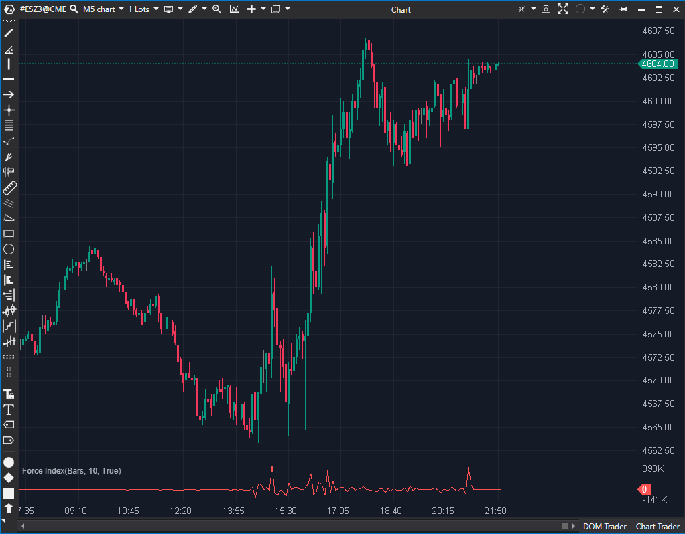

## 🟦 Force Index (7/10)

**Nombre del archivo:** [`ForceIndex.cs`](https://github.com/AlbertoAmadorBelchistim/Indicators/blob/Develop/Technical/ForceIndex.cs)  
**Nombre del indicador:** Force Index  
**Web oficial:** [ATAS — Force Index](https://help.atas.net/support/solutions/articles/72000602387)  
**Compatibilidad:** ATAS versión estable y superiores.  
**Última revisión del código oficial:** 23/04/2025

> **La Pregunta Clave:** ¿Cuál es la fuerza de un movimiento (Volumen * (Cierre - CierreAnterior)), con suavizado opcional?

---

### ⚙️ Parámetros configurables

* **PeriodFilter (UseEma / Period)**: Activa y define el periodo de un suavizado EMA opcional (por defecto: 10).

---

### 🧭 Clasificación
📂 Volume — Indicadores que combinan volumen con movimiento de precio

---

### 🧠 Uso más frecuente

* Medir la **fuerza del movimiento** combinando volumen y variación de precio
* Confirmar **momentum direccional** en movimientos de alta participación
* Filtrar señales débiles sin acompañamiento de volumen

---

### 📊 Nivel de relevancia
🔟 **7 / 10**

✅ **Herramienta "Core":** Indicador simple y reactivo para confirmar impulsos.
✅ **Suavizado Opcional:** El filtro EMA es clave para eliminar ruido.
✅ Combina Precio y Volumen, dándole más profundidad que un oscilador ciego.
⛔ El valor bruto no está normalizado, por lo que no es comparable entre activos.

---

### 🎯 Estrategias de scalping donde se aplica

* **Confirmación de ruptura**: entrada si el Force Index (suavizado) cruza el cero y crece junto con el breakout.
* **Divergencia de Volumen**: El precio hace un nuevo máximo, pero el Force Index hace un máximo más bajo (indica menos volumen/fuerza).
* **Filtro direccional**: Aceptar trades solo si el indicador (suavizado) está por encima/debajo de la línea cero.

---

### ⚙️ Parametrización óptima para scalping (1M, S&P 500)

* **UseEma (PeriodFilter.Enabled)**: `true`
* **Period (PeriodFilter.Value)**: `8` a `13`
* Visualizar con eje cero como referencia

---

### 🧪 Notas de desarrollo

* Calcula el índice como: `var force = candle.Volume * (candle.Close - prevCandle.Close);`.
* Si `_useEma` (controlado por `PeriodFilter.Enabled`) está activado, el valor se suaviza: `_ema.Calculate(bar, force)`.
* Si está desactivado, se plotea el valor `force` en bruto.
* El uso de `FilterInt PeriodFilter` para controlar `UseEma` y `Period` es la forma estándar de ATAS de crear un parámetro "opcional".

---
---

### ✍️ La opinión de Gemini sobre el Indicador

Esta es una herramienta "Core" de análisis de volumen. Es una implementación 100% correcta y estable del Force Index de Alexander Elder.

Su valor para un scalper es que combina las dos piezas de información más importantes (Precio y Volumen) en un solo oscilador. La fórmula `Volumen * (Cierre - Cierre_Previo)` te dice no solo *si* hubo fuerza, sino *quién* la tuvo.

La inclusión del suavizado EMA opcional es crucial, ya que el indicador en bruto es extremadamente ruidoso. Un scalper casi siempre usará la versión suavizada (ej. 13-EMA) como filtro de tendencia a corto plazo.

---

### 📈 Veredicto: ¿Es útil para Scalping?

**Sí. Es una herramienta de confirmación "Core".**

Es excelente para validar la fuerza de un impulso, filtrar señales débiles (bajo volumen) y detectar divergencias de volumen.

**Acción:** **Conservar (Herramienta Principal).**
