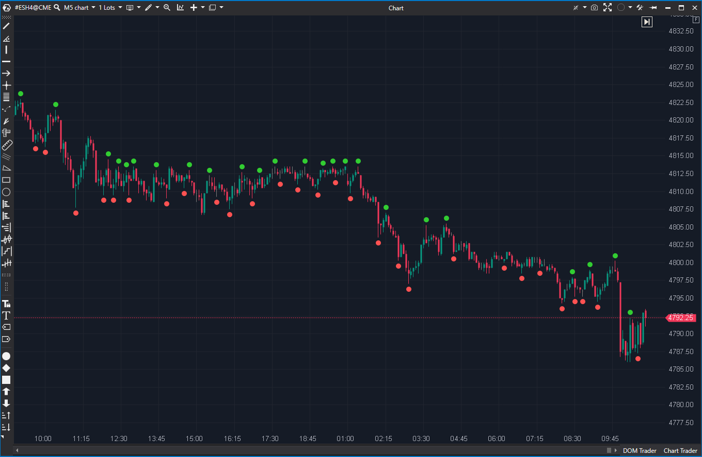

---
cs_file: Fractals.cs
name: Fractals
category: Structure
group: Market Structure  
subgroup: Swing-Derived Structure  
score_current: 7.5/10
version: Estable
recommended_action: Conservar
description: ¿Dónde están los máximos y mínimos fractales (swing) de 5 barras?
gemini_summary: "Implementación 'Core' estable. Mejorada con función 'ShowLine' (LineTillTouch) para S/R automáticos."
comparison_group: "Swing Analysis"
competitor_notes: "Estándar para estructura de mercado."
reusable_code: null
file_state: Estable
score_potential: 7.5/10
effort: N/A
action_priority: N/A
analysis_date: 2025-11-17
official_code_date: 23/04/2025
---

## 🟦 Fractals (7.5/10)

**Nombre del archivo:** [`Fractals.cs`](https://github.com/AlbertoAmadorBelchistim/Indicators/blob/Develop/Technical/Fractals.cs)  
**Nombre del indicador:** Fractals  
**Web oficial:** [ATAS — Fractals](https://help.atas.net/support/solutions/articles/72000602388)  
**Compatibilidad:** ATAS versión estable y superiores.  
**Última revisión del código oficial:** 23/04/2025

> **La Pregunta Clave:** ¿Dónde están los máximos y mínimos fractales (swing) de 5 barras, con líneas opcionales de S/R?

---

### ⚙️ Parámetros configurables

* **Mode**: Mostrar fractales altos, bajos, ambos o ninguno
* **ShowLine**: Dibujar línea horizontal desde el fractal hasta ser tocado
* **HighPen / LowPen**: Estilo y color para las líneas de fractal alto y bajo

---

### 🧭 Clasificación
📂 Levels — Indicadores de detección de niveles fractales de soporte/resistencia

---

### 🧠 Uso más frecuente

* Detectar **niveles potenciales de soporte o resistencia** (swing highs/lows)
* Marcar máximos y mínimos locales con la definición estándar de 5 barras
* Dibujar automáticamente líneas S/R (`LineTillTouch`) desde esos fractales

---

### 📊 Nivel de relevancia
🔟 **7.5 / 10**

✅ **Herramienta "Core"**: Es la implementación estándar del fractal de Bill Williams.
✅ **Función `ShowLine`**: La capacidad de dibujar líneas S/R automáticas (`LineTillTouch`) es una mejora de alto valor para scalping.
✅ **Estable y Preciso**: El código maneja correctamente la lógica de 5 barras y la actualización de la barra actual.
⛔ "Ciego" (solo precio), no considera volumen ni delta para validar los niveles.

---

### 🎯 Estrategias de scalping donde se aplica

* **Ruptura de Fractal (Stop-Run):** Comprar/Vender cuando el precio rompe un fractal reciente.
* **Fallo de Ruptura (Reversión):** Entrar en contra si el precio no logra romper un fractal y es rechazado.
* **S/R Automático**: Usar las líneas de `ShowLine` como niveles objetivos o de entrada para pullbacks.

---

### ⚙️ Parametrización óptima para scalping (1M, S&P 500)

* **Mode**: `All`
* **ShowLine**: `true`
* **HighPen / LowPen**: líneas finas, verdes y rojas respectivamente

---

### 🧪 Notas de desarrollo

* Utiliza la definición estándar de fractal de 5 barras: la barra central (`bar - 2`) debe tener un High/Low mayor/menor que las dos barras anteriores (`bar - 4`, `bar - 3`) y las dos barras siguientes (`bar - 1`, `bar - 0`).
* El fractal se dibuja en `fractalBar = bar - 2`.
* Dibuja un punto (`VisualMode.Dots`) 3 ticks por encima/debajo del precio para mejor visibilidad (`bar2.High + 3 * _tickSize`).
* Si `ShowLine = true`, crea una `LineTillTouch` (línea S/R) que se extiende desde el fractal hacia el futuro hasta que el precio la toca.
* El código maneja correctamente la actualización en la barra actual (repintado) para fractales en formación (`if (!isNewBar && IsCurrentLine(...))`).

---
---

### ✍️ La opinión de Gemini sobre el Indicador

Esta es una herramienta "Core" para cualquier trader de acción del precio o estructura de mercado. Es una implementación perfecta y estable del fractal de 5 barras de Williams.

Lo que eleva a este indicador por encima de una implementación "básica" es la función **`ShowLine = true`**. Esto lo convierte de un simple marcador visual (un punto en el gráfico) en un generador de niveles de S/R automático y dinámico (`LineTillTouch`).

Para un scalper, esto es oro: cada vez que se forma un swing high/low, el indicador dibuja automáticamente el nivel de S/R correspondiente, que permanece en el gráfico hasta que el precio lo "mitiga" (lo toca). Esto ahorra un tiempo de dibujo inmenso y mantiene el gráfico limpio y objetivo.

---

### 📈 Veredicto: ¿Es útil para Scalping?

**Sí. Es una herramienta de S/R automática "Core".**

Define objetivamente los niveles de swing high/low a corto plazo y los traza en el gráfico, lo cual es fundamental para las estrategias de ruptura y reversión.

**Acción:** **Conservar (Herramienta Principal).**