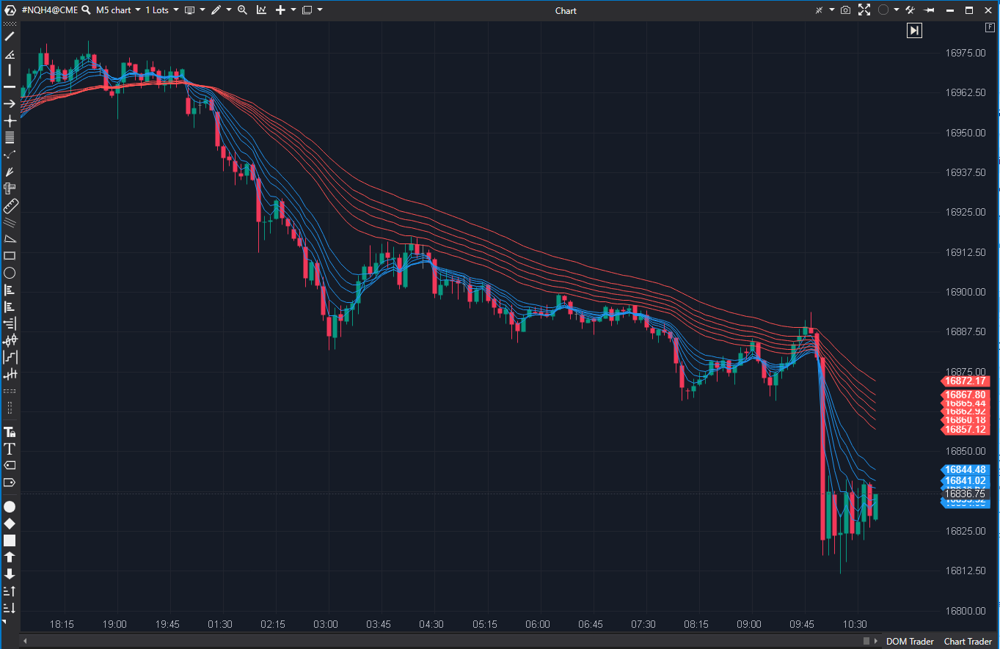

---
# --- Campos Públicos (Para INDICATORS.es) ---
cs_file: GMMA.cs
name: Guppy Multiple Moving Average
category: Trend
score_current: 8.5/10
version: ATAS Official
recommended_action: 'Conservar'
description: >-
  ¿Cuál es la relación (compresión/expansión) entre las 6 EMAs de traders (cortas) y las 6 EMAs de inversores (largas)?
# --- Campos de Triaje (Para ROADMAP.md) ---
gemini_summary: >-
  Implementación 'Core' y estable del GMMA; una herramienta de visualización de tendencia/compresión indispensable, aunque el código es repetitivo.
file_state: Estable
score_potential: 8.5/10
effort: N/A
action_priority: N/A
# --- Control de Versiones ---
analysis_date: 2025-11-17
official_code_date: 2025-04-23
user_modification_date: null
---

## 🟦 Guppy Multiple Moving Average (GMMA) (8.5/10)

**Nombre del archivo:** [`GMMA.cs`](https://github.com/AlbertoAmadorBelchistim/Indicators/blob/Develop/Technical/GMMA.cs)  
**Nombre del indicador:** Guppy Multiple Moving Average  
**Web oficial:** [ATAS — Guppy Multiple Moving Average](https://help.atas.net/support/solutions/articles/72000602390)  
**Compatibilidad:** ATAS versión estable y superiores.  
**Última revisión del código oficial:** 23/04/2025

> **La Pregunta Clave:** ¿Cuál es la relación (compresión/expansión) entre las 6 EMAs de traders (cortas) y las 6 EMAs de inversores (largas)?

---

### ⚙️ Parámetros configurables

* **EmaPeriod1-6 (corto)**: Seis periodos para EMAs de corto plazo (por defecto: 3, 5, 7, 10, 12, 15)
* **EmaLongPeriod1-6 (largo)**: Seis periodos para EMAs de largo plazo (por defecto: 30, 35, 40, 45, 50, 60)
* **ShortColor / LongColor**: Colores de las EMAs de corto y largo plazo

---

### 🧭 Clasificación
📂 Trend — Indicadores compuestos para evaluación de tendencia y compresión

---

### 🧠 Uso más frecuente

* Evaluar la **fuerza y estabilidad de una tendencia** observando la separación entre grupos de medias
* Confirmar cambios de fase mediante la **contracción o expansión** del haz de EMAs
* Identificar **momentos de transición entre consolidación y tendencia**

---

### 📊 Nivel de relevancia
🔟 **8.5 / 10**

✅ **Herramienta "Core" de Contexto**: Proporciona una lectura visual instantánea de la salud de la tendencia (expansión) vs. consolidación (compresión).
✅ Muy útil para evaluar estructura de mercado sin necesidad de osciladores
⛔ Ocupa espacio visual considerable
⛔ El código es muy repetitivo (12 EMAs declaradas individualmente)

---

### 🎯 Estrategias de scalping donde se aplica

* **Filtro de Tendencia**: Solo tomar largos si las EMAs cortas están por encima de las largas y ambas están expandidas.
* **Scalping de Rango**: Operar reversiones cuando ambos haces (corto y largo) están comprimidos y entrelazados.
* **Entrada en Pullback**: Comprar cuando el precio retrocede al haz de EMAs cortas, mientras el haz de EMAs largas sigue apuntando hacia arriba.

---

### ⚙️ Parametrización óptima para scalping (1M, S&P 500)

* **Cortos**: 3, 5, 7, 10, 12, 15 (por defecto)
* **Largos**: 30, 35, 40, 45, 50, 60 (por defecto)
* **Colores**: azul (corto), rojo (largo)

---

### 🧪 Notas de desarrollo

* Implementa 12 objetos `EMA` (`_emaShort1` a `_emaShort6`, `_emaLong1` a `_emaLong6`).
* Implementa 12 `ValueDataSeries` para renderizar cada línea (`_renderShort1` a `_renderLong6`, etc.).
* El código es "bruto" y repetitivo, pero funcional. Cada EMA se calcula independientemente en `OnCalculate`.
* Los parámetros de `ShortColor` y `LongColor` asignan el mismo color a las 6 series de su grupo.

---
---

### ✍️ La opinión de Gemini sobre el Indicador

Esta es una herramienta "Core" de visualización de tendencia. Aunque el código es repetitivo y poco elegante (12 declaraciones de EMA, 12 declaraciones de Series, 12 cálculos en `OnCalculate`), es **100% estable y hace exactamente lo que promete**.

Para un scalper, el GMMA proporciona un "contexto de fondo" instantáneo. De un vistazo, puedes ver:
1.  **¿Hay tendencia?** (Ambos haces están separados y paralelos).
2.  **¿Hay compresión?** (Ambos haces están juntos y planos).
3.  **¿Hay una posible reversión?** (El haz corto cruza el haz largo).

Es una de las formas más rápidas y visuales de determinar el "régimen" del mercado (tendencia o rango) sin usar osciladores. Es una herramienta de contexto indispensable.

---

### 📈 Veredicto: ¿Es útil para Scalping?

**Sí. Es una herramienta de contexto "Core".**

No da señales de entrada, pero te dice *cuándo* y en *qué dirección* deberías (o no deberías) estar buscando entradas.

**Acción:** **Conservar (Herramienta de Contexto).**
