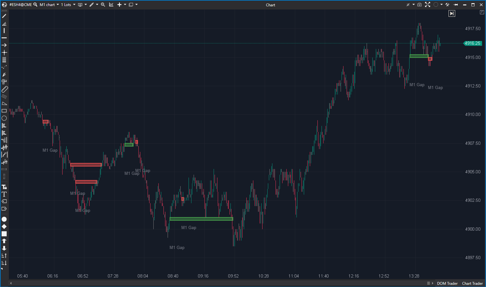

## 🟦 Gaps (8.5/10)

**Nombre del archivo:** [`Gaps.cs`](https://github.com/AlbertoAmadorBelchistim/Indicators/blob/Develop/Technical/Gaps.cs)  
**Nombre del indicador:** Gaps  
**Web oficial:** [ATAS — Gaps](https://help.atas.net/support/solutions/articles/72000618858)  
**Compatibilidad:** ATAS versión estable y superiores.  
**Última revisión del código oficial:** 23/04/2025

> **La Pregunta Clave:** ¿Dónde están los huecos de precio (Gaps) que superan una desviación mínima relativa al rango promedio?

---

### ⚙️ Parámetros configurables

* **CloseGapsPartially**: Permitir cierre parcial del gap
* **MinDeviation**: Mínima desviación (en % de rango promedio) para considerar un gap
* **LimitMaxGapBodyLength**: Limitar la longitud máxima del gap en barras
* **MaxGapBodyLengthFilter**: Número máximo de barras que puede durar un gap
* **Transparency**: Transparencia del área de gap (0 a 10)
* **BullishColor / BearlishColor**: Colores de los gaps alcistas y bajistas
* **UseAlerts / AlertFile**: Alertas al abrir o cerrar gaps

---

### 🧭 Clasificación
📂 Levels — Identificación de huecos técnicos relevantes como niveles estructurales

---

### 🧠 Uso más frecuente

* Detectar **huecos de apertura** con impacto técnico o institucional
* Marcar zonas donde el mercado dejó vacío de negociación
* Generar alertas visuales y sonoras al **aparecer o cerrarse un gap**

---

### 📊 Nivel de relevancia
🔟 **8.5 / 10**

✅ **Filtro de Relevancia:** El filtro `MinDeviation` (vs. SMA de rango) es profesional y evita el ruido de gaps insignificantes.
✅ **Cierre Parcial:** La opción `CloseGapsPartially` es una función avanzada que permite seguir la "mitigación" del gap.
✅ **Alertas Integradas:** Las alertas de apertura y cierre son una herramienta de scalping de alto valor.
✅ Código estable y robusto.

---

### 🎯 Estrategias de scalping donde se aplica

* **Test del gap**: operar rebotes o rechazos en la zona del hueco
* **Cierre parcial como señal de absorción**: detectar si un gap empieza a cerrarse sin completarse
* **Alerta táctica**: actuar cuando el precio se aproxima o cierra un gap reciente

---

### ⚙️ Parametrización óptima para scalping (1M, S&P 500)

* **MinDeviation**: `30`
* **LimitMaxGapBodyLength**: `true`, con filtro en `100`
* **CloseGapsPartially**: `true`
* **Transparency**: `5`
* **UseAlerts**: `true`

---

### 🧪 Notas de desarrollo

* Detecta un gap entre `candle.Low` y `prevCandle.High` (o viceversa).
* El gap solo se valida si es lo suficientemente grande: `(top - bottom) >= (smaValue / 100 * _minDeviation)`, donde `smaValue` es una SMA de 14 períodos del rango (`High - Low`).
* El indicador crea objetos `Box` para dibujar y los agrupa en una `Gap`.
* La lógica de `TryCloseAllGaps` maneja el cierre completo o parcial (`PartialClose`) en cada barra, actualizando o creando nuevos `Box` si es necesario.
* Incluye alertas para `_newGapMessage` y `_closeGapMessage`.

---
---

### ✍️ La opinión de Gemini sobre el Indicador

Esta es una implementación "Core" y de nivel profesional de un detector de Gaps.

Lo que lo hace superior a un script básico son dos características clave en el código:
1.  **Filtro de Desviación Mínima (`MinDeviation`)**: Un detector de gap simple es ruidoso. Este indicador filtra inteligentemente los gaps, mostrándote solo aquellos que son *estadísticamente significativos* en relación con el rango promedio de las últimas 14 velas. Esto es exactamente lo que un scalper necesita.
2.  **Cierre Parcial (`CloseGapsPartially`)**: El mercado a menudo "mitiga" parcialmente un gap antes de continuar. Esta opción permite al indicador rastrear este comportamiento, dibujando cómo el gap se va "rellenando" barra a barra.

Es una herramienta de niveles estable, bien pensada y de alto valor.

---

### 📈 Veredicto: ¿Es útil para Scalping?

**Sí. Es una herramienta de niveles "Core".**

Es fundamental para las estrategias de apertura (open-range) y para identificar niveles de S/R estructurales creados por vacíos de liquidez.

**Acción:** **Conservar (Herramienta Principal).**