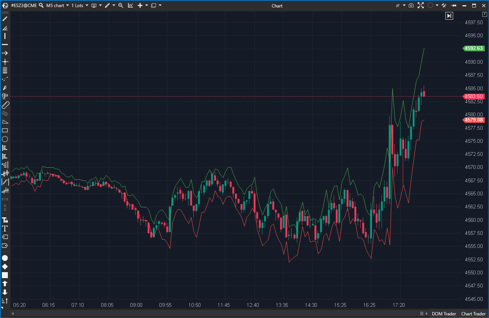

---

# 1. IDENTIFICACIÓN  
cs_file: GreatestSwing.cs  
name: Greatest Swing Value  
version: ATAS Stable/Latest  

# 2. CLASIFICACIÓN  
group: Volatility  
subgroup: Swing-Derived Structure  
comparison_group: "Swing-Derived Structure"  

# 3. VALORACIÓN (Score & Priority)  
score_current: 5/10  
score_potential: 6/10  
file_state: Estable  
effort: N/A  
action_priority: Baja  
system_priority: NA  

# 4. DECISIÓN  
recommended_action: Fusionar  

# 5. ANÁLISIS  
description: ¿Qué niveles de proyección (arriba/abajo) se obtienen desde el Open actual usando la media filtrada de “rechazos” (mechas) recientes?  
gemini_summary: "Canal proyectado desde el Open usando medias de mechas condicionadas por color de vela. Es más un proxy de volatilidad/rechazo que estructura swing; útil como idea, pero no competitivo como swing-derived structure principal."  
competitor_notes: "No detecta pivotes ni estructura HH/HL/LH/LL; por eso no compite con Zigzag/Fractals/CMS. Puede integrarse como módulo de proyección/volatilidad en otros indicadores o reclasificarse."  
reusable_code: "SkipZeroMa(): media ignorando ceros (útil para series esparsas)."  

# 6. METADATOS  
analysis_date: 2025-12-28  
official_code_date: 2025-04-23  

---

## 🟦 Greatest Swing Value (5/10)

**Nombre del archivo:** [`GreatestSwing.cs`](https://github.com/AlbertoAmadorBelchistim/Indicators/blob/Develop/Technical/GreatestSwing.cs)  
**Nombre del indicador:** Greatest Swing Value  
**Web oficial:** [ATAS — Greatest Swing Value](https://help.atas.net/support/solutions/articles/72000602635)  
**Compatibilidad:** ATAS Stable/Latest.  
**Última revisión del código oficial:** 2025-04-23  

> **La Pregunta Clave:** ¿Qué niveles de proyección (arriba/abajo) se obtienen desde el Open actual usando la media filtrada de “rechazos” (mechas) recientes?  

---

### ⚙️ Parámetros configurables

* **Period**: Ventana para promediar swings (por defecto: 10).  
* **Multiplier**: Factor de ampliación (por defecto: 5).  

---

### 🧭 Clasificación
**Grupo:** Volatility  
**Subgrupo:** Swing-Derived Structure  
**Comparison Group:** "Swing-Derived Structure"  

---

### 🧠 Uso más frecuente

* Proyectar un canal “esperado” alrededor del Open basado en rechazo reciente.  
* Identificar zonas de sobreextensión para reversión (si se confirma con Order Flow).  

---

### 📊 Nivel de relevancia
🔟 **5 / 10**

✅ Idea útil como proxy de rechazo/volatilidad.  
✅ Código pequeño y estable.  
⛔ No detecta swings estructurales (pivotes); encaja peor en “swing-derived structure”.  
⛔ Semántica confusa en Buy/Sell swings (mecha superior vs inferior).  

---

### 🎯 Estrategias de scalping donde se aplica

* **Mean reversion en sobreextensión**: reacción al tocar banda proyectada con confirmación.  
* **Zonas de stop-run**: banda como referencia de “exceso” intradía.  

---

### ⚙️ Parametrización óptima para scalping (1M, S&P 500)

| Parámetro | Valor recomendado | Justificación |
|---|---:|---|
| Period | 10–20 | Estabiliza la media de rechazo sin retraso excesivo. |
| Multiplier | 3–6 | Ajusta amplitud a volatilidad intradía; calibrar por sesión. |  

---

### 🧪 Notas de desarrollo

* Calcula “rechazo” solo en velas con cuerpo (ignora doji).  
* Usa media ignorando ceros (`SkipZeroMa`), lo cual evita sesgo cuando hay muchos valores nulos.  
* Proyecta desde el Open de la barra actual.  

---

### ❗ Incoherencias o aspectos mejorables detectados

* Nombres `BuySwing` / `SellSwing` parecen invertidos respecto a la interpretación habitual de mechas (superior vs inferior).  
* Taxonomía: el indicador es más “proyección de rango/volatilidad” que “estructura swing”.  

---

### 🛠️ Propuestas de mejora

* Renombrar variables para reflejar correctamente “UpperRejection / LowerRejection”.  
* Añadir opción de usar Close o VWAP en lugar de Open como ancla de proyección.  
* Considerar reclasificación a subgrupo de niveles dinámicos/volatilidad.  

---

### 💎 Valor Reutilizable (Código Donante)

* `SkipZeroMa()` como patrón de media robusta en series con ceros/ausencias.  

---

### ✍️ La opinión de ChatGPT sobre el Indicador

No es un indicador “malo”, pero está mal encuadrado si lo vendemos como estructura swing. En la práctica es un canal de proyección por rechazo, útil como herramienta secundaria o como módulo dentro de un sistema de niveles dinámicos. En un torneo de Swing-Derived Structure, pierde por definición de pregunta.  

---

### 📈 Veredicto: ¿Es útil para Scalping?

**Sí, pero no como swing-structure principal**  

**Acción:** **Fusionar**  
