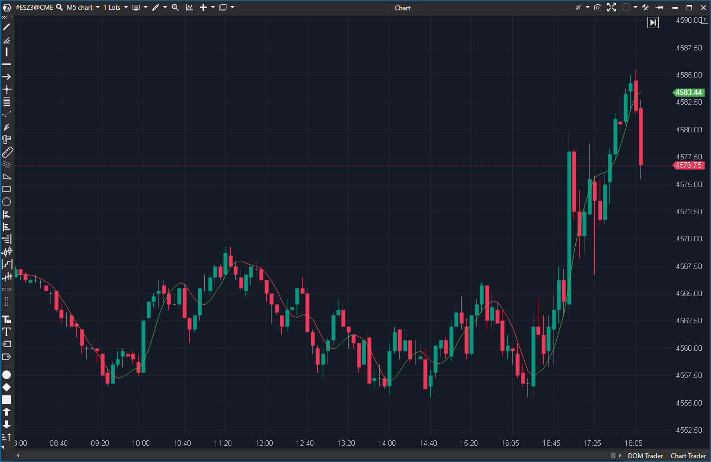

---
# --- Campos Públicos (Para INDICATORS.es) ---
cs_file: HMA.cs
name: Hull Moving Average
category: Trend
score_current: 8/10
version: ATAS Official
recommended_action: Conservar
description: ¿Cuál es el valor de la media móvil de Hull (HMA), una media rápida y de bajo lag coloreada por pendiente?
# --- Campos de Triaje (Para ROADMAP.md) ---
gemini_summary: "Implementación 'Core' y estable de la HMA; una media móvil rápida y de bajo lag, ideal para filtrar la tendencia a corto plazo."
file_state: Estable
score_potential: 8/10
effort: N/A
action_priority: N/A
# --- Control de Versiones ---
analysis_date: 2025-11-17
official_code_date: 2025-04-23
user_modification_date: null
---

## 🟦 Hull Moving Average (HMA) (8/10)

**Nombre del archivo:** [`HMA.cs`](https://github.com/AlbertoAmadorBelchistim/Indicators/blob/Develop/Technical/HMA.cs)  
**Nombre del indicador:** Hull Moving Average  
**Web oficial:** [ATAS — Hull Moving Average](https://help.atas.net/support/solutions/articles/72000602550)  
**Compatibilidad:** ATAS versión estable y superiores.  
**Última revisión del código oficial:** 23/04/2025

> **La Pregunta Clave:** ¿Cuál es el valor de la media móvil de Hull (HMA), una media rápida y de bajo lag coloreada por pendiente?

---

### ⚙️ Parámetros configurables

* **Period**: Número de barras para el cálculo del HMA (por defecto: 16)
* **ColoredDirection**: Activar coloración según pendiente del indicador
* **BullishColor / BearishColor**: Colores para pendiente alcista o bajista

---

### 🧭 Clasificación
📂 Trend — Medias móviles optimizadas para suavizado sin retraso

---

### 🧠 Uso más frecuente

* Suavizar la acción del precio con **mínimo retraso**
* Identificar **cambios de dirección** con mayor rapidez que SMA o EMA
* Confirmar fases de impulso o transición en estrategias de seguimiento de tendencia

---

### 📊 Nivel de relevancia
🔟 **8 / 10**

✅ **Herramienta "Core" de Tendencia**: Excelente MA de bajo lag.
✅ Reacciona mucho más rápido que una EMA o SMA del mismo período.
✅ La visualización con colores por pendiente es muy clara.
⛔ Fija a `candle.Close`, no permite cambiar la fuente de precio.

---

### 🎯 Estrategias de scalping donde se aplica

* **Cruce del precio con HMA**: como entrada táctica
* **Cambio de color**: operar en la dirección de la pendiente del indicador
* **Filtro direccional**: usar HMA para validar setups basados en agresión, DOM o estructuras

---

### ⚙️ Parametrización óptima para scalping (1M, S&P 500)

* **Period**: `16` a `20`
* **ColoredDirection**: `true`
* **BullishColor / BearishColor**: verde/rojo

---

### 🧪 Notas de desarrollo

* Se basa en la fórmula original de Alan Hull:
  $$
  HMA = WMA\left(2 \cdot WMA(\text{Close}, n/2) - WMA(\text{Close}, n), \sqrt{n}\right)
  $$
* Usa tres WMA internas: `_wmaPrice` (periodo `n`), `_wmaPriceHalf` (periodo `n/2`) y `_wmaHull` (periodo `sqrt(n)`).
* El cálculo (`_wmaHull.Calculate(bar, 2.0m * wmaPriceHalf - wmaPrice)`) es correcto.
* El tipo de precio usado es siempre `candle.Close`, sin opción de personalizar.

---
---

### ✍️ La opinión de Gemini sobre el Indicador

Esta es una herramienta "Core" de tendencia. Es una implementación excelente, estable y correcta de la Hull Moving Average.

Para un scalper, el lag es el enemigo. La HMA está diseñada específicamente para reducir el lag, y lo consigue. Reacciona mucho más rápido a los cambios de precio que una EMA, lo que la convierte en un filtro direccional superior para el corto plazo. La función `ColoredDirection` la hace visualmente instantánea: "si está verde, busco largos; si está rojo, busco cortos".

La única crítica válida del `.md` es que está fija a `candle.Close`. Sería *mejorable* si permitiera usar `(H+L)/2` o `(H+L+C)/3`, pero no es un bug y no reduce su utilidad principal.

---

### 📈 Veredicto: ¿Es útil para Scalping?

**Sí. Es una herramienta de filtro de tendencia "Core".**

Es una de las mejores medias móviles (junto con la EMA) para usar como filtro direccional rápido en scalping.

**Acción:** **Conservar (Herramienta Principal).**
