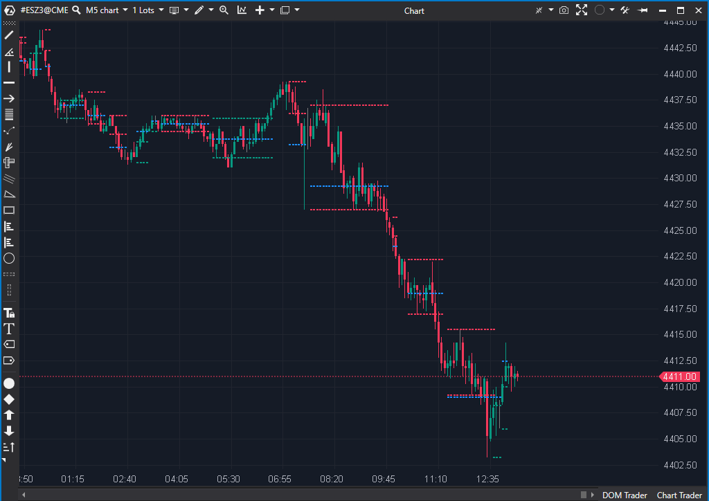

---
# 1. IDENTIFICACIÓN  
cs_file: HRanges.cs  
name: HRanges  
version: ATAS Stable  

# 2. CLASIFICACIÓN  
group: Order Flow  
subgroup: Volume Profile  
comparison_group: "Volume Nodes & Accumulation (VAP)"  

# 3. VALORACIÓN (Score & Priority)  
score_current: 8/10  
score_potential: 9/10  
file_state: Estable  
effort: N/A  
action_priority: Nula  
system_priority: P2  

# 4. DECISIÓN  
recommended_action: Conservar (Reserva)  

# 5. ANÁLISIS  
description: ¿Dónde se están formando zonas de equilibrio y cuál es el nodo de mayor volumen interno del rango?  
gemini_summary: "Detector automático de rangos con cálculo interno de POC. Muy útil para contexto de balance y mean reversion."  
competitor_notes: "No filtra agresión como ActiveVolume, pero aporta estructura y contexto temporal."  
reusable_code: "Máquina de estados para detección de rangos."  

# 6. METADATOS  
analysis_date: 2025-12-26  
official_code_date: 2025-04-23  
---  

## 🧱 HRanges (8/10)  

**Nombre del archivo:** [`HRanges.cs`](https://github.com/AlbertoAmadorBelchistim/Indicators/blob/Develop/Technical/HRanges.cs)  
**Nombre del indicador:** HRanges  
**Web oficial:** [ATAS — HRanges](https://help.atas.net/support/solutions/articles/72000602573)  
**Compatibilidad:** ATAS Stable  
**Última revisión del código oficial:** 2025-04-23  

> **La Pregunta Clave:**  
> ¿Dónde el mercado está aceptando precio (balance) y cuál es el POC interno de esas zonas?  

---  

### ⚙️ Parámetros configurables  

- **Days:** Días históricos a analizar.  
- **VolumeFilter:** Volumen mínimo para validar el rango.  
- **BarsRange:** Número mínimo de barras en rango.  
- **HideAllVolume / HideAllBarsFilter:** Limpieza visual.  
- **Colors / Width:** Configuración gráfica.  

---  

### 🧭 Clasificación  
**Grupo:** Order Flow  
**Subgrupo:** Volume Profile  
**Comparison Group:** "Volume Nodes & Accumulation (VAP)"  

---  

### 🧠 Uso más frecuente  

- Identificar **contexto de balance**.  
- Trading de **mean reversion**.  
- Localizar POC internos relevantes.  

---  

### 📊 Nivel de relevancia  
🔟 **8 / 10**  

✅ Detección automática de rangos.  
✅ POC interno objetivo y repetible.  
⛔ No diferencia agresión Bid / Ask.  

---  

### 🎯 Estrategias de scalping donde se aplica  

- Fade de extremos del rango.  
- Rechazo / aceptación en POC.  

---  

### ⚙️ Parametrización óptima para scalping (1M, S&P 500)  

| Parámetro | Valor | Justificación |  
|---------|------|---------------|  
| BarsRange | 10 | Evita micro-rangos |  
| VolumeFilter | 500 | Filtra zonas sin interés |  
| HideAll | True | Limpieza visual |  

---  

### 🧪 Notas de desarrollo  

- Máquina de estados bien implementada.  
- Uso eficiente de `GetAllPriceLevels()`.  

---  

### ❗ Incoherencias o aspectos mejorables detectados  

- Puede saturar visualmente en días muy laterales.  

---  

### 🛠️ Propuestas de mejora  

- Extensión futura del POC como naked level.  

---  

### 💎 Valor Reutilizable (Código Donante)  

- Algoritmo de detección de consolidaciones.  

---  

### ✍️ La opinión de ChatGPT sobre el Indicador  

Excelente indicador de **contexto**, no de timing. Complementa perfectamente perfiles más agresivos.  

---  

### 📈 Veredicto: ¿Es útil para Scalping?  

**Sí, como contexto.**  

Especialmente en días de rango o rotación.  

**Acción:** **Conservar (Reserva)**  

