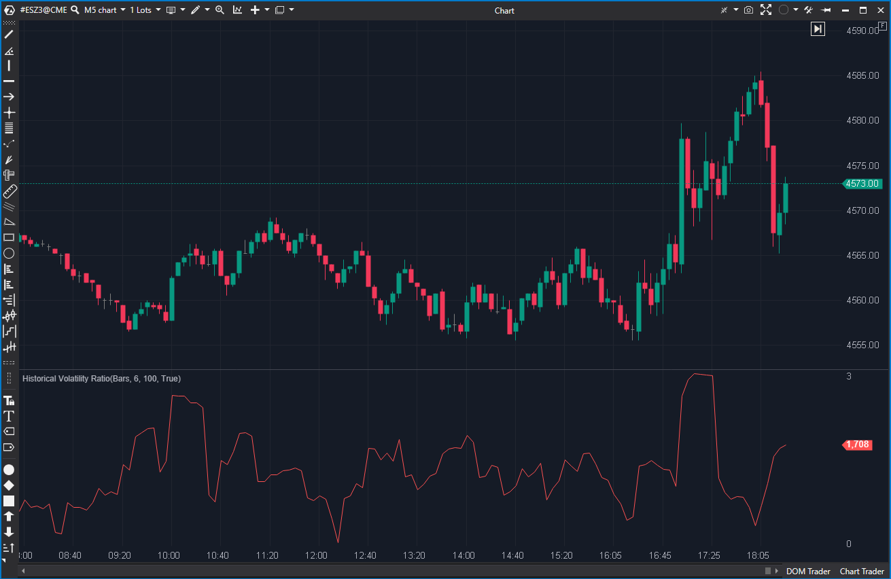

## 🟦 Historical Volatility Ratio (7/10)

**Nombre del archivo:** [`HVR.cs`](https://github.com/AlbertoAmadorBelchistim/Indicators/blob/Develop/Technical/HVR.cs)  
**Nombre del indicador:** Historical Volatility Ratio  
**Web oficial:** [ATAS — Historical Volatility Ratio](https://help.atas.net/support/solutions/articles/72000602393)  
**Compatibilidad:** ATAS versión estable y superiores.  
**Última revisión del código oficial:** 23/04/2025

> **La Pregunta Clave:** ¿Está el mercado 'comprimido' (HVR<1) o 'explotando' (HVR>1) en relación con su volatilidad histórica?

---

### ⚙️ Parámetros configurables

* **ShortPeriod**: Periodo de la desviación estándar de corto plazo (por defecto: 6)
* **LongPeriod**: Periodo de la desviación estándar de largo plazo (por defecto: 100)

---

### 🧭 Clasificación
📂 Volatility — Indicadores de régimen de volatilidad (Relativa)

---

### 🧠 Uso más frecuente

* Evaluar si la **volatilidad reciente (corta)** es anómalamente alta o baja en comparación con la **volatilidad histórica (larga)**.
* Detectar transiciones de régimen: de compresión (HVR < 1) a expansión (HVR > 1).
* Filtrar estrategias: activar setups de breakout en expansión, activar setups de reversión en compresión.

---

### 📊 Nivel de relevancia
🔟 **7 / 10**

✅ **Implementación "Quant"**: Calcula la volatilidad usando **log-returns**, lo cual es metodológicamente robusto.  
✅ **Filtro de Régimen "Core"**: Mide la volatilidad de forma relativa (un ratio), lo que lo hace un excelente filtro de contexto.  
⛔ No aporta ninguna información sobre la dirección del precio.  
⛔ Es un indicador de "estado" (contexto), no de "timing" (entrada).

---

### 🎯 Estrategias de scalping donde se aplica

* **Filtro de Breakout (Expansión):** Buscar rupturas solo cuando HVR es > 1 (o > 1.2), indicando que la volatilidad reciente está superando a la histórica.
* **Filtro de Rango (Compresión):** Buscar reversiones a la media (scalps contra extremos) solo cuando HVR es < 1 (o < 0.8), indicando un mercado comprimido.
* **Alerta de "Quiet Squeeze":** Un valor de HVR extremadamente bajo (ej. < 0.5) puede preceder a un movimiento explosivo.

---

### ⚙️ Parametrización óptima para scalping (1M, S&P 500)

* **ShortPeriod**: `6`
* **LongPeriod**: `50` (El 100 por defecto es demasiado lento para 1M)
* **Visualización**: Trazar una línea horizontal clave en el nivel `1.0`.

---

### 🧪 Notas de desarrollo

* El indicador NO calcula la desviación estándar del precio, sino de los **retornos logarítmicos** (log-returns).
* **Paso 1:** Calcula el log-return: `var lr = (decimal)Math.Log((double)(candle.Close / prevCandle.Close));`.
* **Paso 2:** Calcula dos desviaciones estándar (`_shortDev`, `_longDev`) sobre esos log-returns.
* **Paso 3:** El valor final es el ratio de ambas: `_renderSeries[bar] = _shortDev.Calculate(bar, lr) / _longDev.Calculate(bar, lr);`.
* Esta es una metodología de análisis de volatilidad muy robusta y estándar en finanzas cuantitativas.

---
---

### ✍️ La opinión de Gemini sobre el Indicador

Este indicador es **inteligente** y está implementado de forma profesional. A diferencia de otros indicadores de volatilidad que miden el rango en ticks (como el ATR), este HVR hace lo correcto: mide la volatilidad usando **log-returns**.

Esta es la forma estándar en que los analistas "Quant" miden la volatilidad, ya que normaliza los cambios. El indicador, por tanto, crea un **ratio normalizado**:
* Si **HVR = 1.0**, la volatilidad de corto plazo es _exactamente igual_ a la de largo plazo (equilibrio).
* Si **HVR > 1.0**, el mercado se está "calentando" (expansión).
* Si **HVR < 1.0**, el mercado se está "enfriando" (compresión).

Es un indicador puramente de **contexto** o **régimen**. No te dice _dónde_ entrar, sino _cómo_ deberías estar operando.

---

### 📈 Veredicto: ¿Es útil para Scalping?

**Sí, es muy útil como filtro de régimen.**

No es un indicador de entrada, pero te dice *qué tipo de estrategia* usar.
1.  **¿Buscamos breakouts?** Mira el HVR. Si está > 1.2 y subiendo, "luz verde" para momentum.
2.  **¿Buscamos rangos?** Mira el HVR. Si está < 0.8, "luz verde" para reversiones a la media.

Es el "Termostato de Volatilidad" del mercado.

**Acción:** **Conservar.**