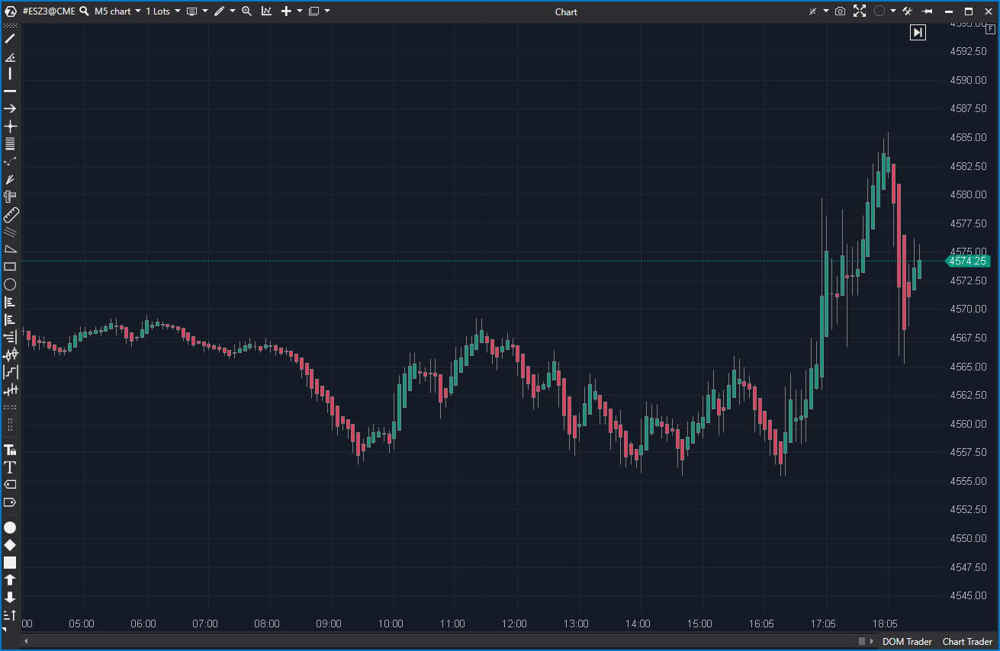

## 🟦 Heiken Ashi (6.5/10)

**Nombre del archivo:** [`HeikenAshi.cs`](https://github.com/AlbertoAmadorBelchistim/Indicators/blob/Develop/Technical/HeikenAshi.cs)  
**Nombre del indicador:** Heiken Ashi  
**Web oficial:** [ATAS — Heiken Ashi](https://help.atas.net/support/solutions/articles/72000602391)  
**Compatibilidad:** ATAS versión estable y superiores.  
**Última revisión del código oficial:** 23/04/2025

> **La Pregunta Clave:** ¿Cómo se vería el precio usando velas Heiken Ashi estándar para suavizar la tendencia?

---

### ⚙️ Parámetros configurables

* **Days**: Número de días atrás desde los cuales comenzar a calcular las velas Heiken Ashi (por defecto: 20)

---

### 🧭 Clasificación
📂 Visualization — Representación alternativa de velas para suavizar estructura

---

### 🧠 Uso más frecuente

* Suavizar el comportamiento del precio para eliminar ruido
* Detectar **cambios de tendencia** visualmente más claros
* Evaluar fases de **impulso o retroceso** mediante la dirección de las velas

---

### 📊 Nivel de relevancia
🔟 **6.5 / 10**

✅ **Herramienta "Core" de Visualización**: Ideal para detectar visualmente la dirección y estabilidad de la tendencia.  
✅ Implementación estable y precisa de la fórmula estándar.  
✅ Incluye optimización de carga (`Days`).  
⛔ Puede retrasar las señales reales al suavizar los datos.

---

### 🎯 Estrategias de scalping donde se aplica

* **Entrada tras dos velas consecutivas del mismo color**
* **Confirmación visual de tendencia** antes de ejecutar setups más agresivos
* **Filtro contextual**: operar solo en dirección de Heiken Ashi si se mantiene firme

---

### ⚙️ Parametrización óptima para scalping (1M, S&P 500)

* **Days**: `5` (para scalping, no se necesita más historial)
* Dibujar sobre el gráfico principal (`DenyToChangePanel = true`)
* Usar junto con Delta o CVD para validar contexto

---

### 🧪 Notas de desarrollo

* Es una implementación estándar de Heiken Ashi.
* **Close**: `(candle.Open + candle.Close + candle.High + candle.Low) * 0.25m`
* **Open**: `(prevCandle.Open + prevCandle.Close) * 0.5m`
* **High**: `Math.Max(Math.Max(close, open), candle.High)`
* **Low**: `Math.Min(Math.Min(close, open), candle.Low)`
* Se representa usando un `CandleDataSeries` llamado `_candles`.
* El parámetro `Days` se usa para encontrar una `_targetBar` de inicio, lo cual es una **optimización de rendimiento** para no calcular todo el historial.

---
---

### ✍️ La opinión de Gemini sobre el Indicador

Esta es una implementación "Core", estable y 100% correcta del indicador de velas Heiken Ashi. Es una herramienta de visualización fundamental para los traders que buscan filtrar el ruido y ver la tendencia suavizada.

El análisis del `.md` original mencionaba una "incoherencia" sobre el cálculo de `_targetBar`. Esto no es un bug, sino una **característica de optimización**. El parámetro `Days` permite al indicador cargar solo los últimos N días, evitando procesar miles de barras en gráficos con mucho historial. Es una buena práctica de programación que lo hace más eficiente.

El indicador es estable y no requiere cambios.

---

### 📈 Veredicto: ¿Es útil para Scalping?

**Sí.**

Es una herramienta de visualización de contexto. Ayuda al scalper a "mantenerse en el lado correcto" del movimiento y a no ser "sacudido" por el ruido de las velas estándar.

**Acción:** **Conservar (Herramienta de Contexto).**
