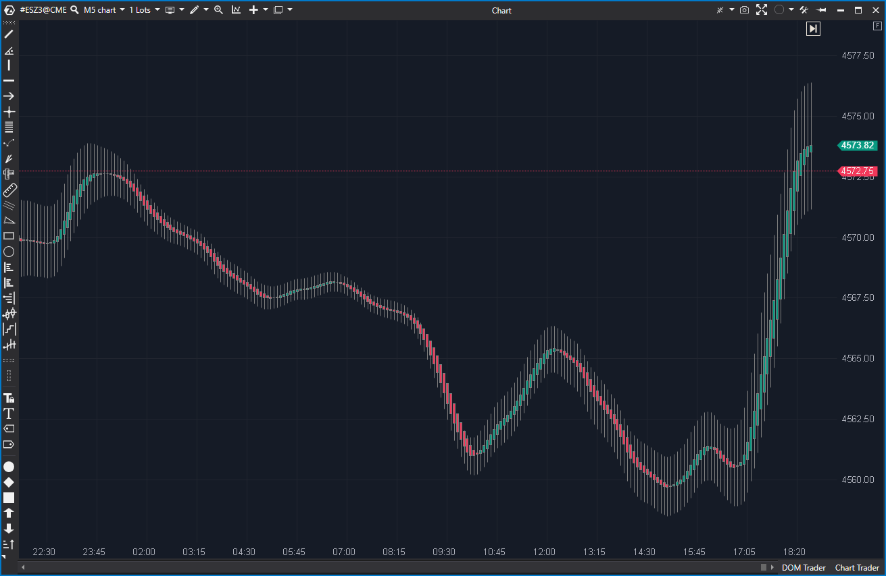

---
# --- Campos Públicos (Para INDICATORS.es) ---
cs_file: HeikenAshiSmoothed.cs
name: Heiken Ashi Smoothed
category: Visualization
score_current: 5/10
version: ATAS Official
recommended_action: 'Mejorar'
description: >-
  ¿Cómo se vería el precio usando velas Heiken Ashi "doblemente suavizadas" (SMMA + HA + WMA)?
# --- Campos de Triaje (Para ROADMAP.md) ---
gemini_summary: >-
  Implementación 'Mejorable' de un indicador de lag extremo (triple suavizado: SMMA + HA + WMA). Tiene un bug en 'bar == 0' que crea una vela inconsistente.
file_state: Mejorable
score_potential: 6/10
effort: Bajo
action_priority: P4
# --- Control de Versiones ---
analysis_date: 2025-11-17
official_code_date: 2025-04-23
user_modification_date: null
---

## 🟦 Heiken Ashi Smoothed (5/10)

**Nombre del archivo:** [`HeikenAshiSmoothed.cs`](https://github.com/AlbertoAmadorBelchistim/Indicators/blob/Develop/Technical/HeikenAshiSmoothed.cs)  
**Nombre del indicador:** Heiken Ashi Smoothed  
**Web oficial:** [ATAS — Heiken Ashi Smoothed](https://help.atas.net/support/solutions/articles/72000602392)  
**Compatibilidad:** ATAS versión estable y superiores.  
**Última revisión del código oficial:** 23/04/2025

> **La Pregunta Clave:** ¿Cómo se vería el precio usando velas Heiken Ashi "doblemente suavizadas" (SMMA + HA + WMA)?

---

### ⚙️ Parámetros configurables

* **SmmaPeriod**: Periodo de suavizado tipo SMMA (por defecto: 10)
* **WmaPeriod**: Periodo de suavizado tipo WMA para la salida visual (por defecto: 10)
* **ShowBars**: Mostrar o no las barras suavizadas en el gráfico

---

### 🧭 Clasificación
📂 Visualization — Representación suavizada de velas para análisis de tendencia

---

### 🧠 Uso más frecuente

* Eliminar ruido extremo del gráfico mediante velas Heiken Ashi doblemente suavizadas
* Identificar cambios de tendencia de muy largo plazo (para un gráfico de scalping)

---

### 📊 Nivel de relevancia
🔟 **5 / 10**

✅ Elimina casi todo el ruido visual.
⛔ **Lag Extremo:** Es un "triple suavizado" (SMMA + HA + WMA). Es demasiado lento para scalping.
⛔ **Bug Menor:** La lógica para `bar == 0` es inconsistente y dibuja una primera vela incorrecta.
⛔ Redundante con `HeikenAshi` (6.5/10) que ya suaviza la tendencia.

---

### 🎯 Estrategias de scalping donde se aplica

* **Ninguna.** Es demasiado lento. Para cuando este indicador cambia de color, el movimiento de scalping ya ha terminado.
* (Uso en swing trading) Filtro de tendencia visual.

---

### ⚙️ Parametrización óptima para scalping (1M, S&P 500)

* **No recomendado** debido a su lag extremo.

---

### 🧪 Notas de desarrollo

* Aplica primero un **suavizado SMMA** independiente a Open, High, Low y Close de las velas originales.
* Luego, calcula una vela tipo Heiken Ashi (`_candles`) basada en estos valores SMMA suavizados.
* Finalmente, aplica un segundo **suavizado WMA** a la vela Heiken Ashi (`_candles`) para mostrar la versión final (`_smoothedCandles`).
* **Bug en `bar == 0`**: La lógica `OnCalculate` para `bar == 0` usa la vela *original* para `_candles[bar]` y omite el cálculo del WMA, generando una vela inicial que no es coherente con el resto del cálculo.

---
---

### ✍️ La opinión de Gemini sobre el Indicador

Este es un indicador derivado que lleva el concepto de "suavizado" al extremo. El `HeikenAshi` (6.5/10) ya es un suavizado. Este indicador le aplica un suavizado **SMMA** *antes* de calcular el HA, y un suavizado **WMA** *después*.

El resultado es un **lag extremo**. Para un scalper, esta herramienta es inútil, ya que las velas cambiarán de color mucho después de que el precio real haya girado.

Además, como detectó el `.md` original, el código tiene un bug en `bar == 0` que causa que la primera vela renderizada sea inconsistente. Es mejorable (para arreglar el bug), pero su utilidad es casi nula para scalping.

---

### 📈 Veredicto: ¿Es útil para Scalping?

**No.**

Es demasiado lento (lag excesivo) y es redundante con `HeikenAshi`.

**Acción:** **Mejorar (Prioridad Baja)** (para corregir el bug) o **Descartar (Redundante/Lento)**.
