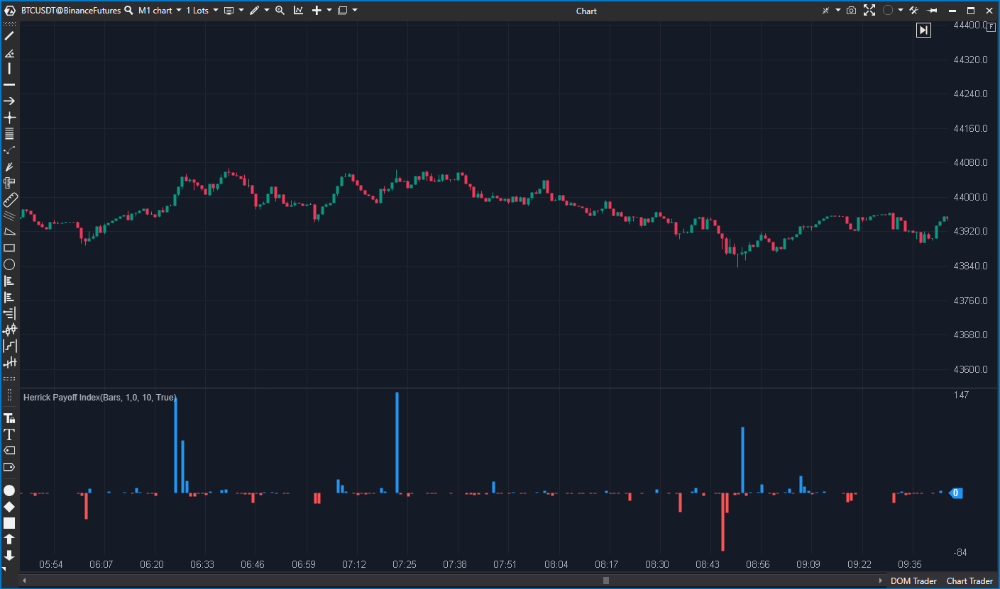

---
# --- Campos Públicos (Para INDICATORS.es) ---
cs_file: HerrickPayoff.cs
name: Herrick Payoff Index (HPI)
category: Volume
score_current: 3/10
version: ATAS Official
recommended_action: 'Reparar'
description: >-
  ¿Cuál es la fuerza del movimiento (Precio + Volumen + Open Interest)? (Implementación Rota)
# --- Campos de Triaje (Para ROADMAP.md) ---
gemini_summary: >-
  Indicador 'Roto'; el concepto (Precio+Vol+OI) es 8/10, but la implementación del 'Smooth' no es un suavizado, sino un acumulador de diferencias que genera valores erróneos.
file_state: Roto
score_potential: 8/10
effort: Medio
action_priority: P2
# --- Control de Versiones ---
analysis_date: 2025-11-17
official_code_date: 2025-04-23
user_modification_date: null
---

## 🟦 Herrick Payoff Index (HPI) (3/10)

**Nombre del archivo:** [`HerrickPayoff.cs`](https://github.com/AlbertoAmadorBelchistim/Indicators/blob/Develop/Technical/HerrickPayoff.cs)  
**Nombre del indicador:** Herrick Payoff Index  
**Web oficial:** [ATAS — Herrick Payoff Index](https://help.atas.net/support/solutions/articles/72000602286)  
**Compatibilidad:** ATAS versión estable y superiores.  
**Última revisión del código oficial:** 23/04/2025

> **La Pregunta Clave:** ¿Cuál es la fuerza del movimiento (Precio + Volumen + Open Interest)? (Implementación Rota)

---

### ⚙️ Parámetros configurables

* **Divisor**: Factor divisor aplicado al cálculo principal para escalar los valores
* **Smooth**: (Nombre incorrecto) Factor de multiplicación para la acumulación de diferencias (por defecto: 10)
* **PosColor / NegColor**: Colores para valores positivos o negativos del histograma

---

### 🧭 Clasificación
📂 Volume — Indicadores que combinan volumen, OI y desplazamiento de precio

---

### 🧠 Uso más frecuente

* (Teórico) Evaluar la **fuerza real del movimiento** considerando el volumen, la variación del precio y el interés abierto (OI)
* (Teórico) Detectar divergencias entre precio y flujo de contratos

---

### 📊 Nivel de relevancia
🔟 **3 / 10**

✅ **Concepto 8/10:** La idea de combinar Precio, Volumen y OI es excelente.  
⛔ **Implementación 1/10 (Rota):** La fórmula de "suavizado" es fundamentalmente incorrecta.  
⛔ El parámetro `Smooth` no suaviza nada; es un multiplicador de diferencias.  
⛔ El manejo de `OI == 0` es deficiente y propaga errores.  

---

### 🎯 Estrategias de scalping donde se aplica

* **Ninguna.** El indicador está roto y no produce datos fiables.

---

### ⚙️ Parametrización óptima para scalping (1M, S&P 500)

* **No recomendado** hasta que sea reparado.

---

### 🧪 Notas de desarrollo

* El indicador calcula correctamente el HPI base en `_hpiSec[bar]`.
* **El error fatal está aquí:** `_renderSeries[bar] = lastValue + _smooth * (_hpiSec[bar] - _hpiSec[bar - 1])`.
* Esto **no es un suavizado** (como una EMA o SMA). Es una acumulación de la *diferencia* de HPI, multiplicada por un factor `_smooth`.
* Esta fórmula no estándar produce un oscilador que no se parece en nada al HPI suavizado y puede generar valores explosivos e incorrectos.
* Además, si `maxOi == 0`, la función hace `return`, sin asignar valor a `_hpiSec[bar]` ni a `_renderSeries[bar]`, dejando un hueco en los datos.

---
---

### ✍️ La opinión de Gemini sobre el Indicador

Este indicador está **Roto**.

El concepto de combinar Precio, Volumen y Open Interest es de nivel profesional y tiene un potencial de 8/10.

Sin embargo, la implementación es fundamentalmente defectuosa. El `.md` original identificó correctamente que el parámetro `Smooth` no actúa como una media móvil. Al revisar el código, se confirma que la fórmula `lastValue + _smooth * (_hpiSec[bar] - _hpiSec[bar - 1])` no es un suavizado en absoluto. Es una fórmula de acumulación de diferencias inventada que no representa el Índice Herrick Payoff y puede "explotar" o dar valores completamente erróneos.

Además, el manejo de `OI == 0` es deficiente y puede corromper los datos.

**Propuesta de Reparación (Esfuerzo Medio):**
1.  Eliminar la fórmula de acumulación `renderValue`.
2.  Implementar un suavizado real (ej. `EMA` o `SMA`) sobre `_hpiSec[bar]`.
3.  Asignar `_renderSeries[bar]` al resultado de esa media móvil.
4.  Corregir el `return` de `OI == 0` para que asigne `_hpiSec[bar] = _hpiSec[bar-1]` y continúe el cálculo del suavizado, evitando huecos.

---

### 📈 Veredicto: ¿Es útil para Scalping?

**No. Es un indicador "Roto" que no debe usarse.**

La fórmula de cálculo principal es incorrecta y genera datos que no son fiables.

**Acción:** **Reparar (Prioridad Alta).**
