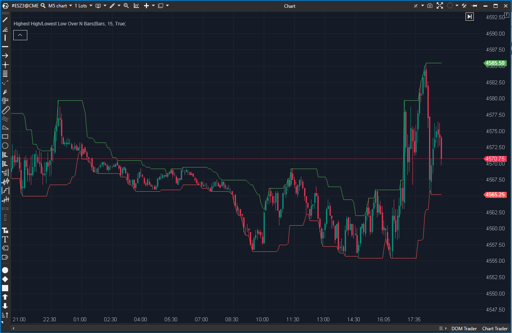

---

# 1. IDENTIFICACIÓN  
cs_file: HighLow.cs  
name: Highest High/Lowest Low Over N Bars  
version: ATAS Stable/Latest  

# 2. CLASIFICACIÓN  
group: Market Structure  
subgroup: Extremes & Range Structure  
comparison_group: "Extremes & Range Structure"  

# 3. VALORACIÓN (Score & Priority)  
score_current: 7/10  
score_potential: 7/10  
file_state: Estable  
effort: N/A  
action_priority: Nula  
system_priority: P3  

# 4. DECISIÓN  
recommended_action: Conservar (Reserva)  

# 5. ANÁLISIS  
description: ¿Cuál es el máximo High y el mínimo Low de las últimas N barras?  
gemini_summary: "Canal de extremos eficiente y muy simple. Es un backup válido, pero pierde frente a Donchian por no incluir midline opcional ni robustez ante High/Low=0."  
competitor_notes: "Es funcionalmente redundante con Donchian (mismo objetivo de canal). Se mantiene como reserva por su simplicidad y por usar MAX/MIN sobre series internas."  
reusable_code: "Uso de MAX/MIN sobre ValueDataSeries como patrón rápido para rolling extremes."  

# 6. METADATOS  
analysis_date: 2025-12-28  
official_code_date: 2025-04-23  

---

## 🟦 Highest High/Lowest Low Over N Bars (7/10)

**Nombre del archivo:** [`HighLow.cs`](https://github.com/AlbertoAmadorBelchistim/Indicators/blob/Develop/Technical/HighLow.cs)  
**Nombre del indicador:** Highest High/Lowest Low Over N Bars  
**Web oficial:** [ATAS — Highest High / Lowest Low Over N Bars](https://help.atas.net/support/solutions/articles/72000602244)  
**Compatibilidad:** ATAS Stable/Latest.  
**Última revisión del código oficial:** 2025-04-23  

> **La Pregunta Clave:** ¿Cuál es el máximo High y el mínimo Low de las últimas N barras?  

---

### ⚙️ Parámetros configurables

* **Period**: Número de barras para calcular el máximo y el mínimo (por defecto: 15).  

---

### 🧭 Clasificación
**Grupo:** Market Structure  
**Subgrupo:** Extremes & Range Structure  
**Comparison Group:** "Extremes & Range Structure"  

---

### 🧠 Uso más frecuente

* Definir canal superior/inferior del rango reciente (breakouts y fail breaks).  
* Soportes/resistencias dinámicos de corto plazo.  

---

### 📊 Nivel de relevancia
🔟 **7 / 10**

✅ Simple, legible y eficiente (rolling MAX/MIN).  
✅ Buen backup “mínimo viable” para canal de rango.  
⛔ Redundante con Donchian, que ofrece midline y mayor robustez de datos.  

---

### 🎯 Estrategias de scalping donde se aplica

* **Breakout por canal**: ruptura del máximo/mínimo del periodo.  
* **Trailing estructural**: usar el mínimo como stop dinámico en largos (y viceversa).  

---

### ⚙️ Parametrización óptima para scalping (1M, S&P 500)

| Parámetro | Valor recomendado | Justificación |
|---|---:|---|
| Period | 15–20 | Mantiene equilibrio entre sensibilidad y ruido en M1. |  

---

### 🧪 Notas de desarrollo

* Calcula `High/Low` por barra y aplica `MAX/MIN` sobre series internas.  
* Muy buen perfil de rendimiento y mínima complejidad.  
* No aporta midline ni control de visualización adicional.  

---

### ❗ Incoherencias o aspectos mejorables detectados

* No hay errores evidentes; la limitación es funcional (menos features que Donchian).  

---

### 🛠️ Propuestas de mejora

* Si se quisiera competir con Donchian: añadir midline opcional y/o fallback defensivo para feeds incompletos.  

---

### 💎 Valor Reutilizable (Código Donante)

* Patrón rápido: `ValueDataSeries.MAX(period, bar)` y `MIN(period, bar)` aplicado a series internas.  

---

### ✍️ La opinión de ChatGPT sobre el Indicador

Es un canal de rango válido, pero en un sistema real de scalping interesa minimizar redundancias. Donchian cubre el mismo caso de uso y añade midline (decisiones de rotación) y robustez.  
Aun así, mantenerlo como “reserva” tiene sentido por su simplicidad y por si quieres una versión sin extras en layouts muy cargados.  

---

### 📈 Veredicto: ¿Es útil para Scalping?

**Sí (como reserva)**  

**Acción:** **Conservar (Reserva)**  
