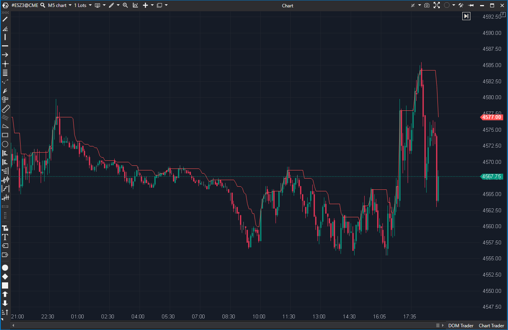

---
# --- Campos Públicos (Para INDICATORS.es) ---
cs_file: Highest.cs
name: Highest
category: Levels
score_current: 6/10
version: ATAS Official
recommended_action: 'Descartar'
description: >-
  ¿Cuál es el valor más alto del "Source" (por defecto, el Cierre) de las últimas N barras?
# --- Campos de Triaje (Para ROADMAP.md) ---
gemini_summary: >-
  Indicador estable que traza el 'Highest Close' (por defecto). Es funcionalmente redundante y menos útil que el indicador 'HighLow' (Donchian Channel).
file_state: Estable
score_potential: 6/10
effort: N/A
action_priority: N/A
# --- Control de Versiones ---
analysis_date: 2025-11-17
official_code_date: 2025-04-23
user_modification_date: null
---

## 🟦 Highest (6/10)

**Nombre del archivo:** [`Highest.cs`](https://github.com/AlbertoAmadorBelchistim/Indicators/blob/Develop/Technical/Highest.cs)  
**Nombre del indicador:** Highest  
**Web oficial:** [ATAS — Highest](https://help.atas.net/support/solutions/articles/72000602627)  
**Compatibilidad:** ATAS versión estable y superiores.  
**Última revisión del código oficial:** 23/04/2025

> **La Pregunta Clave:** ¿Cuál es el valor más alto del "Source" (por defecto, el Cierre) de las últimas N barras?

---

### ⚙️ Parámetros configurables

* **Period**: Número de barras usadas para buscar el valor máximo (por defecto: 10)

---

### 🧭 Clasificación
📂 Levels — Indicadores que marcan extremos locales o históricos

---

### 🧠 Uso más frecuente

* Marcar el **punto más alto** dentro de una ventana móvil (basado en `SourceDataSeries`, usualmente `Close`)
* Detectar **niveles de resistencia dinámica**

---

### 📊 Nivel de relevancia
🔟 **6 / 10**

✅ Ligero y preciso en su cálculo.  
⛔ **Redundante:** Es funcionalmente inferior al indicador `HighLow` (7/10), que traza tanto el máximo (`High`) como el mínimo (`Low`), proporcionando el canal completo.  
⛔ Menos útil: Los traders de breakout suelen preferir el "Highest High" (que traza `HighLow`) en lugar del "Highest Close" (que traza este).

---

### 🎯 Estrategias de scalping donde se aplica

* **Breakout alcista**: entrada si el precio supera el valor de Highest
* **Zona de rechazo**: actuar si el precio toca el nivel y aparece absorción

---

### ⚙️ Parametrización óptima para scalping (1M, S&P 500)

* **Period**: `20`
* *Recomendación: Usar el indicador `HighLow` (7/10) en su lugar.*

---

### 🧪 Notas de desarrollo

* El cálculo recorre `SourceDataSeries` (por defecto `Close`) desde `bar - Period + 1` hasta `bar`.
* Se usa `Math.Max` para encontrar el mayor valor dentro de esa ventana.
* El resultado se plotea como una sola línea (`this[bar] = max`).
* El `.md` sugiere que no se puede cambiar la fuente a `High`, `Delta`, etc. Esto es **incorrecto**. Al ser un indicador que opera sobre `SourceDataSeries`, el usuario *puede* cambiar la fuente de entrada a `High`, `Low`, `Delta`, etc., desde la UI de ATAS.

---
---

### ✍️ La opinión de Gemini sobre el Indicador

Este es un indicador `Estable` pero **Redundante**.

Calcula y traza el valor más alto del `SourceDataSeries` (que por defecto es el `Close`) en las últimas N barras.

El problema es que ATAS ya proporciona el indicador `HighLow` (7/10), que es el Canal Donchian/Price Channel. `HighLow` traza el *Highest High* y el *Lowest Low*, que es lo que el 99% de los traders de breakout buscan.

Este indicador (`Highest`) solo traza el *Highest Close* y no traza el mínimo. Por lo tanto, es menos funcional y redundante.

---

### 📈 Veredicto: ¿Es útil para Scalping?

**Poco.**

Es técnicamente estable, pero es una herramienta inferior al indicador `HighLow`, que proporciona más información (el canal completo) y usa los datos correctos (High/Low) para el análisis de breakout.

**Acción:** **Descartar (Redundante).**