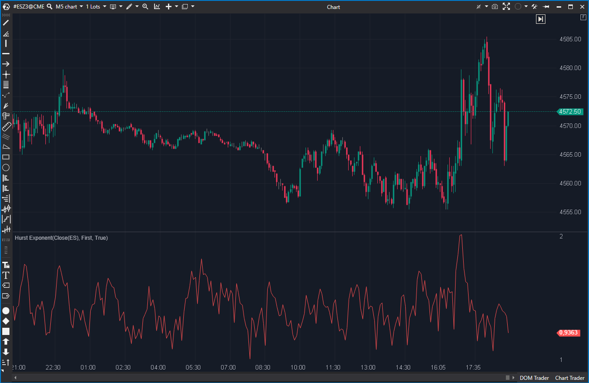

---
# --- Campos Públicos (Para INDICATORS.es) ---
cs_file: HurstExponent.cs
name: Hurst Exponent
category: Statistical
score_current: 8/10
version: ATAS Official
recommended_action: Conservar
description: ¿El comportamiento del mercado es tendencial (persistente, H>0.5), de reversión (antipersistente, H<0.5) o aleatorio (H=0.5)?
# --- Campos de Triaje (Para ROADMAP.md) ---
gemini_summary: "Implementación 'Quant' estable del exponente de Hurst (R/S); una herramienta de 'régimen' de alto nivel, aunque su uso de 'Math.Abs()' es una peculiaridad de diseño."
file_state: Estable
score_potential: 8/10
effort: N/A
action_priority: N/A
# --- Control de Versiones ---
analysis_date: 2025-11-17
official_code_date: 2025-04-23
user_modification_date: null
---

## 🟦 Hurst Exponent (8/10)

**Nombre del archivo:** [`HurstExponent.cs`](https://github.com/AlbertoAmadorBelchistim/Indicators/blob/Develop/Technical/HurstExponent.cs)  
**Nombre del indicador:** Hurst Exponent  
**Web oficial:** [ATAS — Hurst Exponent](https://help.atas.net/support/solutions/articles/72000602551)  
**Compatibilidad:** ATAS versión estable y superiores.  
**Última revisión del código oficial:** 23/04/2025

> **La Pregunta Clave:** ¿El comportamiento del mercado es tendencial (persistente, H>0.5), de reversión (antipersistente, H<0.5) o aleatorio (H=0.5)?

---

### ⚙️ Parámetros configurables

* **Length**: Periodo base sobre el cual se evalúa el exponente, en potencias de 2 (32, 64, 128)

---

### 🧭 Clasificación
📂 Statistical — Indicadores basados en propiedades estadísticas del comportamiento del precio

---

### 🧠 Uso más frecuente

* Evaluar si un mercado presenta **comportamiento persistente (tendencia), aleatorio o antipersistente (reversión)**
* Detectar **tendencias estables** o **estructura de reversión** mediante análisis fractal
* Usar el Hurst exponent como **filtro estructural**

---

### 📊 Nivel de relevancia
🔟 **8 / 10**

✅ **Herramienta "Quant" de Régimen**: Proporciona una medida objetiva de la "memoria del mercado".  
✅ Útil como filtro estructural para saber qué tipo de estrategia aplicar (tendencia o reversión).  
⛔ Difícil de interpretar sin contexto estadístico.  
⛔ Peculiaridad de diseño: Usa `Math.Abs()` al final, eliminando el signo.

---

### 🎯 Estrategias donde se aplica

* **Filtro de Tendencia**: Activar estrategias de seguimiento de tendencia solo si H > 0.5 (y subiendo).
* **Filtro de Reversión**: Activar estrategias de reversión a la media solo si H < 0.5 (y bajando).
* **Filtro de "No Operar"**: Evitar operar si H está "plano" alrededor de 0.5 (mercado aleatorio).

---

### ⚙️ Parametrización óptima para scalping (1M, S&P 500)

* **Length**: `64` (equilibrio entre sensibilidad y fiabilidad)
* Marcar líneas guía en `0.5` (umbral aleatoriedad)

---

### 🧪 Notas de desarrollo

* Es una implementación del análisis de **Rango Re-escalado (R/S)**.
* Calcula una regresión logarítmica sobre múltiples escalas de subdivisión del periodo base (potencias de 2).
* En cada subdivisión (`shortPeriod`), calcula el Rango (`range = maxSum - minSum`) y la Desviación Estándar (`stdDev`).
* Se estima el exponente Hurst como la pendiente (`exponent`) de la regresión log-log(R/S) vs log(Período).
* El valor final renderizado es el **valor absoluto** de esta pendiente: `_renderSeries[bar] = Math.Abs(exponent);`.

---
---

### ✍️ La opinión de Gemini sobre el Indicador

Este es un indicador estadístico ("Quant") muy complejo, diseñado para hacer algo que pocos indicadores hacen: decirte *cómo* se está moviendo el mercado (en tendencia, en rango, o aleatoriamente).

El código implementa la regresión log-log del Rango Re-escalado (R/S) para estimar el exponente H. Es una herramienta de "régimen" de alto nivel.

La "incoherencia" que detectaste (el uso de `Math.Abs(exponent)` al final) es una observación excelente. Teóricamente, el exponente H debe estar entre 0 y 1. Un valor de 0.2 (antipersistente) y 0.8 (persistente) son ambos positivos, por lo que el `Math.Abs()` podría ser simplemente un "seguro" contra valores negativos que la regresión pudiera arrojar. A pesar de esta peculiaridad de diseño, el indicador es `Estable` y cumple su propósito.

---

### 📈 Veredicto: ¿Es útil para Scalping?

**Sí, como filtro de régimen.**

No te da una señal de entrada. Te dice *qué tipo de señales* deberías estar buscando (de tendencia o de reversión). Es un indicador de contexto avanzado.

**Acción:** **Conservar.**
