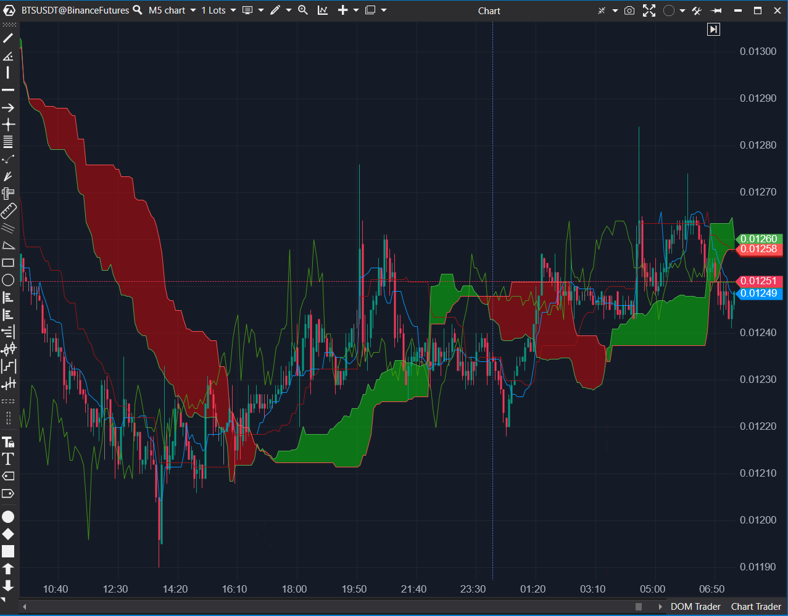

---
# --- Campos Públicos (Para INDICATORS.es) ---
cs_file: Ichimoku.cs
name: Ichimoku Kinko Hyo
category: Trend
score_current: 9/10
version: ATAS Official
recommended_action: Conservar
description: ¿Cuál es el estado de la tendencia y el equilibrio del mercado según el sistema Ichimoku (Nube, Tenkan, Kijun, Chikou)?
# --- Campos de Triaje (Para ROADMAP.md) ---
gemini_summary: "Implementación 'Core' y estable del sistema Ichimoku completo; maneja correctamente los 5 componentes y el desplazamiento temporal (Nube y Lagging)."
file_state: Estable
score_potential: 9/10
effort: N/A
action_priority: N/A
# --- Control de Versiones ---
analysis_date: 2025-11-17
official_code_date: 2025-04-23
user_modification_date: null
---

## 🟦 Ichimoku Kinko Hyo (9/10)

**Nombre del archivo:** [`Ichimoku.cs`](https://github.com/AlbertoAmadorBelchistim/Indicators/blob/Develop/Technical/Ichimoku.cs)  
**Nombre del indicador:** Ichimoku Kinko Hyo  
**Web oficial:** [ATAS — Ichimoku Kinko Hyo](https://help.atas.net/support/solutions/articles/72000602553)  
**Compatibilidad:** ATAS versión estable y superiores.  
**Última revisión del código oficial:** 23/04/2025

> **La Pregunta Clave:** ¿Cuál es el estado de la tendencia y el equilibrio del mercado según el sistema Ichimoku (Nube, Tenkan, Kijun, Chikou)?

---

### ⚙️ Parámetros configurables

* **Tenkan (Conversión)**: Periodo de la línea Tenkan-Sen (por defecto: 9)
* **Kijun (Base)**: Periodo de la línea Kijun-Sen (por defecto: 26)
* **Senkou (Span B)**: Periodo de la línea Senkou Span B (por defecto: 52)
* **Displacement**: Desplazamiento hacia adelante (para la Nube) y atrás (para Lagging) (por defecto: 26)
* **Days**: Número de sesiones atrás desde las que se empieza a calcular (0 = todo el histórico)

---

### 🧭 Clasificación
📂 Trend — Indicadores estructurales completos de tendencia y equilibrio

---

### 🧠 Uso más frecuente

* Evaluar la tendencia general usando la **Nube (Kumo)** como S/R dinámico.
* Usar el cruce de **Tenkan/Kijun** como señal de momentum a corto plazo.
* Confirmar la fuerza de la tendencia usando la **Chikou Span (Lagging)**.

---

### 📊 Nivel de relevancia
🔟 **9 / 10**

✅ **Sistema "Core" Completo:** Ofrece una visión estructural de tendencia, momentum y S/R en un solo indicador.
✅ **Implementación Correcta:** Maneja perfectamente el desplazamiento temporal (Nube futura, Lagging pasado).
✅ Dibuja la nube (Kumo) de forma eficiente usando `RangeDataSeries`.
⛔ Puede saturar el gráfico; requiere que el usuario sepa qué mirar.

---

### 🎯 Estrategias donde se aplica

* **Confirmación de tendencia (Scalping)**: Buscar largos si Precio > Nube, Tenkan > Kijun, y Chikou está libre.
* **Reversión en borde del Kumo**: Entrada si el precio rebota en el Senkou Span A o B.
* **Cruce de Tenkan/Kijun**: Como señal de entrada/salida táctica.

---

### ⚙️ Parametrización óptima para scalping (1M, S&P 500)

* **Tenkan**: `9`
* **Kijun**: `26`
* **Senkou**: `52`
* **Displacement**: `26`
* *Nota: La configuración estándar 9/26/52 es sorprendentemente robusta incluso en M1.*

---

### 🧪 Notas de desarrollo

* El indicador calcula los 5 componentes clásicos:
  * **Tenkan**: `(_conversionHigh[bar] + _conversionLow[bar]) / 2` (sobre `Tenkan` periodos)
  * **Kijun**: `(_baseHigh[bar] + _baseLow[bar]) / 2` (sobre `Kijun` periodos)
  * **Senkou A**: `(_conversionLine[bar] + _baseLine[bar]) / 2` (desplazado `+Displacement`)
  * **Senkou B**: `(_spanHigh[bar] + _spanLow[bar]) / 2` (sobre `Senkou` periodos, desplazado `+Displacement`)
  * **Chikou (Lagging)**: `candle.Close` (desplazado `-Displacement`)
* Dibuja la nube (`Kumo`) usando `_upSeries` y `_downSeries` (`RangeDataSeries`).
* Incluye optimización de carga (`Days`).

---
---

### ✍️ La opinión de Gemini sobre el Indicador

Esta es una implementación "Core", robusta y correcta del sistema Ichimoku Kinko Hyo. El código maneja limpiamente la parte más compleja del indicador: el desplazamiento temporal. Renderiza la nube (Kumo) en el futuro y la línea de Lagging (Chikou) en el pasado, lo cual es esencial para el análisis.

Para un scalper, el Ichimoku puede parecer "lento" o "pesado", pero es una herramienta de **contexto estructural** inigualable. De un vistazo, te dice:
1.  **Contexto (La Nube):** ¿Estamos por encima (alcista), por debajo (bajista) o dentro (rango) de la nube?
2.  **Momentum (Tenkan/Kijun):** ¿El corto plazo (Tenkan) está por encima del medio plazo (Kijun)?
3.  **Confirmación (Chikou):** ¿El precio "pasado" (Chikou) está libre de interferencias?

Las propuestas del `.md` (añadir checkboxes para ocultar líneas, alertas) son mejoras de QoL (Calidad de Vida) válidas, pero el núcleo del indicador es estable y no requiere reparación.

---

### 📈 Veredicto: ¿Es útil para Scalping?

**Sí. Es una herramienta de contexto "Core".**

Proporciona un mapa completo de la tendencia y los niveles de S/R dinámicos. Un scalper la usaría no para señales de entrada, sino para filtrar la dirección de sus operaciones.

**Acción:** **Conservar (Herramienta Principal).**
