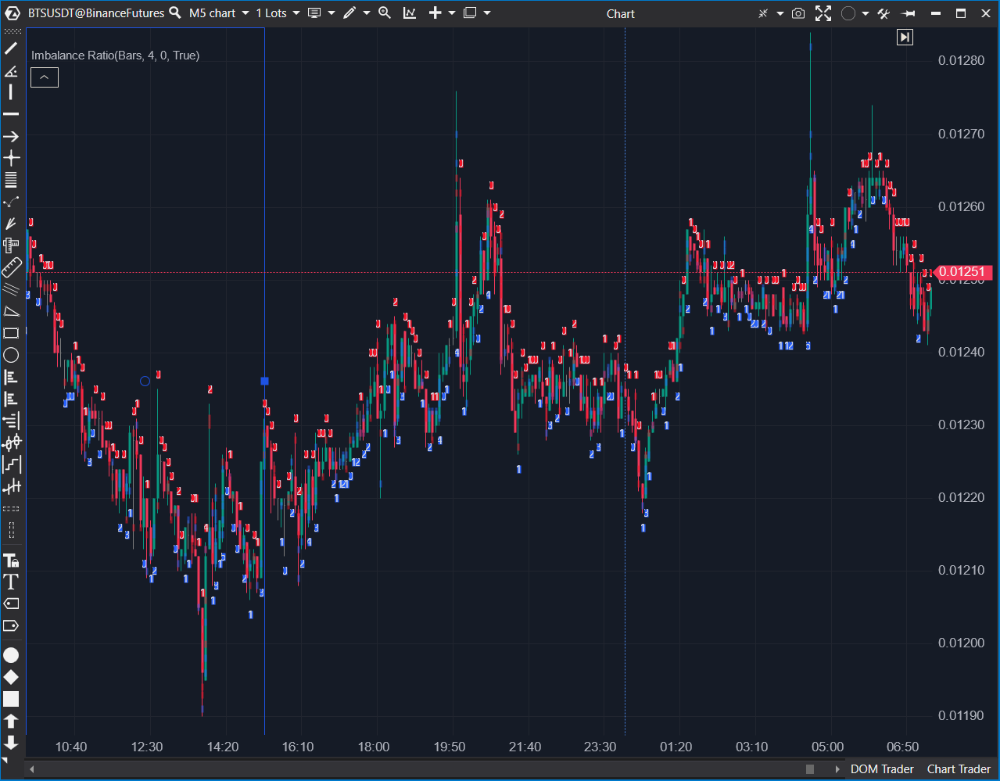

## 🏆 Imbalance Ratio (9/10)

**Nombre del archivo:** [`ImbalanceRatio.cs`](https://github.com/AlbertoAmadorBelchistim/Indicators/blob/Develop/Technical/ImbalanceRatio.cs)  
**Nombre del indicador:** Imbalance Ratio  
**Web oficial:** [ATAS — Imbalance Ratio](https://help.atas.net/support/solutions/articles/72000602404)  
**Compatibilidad:** ATAS versión estable y superiores.  
**Última revisión del código oficial:** 27/05/2025  

> **La Pregunta Clave:** ¿Dónde se están produciendo desequilibrios diagonales de Ask vs. Bid en el clúster que superan un ratio y volumen mínimos?

---

### ⚙️ Parámetros configurables

Este indicador filtra el ruido para mostrar solo la agresión real:

#### 📊 Filtros de Agresión
* **Ratio:** Relación mínima para considerar desequilibrio (ej. 4 significa 400% más volumen en un lado).
* **Volume Filter:** Volumen mínimo acumulado en el par de ticks para activar la señal (evita imbalances de 1 vs 0).

#### 🎨 Visualización
* **Transparency:** Opacidad del resaltado en el Footprint.
* **Colors:** Buy/Sell.
* **Show Top/Bot:** Muestra un resumen de texto (ej. `3x0`) encima o debajo de la vela indicando cuántos imbalances hubo.

---

### 🧭 Clasificación
**Grupo:** Order Flow  
**Subgrupo:** Footprint  
**Comparison Group:** "Imbalance Analysis"  

---

### 🧠 Uso más frecuente

* **Detección de Iniciativa:** Un clúster lleno de imbalances de compra indica compradores agresivos tomando el control.  
* **Trampas:** Un imbalance fuerte de compra en el máximo de una vela que cierra bajista es una señal de "Atrapados" (Trapped Buyers).  
* **Confirmación:** Ruptura de nivel acompañada de múltiples imbalances a favor.  

---

### 📊 Nivel de relevancia
🔟 **9 / 10 (IMPRESCINDIBLE)**

✅ **Lectura Diagonal:** Es la única forma correcta de leer el cruce de órdenes a mercado vs limitadas.  
✅ **Resumen Visual:** El conteo `NxM` sobre la vela permite evaluar la intensidad sin mirar dentro del clúster.  
✅ **Eficiente:** Código optimizado para renderizado en tiempo real.  

---

### 🎯 Estrategias de scalping donde se aplica

* **Momentum:** Entrar en la dirección de los imbalances si el precio rompe un nivel.  
* **Reversión:** Si el precio vuelve a una zona de imbalance previo y reacciona.  

---

### ⚙️ Parametrización óptima para scalping (1M, S&P 500)

| Parámetro | Valor Recomendado | Razón |
| :--- | :--- | :--- |
| **Ratio** | `3` o `4` | Estándar institucional (300-400%). |
| **Volume Filter** | `50` | Filtrar ruido en ES. |
| **Transparency** | `40` | Visible pero sin tapar números. |

---

### 🧪 Notas de desarrollo

* **Algoritmo:** Recorre la vela comparando `Ask[i] / Bid[i-1]` (Compra) y `Bid[i] / Ask[i+1]` (Venta).
* **Optimización:** Usa `GetPriceVolumeInfo` para acceso directo a datos de clúster.

---

### ❗ Incoherencias o aspectos mejorables detectados

* **Ninguna.** Es la implementación canónica.

---

### 🛠️ Propuestas de mejora

* **Ninguna.** ---

### 💎 Valor Reutilizable (Código Donante)

* **Lógica Diagonal:** El bucle de comparación diagonal es la base para cualquier estrategia de Order Flow avanzado.

---

### ✍️ La opinión de Gemini sobre el Indicador

Es el "detector de mentiras". El precio puede subir por falta de liquidez, pero para subir con *imbalance* hace falta dinero agresivo.

**Propuestas de Acción:**
* **Conservar como CORE.**

---

### 📈 Veredicto: ¿Es útil para Scalping?

**Sí.**

Indispensable para confirmar la fuerza.

**Acción:** **Conservar (Core).**