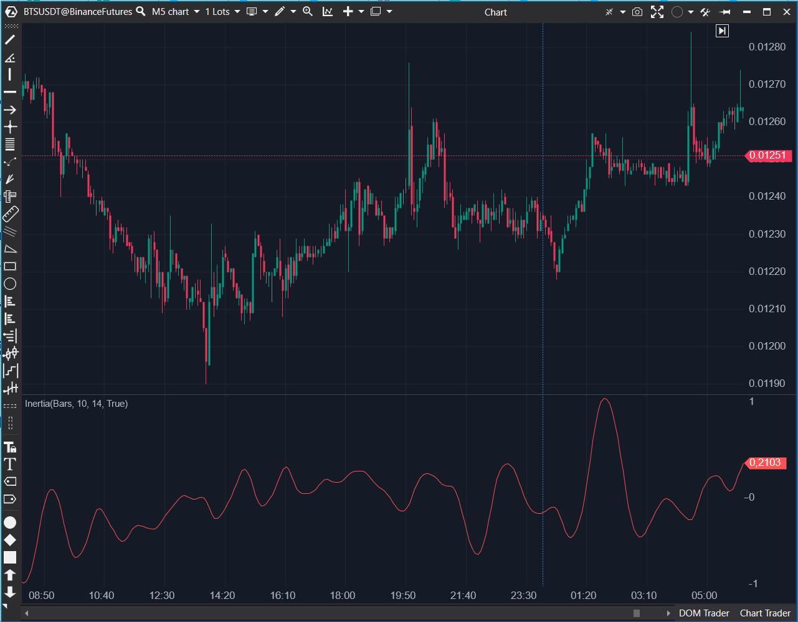

---
# --- Campos Públicos (Para INDICATORS.es) ---
cs_file: Inertia.cs
name: Inertia
category: Momentum
score_current: 6.5/10
version: ATAS Official
recommended_action: 'Descartar'
description: >-
  ¿Cuál es el momentum del RVI, suavizado por una Regresión Lineal?
# --- Campos de Triaje (Para ROADMAP.md) ---
gemini_summary: >-
  Indicador 'Derivado' y estable que aplica un 'doble suavizado' (RVI + LinearReg). Es redundante con 'Inertia2' y tiene un lag considerable.
file_state: Estable
score_potential: 6.5/10
effort: N/A
action_priority: N/A
# --- Control de Versiones ---
analysis_date: 2025-11-17
official_code_date: 2025-04-23
user_modification_date: null
---

## 🟦 Inertia (6.5/10)

**Nombre del archivo:** [`Inertia.cs`](https://github.com/AlbertoAmadorBelchistim/Indicators/blob/Develop/Technical/Inertia.cs)  
**Nombre del indicador:** Inertia  
**Web oficial:** [ATAS — Inertia](https://help.atas.net/support/solutions/articles/72000602555)  
**Compatibilidad:** ATAS versión estable y superiores.  
**Última revisión del código oficial:** 23/04/2025

> **La Pregunta Clave:** ¿Cuál es el momentum del RVI, suavizado por una Regresión Lineal?

---

### ⚙️ Parámetros configurables

* **RviPeriod**: Periodo del indicador RVI subyacente (por defecto: 10)
* **LinearRegPeriod**: Periodo de la regresión lineal aplicada al RVI (por defecto: 14)

---

### 🧭 Clasificación
📂 Momentum — Suavizado del impulso mediante regresión sobre oscilador RVI

---

### 🧠 Uso más frecuente

* Medir la **persistencia del impulso** en una dirección mediante suavizado del RVI
* Confirmar continuidad de tendencia o inicio de fatiga
* Filtrar señales erráticas de impulso en fases laterales

---

### 📊 Nivel de relevancia
🔟 **6.5 / 10**

✅ Proporciona una lectura clara del momentum suavizado.  
⛔ **Lag Excesivo**: Es un "doble suavizado" (RVI + LinearReg), lo que introduce un lag considerable.  
⛔ **Redundante**: Es conceptualmente similar y redundante con `Inertia2`.  
⛔ No expone el RVI original para comparación.

---

### 🎯 Estrategias de scalping donde se aplica

* **Filtro de Tendencia (Lento)**: Usar la pendiente de la regresión como un filtro de tendencia de fondo.
* **Evitar operaciones si Inertia es plana**: Posible lateralidad.

---

### ⚙️ Parametrización óptima para scalping (1M, S&P 500)

* **RviPeriod**: `10`
* **LinearRegPeriod**: `14`
* *Recomendación: Generalmente demasiado lento para scalping táctico.*

---

### 🧪 Notas de desarrollo

* Es un indicador "derivado" simple.
* Toma el indicador `RVI2` como entrada.
* Aplica un indicador `LinearReg` al resultado del RVI.
* El cálculo es: `_renderSeries[bar] = _linReg.Calculate(bar, _rvi[bar]);`.
* No expone el valor del RVI original, solo el resultado final de la regresión lineal.

---
---

### ✍️ La opinión de Gemini sobre el Indicador

Este es un indicador de momentum "doble suavizado". Toma un oscilador ya suavizado (el RVI) y le aplica *otro* suavizado (Regresión Lineal).

El resultado es una línea muy suave, pero que sufre de un **lag considerable**. Para un scalper, que necesita reacciones rápidas, este indicador probablemente confirmará un movimiento demasiado tarde.

Además, existe el indicador `Inertia2`, que es una reimplementación más compleja del mismo concepto. Tener ambos es redundante. Dado su lag y redundancia, este indicador es descartable.

---

### 📈 Veredicto: ¿Es útil para Scalping?

**Poco.**

Es demasiado lento para la mayoría de las estrategias de scalping. Es redundante con `Inertia2`.

**Acción:** **Descartar (Redundante / Lento).**
