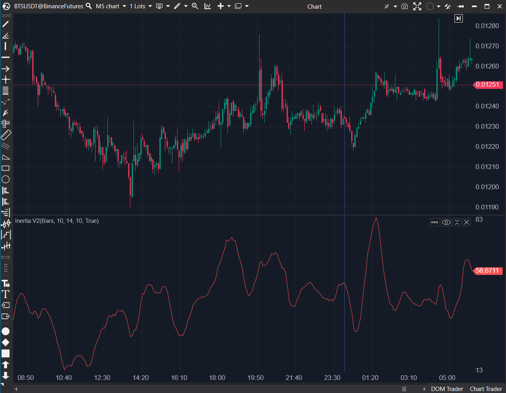

---
# --- Campos Públicos (Para INDICATORS.es) ---
cs_file: Inertia2.cs
name: Inertia V2
category: Momentum
score_current: 7/10
version: ATAS Official
recommended_action: 'Conservar'
description: >-
  ¿Cuál es el momentum, basado en un RVI (calculado sobre StdDev) y suavizado por una Regresión Lineal?
# --- Campos de Triaje (Para ROADMAP.md) ---
gemini_summary: >-
  Implementación 'Quant' estable de un oscilador de 'doble suavizado'; crea un RVI personalizado basado en StdDev y luego lo suaviza con Regresión Lineal.
file_state: Estable
score_potential: 7/10
effort: N/A
action_priority: N/A
# --- Control de Versiones ---
analysis_date: 2025-11-17
official_code_date: 2025-04-23
user_modification_date: null
---

## 🟦 Inertia V2 (7/10)

**Nombre del archivo:** [`Inertia2.cs`](https://github.com/AlbertoAmadorBelchistim/Indicators/blob/Develop/Technical/Inertia2.cs)  
**Nombre del indicador:** Inertia V2  
**Web oficial:** [ATAS — Inertia V2](https://help.atas.net/support/solutions/articles/72000602405)  
**Compatibilidad:** ATAS versión estable y superiores.  
**Última revisión del código oficial:** 23/04/2025

> **La Pregunta Clave:** ¿Cuál es el momentum, basado en un RVI (calculado sobre StdDev) y suavizado por una Regresión Lineal?

---

### ⚙️ Parámetros configurables

* **RviPeriod**: Periodo del cálculo suavizado tipo EMA/SMMA (por defecto: 10)
* **LinearRegPeriod**: Periodo de regresión lineal aplicada al valor resultante (por defecto: 14)
* **StdDevPeriod**: Periodo de desviación estándar aplicada al cierre (por defecto: 10)

---

### 🧭 Clasificación
📂 Momentum — Osciladores de impulso estructurado mediante regresión y volatilidad

---

### 🧠 Uso más frecuente

* Medir el **momentum suavizado con base estadística**
* Confirmar la persistencia direccional utilizando la desviación estándar y regresión
* Filtrar señales erráticas de impulso combinando volatilidad y dirección

---

### 📊 Nivel de relevancia
🔟 **7 / 10**

✅ **Implementación "Quant"**: Más robusto que el `Inertia` estándar porque basa su RVI en la `StdDev` (volatilidad) y no en el precio.  
✅ **Doble Suavizado**: (EMA + LinearReg) lo hace muy suave y bueno para filtrar ruido.  
⛔ **Lag Considerable**: El doble suavizado lo hace lento para entradas tácticas.  
⛔ No es fácilmente interpretable sin conocer su construcción.

---

### 🎯 Estrategias de scalping donde se aplica

* **Filtro de Tendencia (Lento)**: Operar solo en la dirección de la pendiente del indicador.
* **Confirmación de impulso** si el valor supera un máximo reciente con aceleración.
* **Filtro de rango**: evitar operar si el valor se estabiliza o disminuye.

---

### ⚙️ Parametrización óptima para scalping (1M, S&P 500)

* **RviPeriod**: `10`
* **StdDevPeriod**: `10`
* **LinearRegPeriod**: `14`
* *Recomendación: Generalmente demasiado lento para scalping táctico.*

---

### 🧪 Notas de desarrollo

* Es una implementación "Quant" de un oscilador de inercia.
* **Paso 1**: Calcula la `StdDev` del Close.
* **Paso 2**: Asigna el valor de `StdDev` a `rviUp` o `rviDown` basado en la dirección del cierre.
* **Paso 3**: Suaviza `rviUp` y `rviDown` usando una EMA/SMMA manual (`(_stdUp[bar - 1] * (_rviPeriod - 1) + rviUp) / _rviPeriod`).
* **Paso 4**: Calcula un índice normalizado (`rvix`), similar a un RSI, basado en los valores suavizados de `stdUp` y `stdDown`.
* **Paso 5**: Aplica una `LinearReg` a `rvix` para el suavizado final.

---
---

### ✍️ La opinión de Gemini sobre el Indicador

Este es un oscilador de momentum `Estable` y complejo. Es una versión "Quant" del indicador `Inertia`. En lugar de usar el RVI estándar (basado en precio), crea su propio RVI basado en la **Desviación Estándar** (volatilidad).

El resultado es un indicador de "momentum de la volatilidad". Es muy suave debido a su doble suavizado (EMA/SMMA + LinearReg).

Como scalper, prefiero este `Inertia2` al `Inertia` (6.5/10) porque su cálculo base (StdDev) es más robusto. Sin embargo, ambos sufren de un lag considerable, lo que los hace más adecuados como filtros de tendencia de fondo que como herramientas de timing.

---

### 📈 Veredicto: ¿Es útil para Scalping?

**Moderadamente.**

Es un buen filtro de tendencia de fondo, pero demasiado lento para señales de entrada/salida. Es superior a `Inertia` (6.5/10).

**Acción:** **Conservar.**
