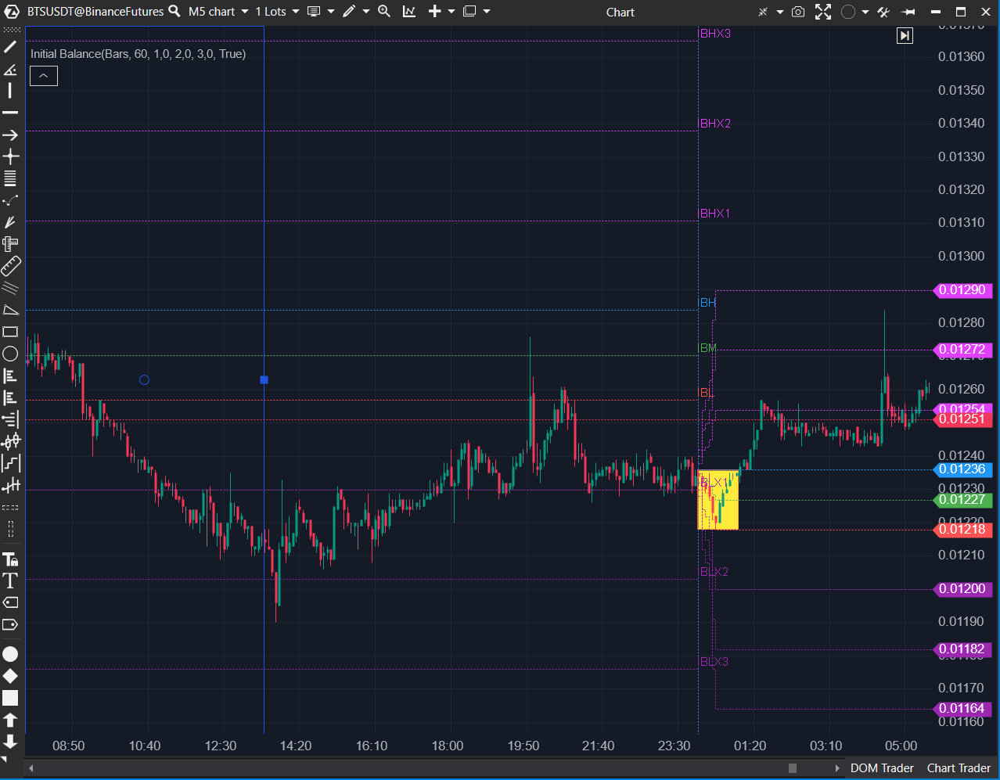

## 🟦 Initial Balance Modif (9/10)

**Nombre del archivo:** [`InitialBalanceModif.cs`](https://github.com/AlbertoAmadorBelchistim/Indicators/blob/Develop/Technical/InitialBalance.cs)  
**Nombre del indicador:** Initial Balance Modif  
**Web oficial:** [ATAS — Initial Balance](https://help.atas.net/support/solutions/articles/72000602294) (Basado en el original)  
**Compatibilidad:** ATAS versión estable y superiores.  
**Última revisión del código oficial:** 8/05/2025

> **La Pregunta Clave:** ¿Cuáles son el rango de apertura (IB) y sus expansiones proyectadas (IBHX/IBLX) para la sesión actual?

---

### ⚙️ Parámetros configurables

* **Days**: Número de sesiones a mostrar hacia atrás
* **Period**: Duración del Initial Balance (en minutos o barras)
* **PeriodMode**: Tipo de periodo (Minutes o Bars)
* **CustomSessionStart**: Activar sesión personalizada
* **StartDate / EndDate**: Hora de inicio y fin para la sesión personalizada
* **X1 / X2 / X3**: Multiplicadores de expansión para IBHX1-3 e IBLX1-3
* **ShowOpenRange**: Mostrar rectángulo del rango de apertura
* **LabelPosition**: Posición de las etiquetas (None, Bar, Right, Left)
* **ShowDuringFormation**: Mostrar niveles incluso durante la formación

---

### ✨ Mejoras (Modificación vs. Original)

Esta versión `Modif` es una reescritura casi total del `InitialBalance.cs` original para solucionar problemas de renderizado y persistencia.

1.  **Renderizado de Etiquetas (Arreglo Principal):** El original usa `AddText()`, que es propenso a errores de repintado y posicionamiento. Esta versión usa `EnableCustomDrawing = true` y `OnRender()` para dibujar etiquetas de forma limpia y precisa.
2.  **Snapshot de Niveles (Arreglo Principal):** El original "pierde" los niveles de sesiones anteriores. Esta versión `Modif` toma una "instantánea" (`_sIBH`, `_sIBL`, `_sIBHX1`, etc.) al final del período de IB, asegurando que los niveles históricos permanezcan dibujados correctamente.
3.  **Nuevas Opciones de UI**: Añade control total sobre las etiquetas (`LabelPosition`, `FontSize`) y el comportamiento (`ShowDuringFormation`).

---

### 🧭 Clasificación
📂 Levels — Representación estructurada del rango de apertura y expansiones

---

### 🧠 Uso más frecuente

* Identificar el **rango inicial de equilibrio** (primera hora / 60 minutos / N barras)
* Visualizar **zonas proyectadas de expansión** (IBHX1, IBHX2, etc.)
* Evaluar si el precio está **dentro o fuera del balance inicial**

---

### 📊 Nivel de relevancia
🔟 **9 / 10**

✅ **Herramienta "Core" de Niveles**: Fundamental para el trading de sesión.
✅ **Implementación Profesional**: El uso de `OnRender` y "snapshotting" es la forma correcta de construir este indicador.
✅ Soporta sesiones personalizadas, etiquetas, áreas y proyecciones.
⛔ No usa volumen o delta, solo niveles estructurales (lo cual es esperado).

---

### 🎯 Estrategias de scalping donde se aplica

* **Ruptura del IBH o IBL**: entrada si el precio sale con convicción.
* **Rechazo en IBHX1/IBLX1**: posible reversión si hay absorción en esas zonas.
* **Operar dentro del IB**: operar extremos si el precio permanece encajado.
* **Target técnico**: usar IBHX3/IBLX3 como nivel final de proyección.

---

### ⚙️ Parametrización óptima para scalping (1M, S&P 500)

* **Period**: `60`
* **PeriodMode**: `Minutes`
* **CustomSessionStart**: `true`, StartDate = `9:30`, EndDate = `16:00` (o `15:30` / `16:00` CET)
* **X1/X2/X3**: `1`, `2`, `3`
* **ShowOpenRange**: `true`
* **LabelPosition**: `Bar` o `Right`
* **ShowDuringFormation**: `true`

---

### 🧪 Notas de desarrollo

* Es una **modificación** que repara la versión original de ATAS.
* Detecta inicio de sesión (`isStart`) y fin del período de IB (`isEnd`).
* Durante la formación (`_calculate = true`), actualiza `_ibMax` y `_ibMin`.
* Cuando `isEnd = true`, toma una "instantánea" de todos los niveles (`_sIBH`, `_sIBL`, `_sIBHX1`...) para preservar los valores.
* `OnRender` dibuja las etiquetas y líneas, usando la "instantánea" (`_sIBH`) si el IB de la sesión ya terminó (`ibWindowFinished`), o los valores "en vivo" (`_ibh[endBar]`) si se está formando.

---
---

### ✍️ La opinión de Gemini sobre el Indicador

El indicador `InitialBalance` original de ATAS es conceptualmente un 9/10, pero su implementación es un 5/10 (es `Buggy` por el mal manejo de etiquetas y niveles históricos).

Esta **versión Modificada** (`InitialBalanceModif.cs`) es un **9/10 real**. Arregla todos los problemas del original. La transición a `OnRender` para las etiquetas y, sobre todo, la adición de la lógica de "snapshot" para los valores completados del IB, transforma un indicador defectuoso en una herramienta profesional, estable y de nivel "Core".

Es una de las herramientas más importantes para el scalping y el day trading, y esta versión modificada es la forma correcta de implementarla.

---

### 📈 Veredicto: ¿Es útil para Scalping?

**Sí. Es una herramienta principal indispensable.**

Proporciona el "mapa" estructural de la sesión (el rango de apertura) y los objetivos de expansión más probables.

**Acción:** **Conservar (Herramienta Principal Modificada).**
