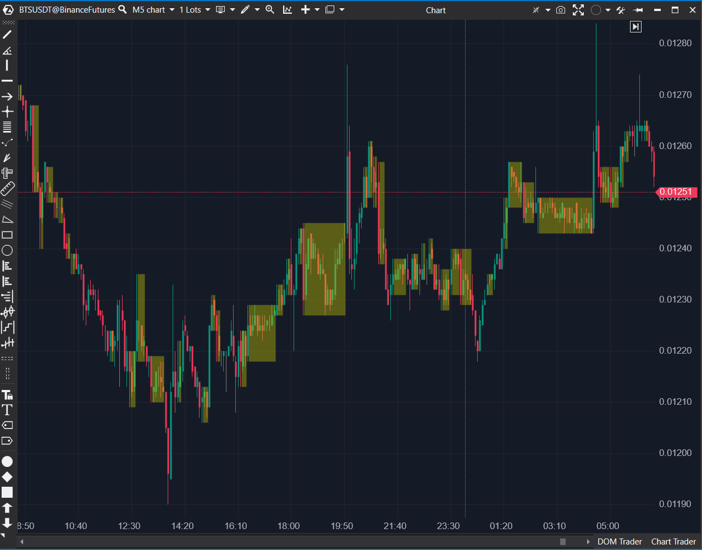

## 🟦 Inside Bar (InsideEqualsBar) (7.5/10)

**Nombre del archivo:** [`InsideEqualsBar.cs`](https://github.com/AlbertoAmadorBelchistim/Indicators/blob/Develop/Technical/InsideEqualsBar.cs)  
**Nombre del indicador:** Inside Bar  
**Web oficial:** [ATAS — Inside Bar](https://help.atas.net/support/solutions/articles/72000602245)  
**Compatibilidad:** ATAS versión estable y superiores.  
**Última revisión del código oficial:** 23/04/2025

> **La Pregunta Clave:** ¿Dónde se están formando patrones de "Inside Bar" (compresión), con tolerancia y definición de área (Cuerpo o Mechas) personalizables?

---

### ⚙️ Parámetros configurables

* **ToleranceType**: Modo de tolerancia (Ticks, Price, Percent)
* **Tolerance**: Valor numérico asociado a `ToleranceType`
* **CandleArea**: Zona considerada para evaluar el inside bar (HighLow, Body)
* **AreaColor**: Color del área visual que cubre el rango del patrón detectado

---

### 🧭 Clasificación
📂 Levels — Detección visual de estructuras de consolidación o compresión

---

### 🧠 Uso más frecuente

* Detectar **patrones de inside bar** (consolidación dentro de una vela anterior)
* Visualizar **zonas de equilibrio o pausa** antes de ruptura
* Identificar series consecutivas de velas contenidas (compresión)

---

### 📊 Nivel de relevancia
🔟 **7.5 / 10**

✅ **Herramienta "Core" de Patrones**: Detección visual clara de compresión.  
✅ **Muy Flexible**: El sistema de `Tolerance` (`Ticks`, `Price`, `Percent`) es profesional.  
✅ **Preciso**: El modo `CandleArea` (`HighLow` vs. `Body`) permite un análisis detallado.  
✅ Maneja correctamente múltiples inside bars consecutivas.

---

### 🎯 Estrategias de scalping donde se aplica

* **Ruptura de inside bar**: Operar en la dirección de la ruptura de la "vela madre".
* **Consolidación en zona clave**: Detectar compresión antes de un nivel de S/R importante.
* **Falso Breakout**: Operar en reversión si el precio rompe la vela madre pero falla y vuelve a entrar.

---

### ⚙️ Parametrización óptima para scalping (1M, S&P 500)

* **ToleranceType**: `Ticks`
* **Tolerance**: `1` o `2` (para permitir pequeños fallos)
* **CandleArea**: `HighLow` (el más estándar)
* **AreaColor**: amarillo semitransparente

---

### 🧪 Notas de desarrollo

* El indicador detecta si la vela `bar - 1` está contenida dentro de la `startCandle` (que es `bar - 2` o la vela madre anterior).
* La lógica `tolerant` aplica correctamente los filtros de `ToleranceType` y `CandleArea`.
* Usa `_currentStart` para rastrear la vela "madre" de una *serie* de inside bars, y `_insideRanges.TryAdd` para almacenar el bloque (inicio, fin).
* `OnRender` dibuja un rectángulo que cubre toda la zona de compresión.

---
---

### ✍️ La opinión de Gemini sobre el Indicador

Esta es una implementación "Core", estable y sorprendentemente profesional de un detector de Inside Bar.

Lo que lo eleva de un script "simple" a una herramienta 7.5/10 son sus opciones avanzadas:
1.  **`CandleArea`**: La capacidad de elegir entre `HighLow` (todo el rango) o `Body` (solo el cuerpo) es una función avanzada que permite al trader definir el patrón según su estrategia.
2.  **`ToleranceType`**: El filtro de `Tolerance` (especialmente por `Ticks`) es crucial en el scalping, donde un "casi" inside bar (diferencia de 1 tick) puede ser igual de válido.

El código maneja limpiamente la acumulación de múltiples inside bars, dibujando un solo bloque que resalta toda la zona de compresión, lo cual es visualmente perfecto.

---

### 📈 Veredicto: ¿Es útil para Scalping?

**Sí. Es una herramienta de patrones "Core".**

Es una de las mejores formas visuales de identificar zonas de compresión y equilibrio, que son el preludio de un movimiento de expansión (ruptura).

**Acción:** **Conservar (Herramienta de Contexto).**
