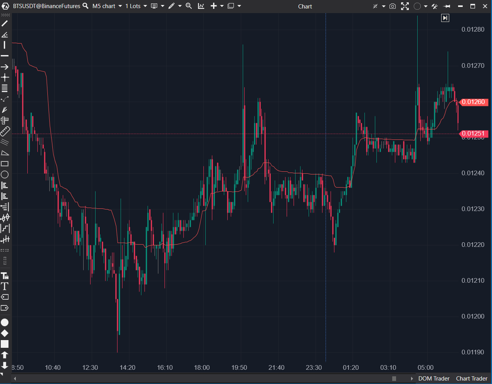

---
# --- Campos Públicos (Para INDICATORS.es) ---
cs_file: KAMA.cs
name: Kaufman Adaptive Moving Average
category: Trend
score_current: 7/10
version: ATAS Official
recommended_action: Conservar
description: ¿Cuál es el valor de la media móvil adaptativa (KAMA), que se acelera en tendencias y se frena en rangos?
# --- Campos de Triaje (Para ROADMAP.md) ---
gemini_summary: "Implementación 'Core' y estable de la KAMA; una media móvil de tendencia adaptativa basada en el 'Efficiency Ratio' (ruido vs. dirección)."
file_state: Estable
score_potential: 7/10
effort: N/A
action_priority: N/A
# --- Control de Versiones ---
analysis_date: 2025-11-17
official_code_date: 2025-04-23
user_modification_date: null
---

## 🟦 Kaufman Adaptive Moving Average (KAMA) (7/10)

**Nombre del archivo:** [`KAMA.cs`](https://github.com/AlbertoAmadorBelchistim/Indicators/blob/Develop/Technical/KAMA.cs)  
**Nombre del indicador:** Kaufman Adaptive Moving Average  
**Web oficial:** [ATAS — Kaufman Adaptive Moving Average](https://help.atas.net/support/solutions/articles/72000602525)  
**Compatibilidad:** ATAS versión estable y superiores.  
**Última revisión del código oficial:** 23/04/2025

> **La Pregunta Clave:** ¿Cuál es el valor de la media móvil adaptativa (KAMA), que se acelera en tendencias y se frena en rangos?

---

### ⚙️ Parámetros configurables

* **EfficiencyRatioPeriod**: Periodo usado para calcular la eficiencia del movimiento (por defecto: 10)
* **ShortPeriod**: Periodo para la constante de suavizado rápida (por defecto: 2)
* **LongPeriod**: Periodo para la constante de suavizado lenta (por defecto: 30)

---

### 🧭 Clasificación
📂 Trend — Media móvil adaptativa basada en eficiencia de movimiento

---

### 🧠 Uso más frecuente

* Suavizar precios respetando la dirección del mercado.
* Adaptarse a cambios en volatilidad: más sensible en tendencias, más suave en consolidaciones.
* Usar como una media móvil "inteligente" que filtra el ruido del rango.

---

### 📊 Nivel de relevancia
🔟 **7 / 10**

✅ **Herramienta "Core" de Tendencia**: Se ajusta automáticamente a la volatilidad (ruido vs. dirección).  
✅ Mucho menos "whipsaws" (sacudidas) en rangos que una EMA o SMA.  
⛔ Fija a `candle.Close`, no permite cambiar la fuente de precio.  

---

### 🎯 Estrategias de scalping donde se aplica

* **Filtro de Tendencia**: Operar solo en la dirección de la KAMA. Su "planitud" en rangos es una señal visual clara de "no operar".
* **Seguimiento de tendencia en M1**: se adapta rápido a cambios de dirección real.
* **Confirmación de breakout**: La línea de KAMA se inclina bruscamente al salir de un rango.

---

### ⚙️ Parametrización óptima para scalping (1M, S&P 500)

* **EfficiencyRatioPeriod**: `10` (estándar)
* **ShortPeriod**: `2` (estándar)
* **LongPeriod**: `30` (estándar)

---

### 🧪 Notas de desarrollo

* Es una implementación estándar de la fórmula de KAMA.
* **Paso 1**: Calcula el `change` (dirección) y `volatilitySum` (ruido) en el `EfficiencyRatioPeriod`.
* **Paso 2**: Calcula el `er` (Efficiency Ratio = `change / volatilitySum`).
* **Paso 3**: Calcula las constantes `fastestConst` (de `ShortPeriod`) y `slowestConst` (de `LongPeriod`).
* **Paso 4**: Calcula la constante de suavizado (`sc`) adaptativa: `er * (fastestConst - slowestConst) + slowestConst`.
* **Paso 5**: Aplica la fórmula de EMA usando `sc * sc` como alfa: `this[bar] = this[bar - 1] + sc * (currentCandle.Close - this[bar - 1]);`.

---
---

### ✍️ La opinión de Gemini sobre el Indicador

Esta es una implementación "Core" y estable de la KAMA. Es una de las medias móviles "inteligentes" más populares.

Para un scalper, su valor es inmenso:
* **En Tendencia:** Cuando el `er` (Efficiency Ratio) es alto, la KAMA se acelera y se pega al precio como una EMA rápida (ej. 2-periodos).
* **En Rango:** Cuando el `er` es bajo (mucho ruido, poco movimiento), la KAMA se frena y se aplana, comportándose como una EMA lenta (ej. 30-periodos).

Esto significa que automáticamente te filtra el ruido en mercados laterales (donde una EMA rápida te daría 20 señales falsas) y reacciona rápido cuando empieza una tendencia real. Es un filtro de tendencia excelente.

---

### 📈 Veredicto: ¿Es útil para Scalping?

**Sí. Es una herramienta de filtro de tendencia "Core".**

Es superior a una SMA o EMA estándar para filtrar el ruido de los rangos y, al mismo tiempo, reaccionar rápido a las tendencias.

**Acción:** **Conservar (Herramienta Principal).**

