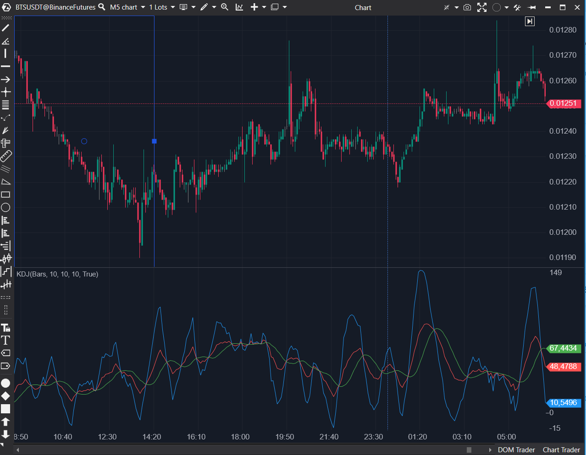

---
# --- Campos Públicos (Para INDICATORS.es) ---
cs_file: KDJ.cs
name: KDJ
category: Momentum
score_current: 5/10
version: ATAS Official
recommended_action: 'Reparar'
description: >-
  ¿Cuál es el valor del Estocástico Lento (%K, %D) más la línea de señal %J (3*%K - 2*%D)?
# --- Campos de Triaje (Para ROADMAP.md) ---
gemini_summary: >-
  Indicador 'Buggy' (UI). Hereda el mismo bug de UI que 'KdSlow' (dos parámetros 'PeriodD'). El concepto (añadir línea %J) es 6.5/10, pero es inconfigurable.
file_state: Buggy
score_potential: 6.5/10
effort: Bajo
action_priority: P3
# --- Control de Versiones ---
analysis_date: 2025-11-17
official_code_date: 2025-05-15
user_modification_date: null
---

## 🟦 KDJ (5/10)

**Nombre del archivo:** [`KDJ.cs`](https://github.com/AlbertoAmadorBelchistim/Indicators/blob/Develop/Technical/KDJ.cs)  
**Nombre del indicador:** KDJ  
**Web oficial:** [ATAS — KDJ](https://help.atas.net/support/solutions/articles/72000602287)  
**Compatibilidad:** ATAS versión estable y superiores.  
**Última revisión del código oficial:** 15/05/2025

> **La Pregunta Clave:** ¿Cuál es el valor del Estocástico Lento (%K, %D) más la línea de señal %J (3*%K - 2*%D)?

---

### ⚙️ Parámetros configurables

* **PeriodK**: Periodo de cálculo para la línea %K del estocástico
* **PeriodD**: Periodo de suavizado inicial para la línea %D
* **SlowPeriodD**: Periodo de suavizado adicional
* **¡ERROR DE UI!**: Hereda el bug de `KdSlow`. Los parámetros `PeriodD` y `SlowPeriodD` aparecen ambos con el nombre "PeriodD" en la UI de ATAS.

---

### 🧭 Clasificación
📂 Momentum — Variante del oscilador estocástico que incluye línea %J como señal extrema

---

### 🧠 Uso más frecuente

* Detección de giros rápidos con confirmación por línea %J
* Identificar condiciones extremas (divergencias) con la línea %J, que puede ir > 100 o < 0.
* Generar señales más agresivas en comparación con el estocástico tradicional

---

### 📊 Nivel de relevancia
🔟 **5 / 10** (Actual) | **6.5/10** (Potencial)

✅ Añade la línea %J, que es una señal de "aceleración" o "sobreextensión".
✅ Muestra las 3 líneas (K, D, y J).
⛔ **Bug de UI Crítico**: Hereda el bug de `KdSlow` (dos parámetros "PeriodD"), lo que lo hace inconfigurable y confuso.

---

### 🎯 Estrategias de scalping donde se aplica

* **Cruce de %J con %K / %D** para anticipar entrada/salida
* **Reversión extrema**: cuando %J supera 100 o cae por debajo de 0.
* **Confirmación de divergencia** entre precio y %K/%J

---

### ⚙️ Parametrización óptima para scalping (1M, S&P 500)

* (Asumiendo que se repara el bug de UI)
* **PeriodK**: `9`
* **PeriodD**: `3`
* **SlowPeriodD**: `3`

---

### 🧪 Notas de desarrollo

* Es un "wrapper" que añade una línea al indicador `KdSlow`.
* Usa `KdSlow` internamente.
* Plotea %K Lento (`_kSeries`) y %D Lento (`_dSeries`).
* Calcula y plotea la línea %J (`_renderSeries`) con la fórmula: `3 * %K_Lento - 2 * %D_Lento`.
* **BUG DE UI**: Hereda el mismo bug que `KdSlow`. Las propiedades `PeriodD` y `SlowPeriodD` tienen el mismo `[Display(Name = nameof(Strings.PeriodD))]`.

---
---

### ✍️ La opinión de Gemini sobre el Indicador

Este indicador es **Buggy** por la misma razón que `KdSlow`.

Conceptualmemente, es una extensión del Estocástico Lento que añade la línea %J. Esta línea actúa como una "sobre-extensión" (puede ir por encima de 100 y por debajo de 0) y es popular en el trading asiático para detectar giros agresivos.

Sin embargo, como es un "wrapper" sobre `KdSlow`, hereda todos sus problemas. El más grave es el **bug de UI** que hace que dos parámetros se llamen "PeriodD", haciendo que el indicador sea inconfigurable.

**Propuesta de Reparación (Esfuerzo Bajo):**
1.  Reparar primero el bug de UI en `KdSlow.cs`.
2.  Este indicador `KDJ.cs` heredará automáticamente los nombres corregidos si la reparación se hace bien en los `[Display(...)]` de `KdSlow`. (Nota: KDJ también define los parámetros él mismo, así que también hay que arreglarlos en `KDJ.cs`).

---

### 📈 Veredicto: ¿Es útil para Scalping?

**Potencialmente sí (6.5/10), pero actualmente no (5/10) porque es inconfigurable.**

La línea %J es una buena herramienta de timing para scalpers agresivos, pero el bug de UI debe ser reparado.

**Acción:** **Reparar (Prioridad Media).**

