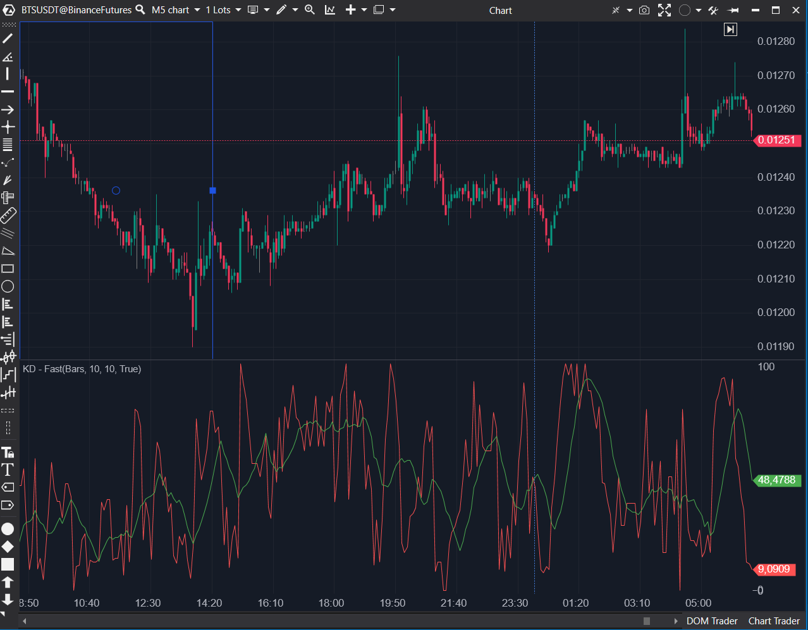

---
# --- Campos Públicos (Para INDICATORS.es) ---
cs_file: KdFast.cs
name: KD - Fast
category: Momentum
score_current: 6/10
version: ATAS Official
recommended_action: 'Conservar'
description: >-
  ¿Cuál es el valor del oscilador Estocástico Rápido (%K) y su media móvil (%D)?
# --- Campos de Triaje (Para ROADMAP.md) ---
gemini_summary: >-
  Implementación 'Core' y estable del Estocástico Rápido (%K = Estocástico, %D = SMA(%K)). Es la base para 'KdSlow' y 'KDJ'.
file_state: Estable
score_potential: 6/10
effort: N/A
action_priority: N/A
# --- Control de Versiones ---
analysis_date: 2025-11-17
official_code_date: 2025-04-23
user_modification_date: null
---

## 🟦 KD - Fast (6/10)

**Nombre del archivo:** [`KdFast.cs`](https://github.com/AlbertoAmadorBelchistim/Indicators/blob/Develop/Technical/KdFast.cs)  
**Nombre del indicador:** KD - Fast  
**Web oficial:** [ATAS — KD - Fast](https://help.atas.net/support/solutions/articles/72000602411)  
**Compatibilidad:** ATAS versión estable y superiores.  
**Última revisión del código oficial:** 23/04/2025

> **La Pregunta Clave:** ¿Cuál es el valor del oscilador Estocástico Rápido (%K) y su media móvil (%D)?

---

### ⚙️ Parámetros configurables

* **PeriodK**: Periodo para el cálculo de la línea %K (por defecto: 10)
* **PeriodD**: Periodo para la media móvil de %K, que genera la línea %D (por defecto: 10)

---

### 🧭 Clasificación
📂 Momentum — Oscilador estocástico rápido basado en %K y su media móvil %D

---

### 📊 Nivel de relevancia
🔟 **6 / 10**

✅ **Herramienta "Base"**: Es el oscilador Estocástico Rápido estándar.  
✅ Reacciona con rapidez a cambios de dirección.  
⛔ **Muy Ruidoso**: Genera muchas señales falsas en entornos tendenciales.  
⛔ Generalmente inferior al `KdSlow` (7/10) para la mayoría de estrategias.

---

### 🎯 Estrategias de scalping donde se aplica

* **Cruce de líneas %K y %D** como señal de entrada/salida.
* **Confirmación de giros** cuando %K rebota en zonas extremas (20/80).
* **Divergencias rápidas** en scalping de reversión.

---

### ⚙️ Parametrización óptima para scalping (1M, S&P 500)

* **PeriodK**: `8`
* **PeriodD**: `3`
* *Recomendación: Usar `KdSlow` (7/10) en su lugar para reducir el ruido.*

---

### 🧪 Notas de desarrollo

* Es la implementación estándar del Estocástico Rápido.
* La línea %K se calcula como la posición relativa del cierre: `_kSeries[bar] = 100m * (candle.Close - low) / (high - low)`.
* La línea %D es una media móvil simple (`SMA`) de la línea %K.
* Maneja la división por cero (si `high == low`) asignando `100m` a `_kSeries[bar]`.

---
---

### ✍️ La opinión de Gemini sobre el Indicador

Esta es la implementación "Core" y estable del Estocástico Rápido. El código es simple y correcto.

Para un scalper, el Estocástico Rápido es a menudo *demasiado* rápido y ruidoso. Genera muchos cruces y señales falsas en una tendencia. Sin embargo, este indicador es la **base** necesaria para los indicadores más útiles:
* `KdSlow` (7/10) (que es `SMA(%K)` y `SMA(%D)`)
* `KDJ` (6.5/10) (que añade la línea J)

Por sí mismo, es un 6/10. Como componente base, es esencial.

---

### 📈 Veredicto: ¿Es útil para Scalping?

**Moderadamente.**

Es muy ruidoso, pero puede ser útil para divergencias muy rápidas. La mayoría de los scalpers preferirán su derivado, el `KdSlow` (Estocástico Lento).

**Acción:** **Conservar (Herramienta Base).**

