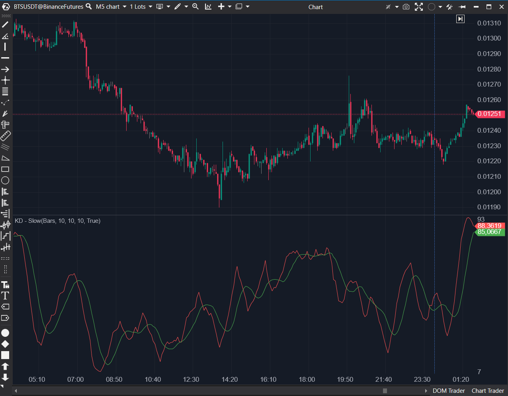

---
# --- Campos Públicos (Para INDICATORS.es) ---
cs_file: KdSlow.cs
name: KD - Slow
category: Momentum
score_current: 6/10
version: ATAS Official
recommended_action: 'Reparar'
description: >-
  ¿Cuál es el valor del oscilador Estocástico Lento (%K Lento = SMA(%K Rápido), %D Lento = SMA(%D Rápido))?
# --- Campos de Triaje (Para ROADMAP.md) ---
gemini_summary: >-
  Indicador 'Buggy' (UI). El concepto (Estocástico Lento) es 7/10, pero tiene dos parámetros con el mismo nombre ('PeriodD') en la UI, haciendo la configuración confusa e inutilizable.
file_state: Buggy
score_potential: 7/10
effort: Bajo
action_priority: P3
# --- Control de Versiones ---
analysis_date: 2025-11-17
official_code_date: 2025-04-23
user_modification_date: null
---

## 🟦 KD - Slow (6/10)

**Nombre del archivo:** [`KdSlow.cs`](https://github.com/AlbertoAmadorBelchistim/Indicators/blob/Develop/Technical/KdSlow.cs)  
**Nombre del indicador:** KD - Slow  
**Web oficial:** [ATAS — KD - Slow](https://help.atas.net/support/solutions/articles/72000602412)  
**Compatibilidad:** ATAS versión estable y superiores.  
**Última revisión del código oficial:** 23/04/2025

> **La Pregunta Clave:** ¿Cuál es el valor del oscilador Estocástico Lento (%K Lento = SMA(%K Rápido), %D Lento = SMA(%D Rápido))?

---

### ⚙️ Parámetros configurables

* **PeriodK**: Periodo para el cálculo de la línea %K (por defecto: 10)
* **PeriodD**: Periodo para la media móvil de %K en `KdFast` (por defecto: 10)
* **SlowPeriodD**: Periodo adicional de suavizado aplicado a la línea %D (por defecto: 10)
* **¡ERROR DE UI!**: Los parámetros `PeriodD` y `SlowPeriodD` aparecen ambos con el nombre "PeriodD" en la UI de ATAS.

---

### 🧭 Clasificación
📂 Momentum — Oscilador estocástico suavizado con doble media móvil

---

### 📊 Nivel de relevancia
🔟 **6 / 10** (Actual) | **7/10** (Potencial)

✅ **Herramienta "Core"**: Es el Estocástico Lento, mucho más útil y menos ruidoso que el Rápido.  
⛔ **Bug de UI Crítico**: El indicador es inconfigurable. Tiene dos parámetros llamados "PeriodD", lo que confunde al usuario.  
⛔ `PeriodD` (el parámetro `ShortPeriod`) es un nombre confuso, ya que en realidad suaviza el %K Rápido.  
 
---

### 🎯 Estrategias de scalping donde se aplica

* **Entrada por cruce retardado** de %K y %D suavizados.
* **Confirmación de señales previas** generadas por otros indicadores rápidos.
* **Detección de giros sostenidos** en movimientos prolongados.

---

### ⚙️ Parametrización óptima para scalping (1M, S&P 500)

* (Asumiendo que se repara el bug de UI)
* **PeriodK**: `8`
* **PeriodD (Suavizado %K)**: `3`
* **SlowPeriodD (Suavizado %D)**: `3`

---

### 🧪 Notas de desarrollo

* El indicador encapsula internamente un `KdFast`.
* Aplica un suavizado `SMA` (`_kSma`) al %K Rápido para crear el %K Lento (`_kSeries`).
* Aplica un segundo suavizado `SMA` (`_dSma`) al %D Rápido para crear el %D Lento (`_dSeries`).
* **BUG DE UI**: La propiedad `SlowPeriodD` usa `[Display(Name = nameof(Strings.PeriodD))]`, que es el mismo texto que la propiedad `PeriodD`. Esto resulta en dos parámetros con el mismo nombre en la interfaz de usuario, haciendo imposible saber cuál es cuál.

---
---

### ✍️ La opinión de Gemini sobre el Indicador

Este indicador es **Buggy** a nivel de interfaz de usuario.

El concepto (`Estocástico Lento`) es una herramienta de momentum "Core" de 7/10, mucho más útil para scalping que el `KdFast` (6/10) porque su doble suavizado filtra la mayoría del ruido.

Sin embargo, la implementación tiene un error crítico de UI. Como detectó el `.md` original, el código asigna el mismo `[Display(Name = "PeriodD")]` a dos parámetros diferentes (`PeriodD` y `SlowPeriodD`). Esto hace que el indicador sea inconfigurable y confuso para el usuario final.

**Propuesta de Reparación (Esfuerzo Bajo):**
1.  Renombrar el `[Display]` de `SlowPeriodD` a algo como "Slow Period D" o "D Smoothing".
2.  (Ideal) Renombrar el `[Display]` de `PeriodD` a "K Smoothing", ya que eso es lo que realmente hace (suaviza el %K Rápido para crear el %K Lento).

---

### 📈 Veredicto: ¿Es útil para Scalping?

**Potencialmente sí (7/10), pero actualmente no (6/10) porque es inconfigurable.**

Es el estocástico preferido por la mayoría de los traders, pero el bug de UI debe ser reparado.

**Acción:** **Reparar (Prioridad Media).**

