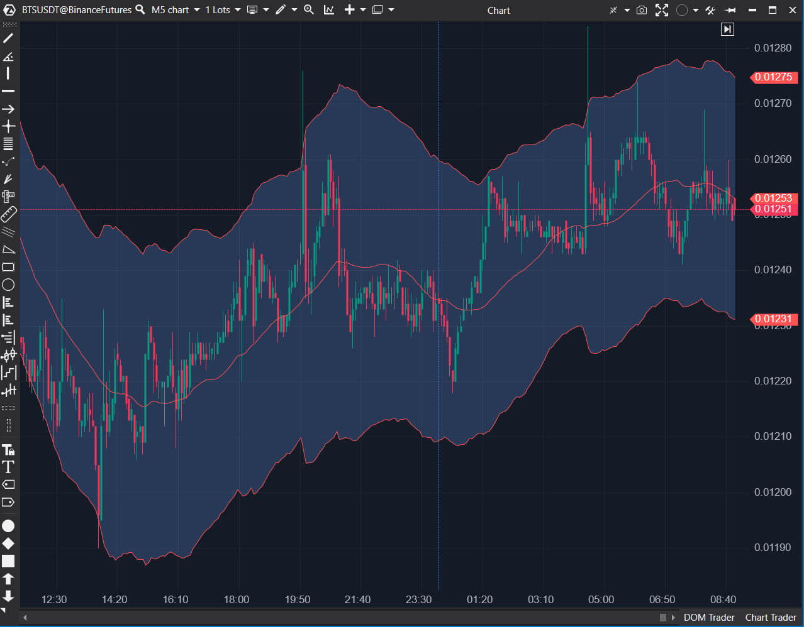

## 🟦 Keltner Channel (7.5/10)

**Nombre del archivo:** [`KeltnerChannel.cs`](https://github.com/AlbertoAmadorBelchistim/Indicators/blob/Develop/Technical/KeltnerChannel.cs)  
**Nombre del indicador:** Keltner Channel  
**Web oficial:** [ATAS — Keltner Channel](https://help.atas.net/support/solutions/articles/72000602574)  
**Compatibilidad:** ATAS versión estable y superiores.  
**Última revisión del código oficial:** 23/04/2025

> **La Pregunta Clave:** ¿Dónde se sitúan las bandas de volatilidad (SMA +/- ATR * Multiplicador) y el precio se está aproximando a ellas?

---

### ⚙️ Parámetros configurables

* **Days**: Días hacia atrás para limitar el cálculo (por defecto: 20)
* **Period**: Periodo para el cálculo del ATR y la SMA base (por defecto: 34)
* **Koef**: Multiplicador aplicado al ATR para definir el canal (por defecto: 4.0)
* **Alertas (Top / Mid / Bot)**: Opciones de activación, repetición, sensibilidad (ticks), color y sonido para cada banda

---

### 🧭 Clasificación
📂 Volatility — Canal de volatilidad basado en ATR y media móvil

---

### 📊 Nivel de relevancia
🔟 **7.5 / 10** (Actual) | **8/10** (Potencial)

✅ **Herramienta "Core" de Volatilidad**: Canal adaptativo eficaz para analizar sobreextensiones.  
✅ **Alertas de Proximidad (Scalping)**: Las alertas de sensibilidad por tick (`AlertSensitivity`) para las 3 bandas son una función de alto valor.  
⛔ **Bug de Alerta**: La alerta de la banda inferior (`Bot`) usa el archivo de sonido de la banda superior (`AlertFileTop`).  
⛔ Fijo a `SMA`, no permite `EMA`.  

---

### 🎯 Estrategias de scalping donde se aplica

* **Reversión desde extremos del canal**: Venta cerca de la banda superior, compra en la inferior.
* **Confirmación de ruptura** si el precio "camina sobre la banda" (se mantiene fuera).
* **Alerta Táctica**: Recibir una alerta sonora cuando el precio esté a N ticks de la banda.

---

### ⚙️ Parametrización óptima para scalping (1M, S&P 500)

* **Days**: `0` (mostrar todo el histórico)
* **Period**: `21`
* **Koef**: `1.5` a `2.0`
* **UseAlertsTop / UseAlertsBot**: `true`
* **AlertSensitivityTop / Bot**: `1` (alerta a 1 tick de la banda)

---

### 🧪 Notas de desarrollo

* Usa una `SMA` (media) y `ATR` (volatilidad) con el mismo `Period`.
* **Media**: `var ema = _sma.Calculate(bar, currentCandle.Close);`.
* **Bandas**: `ema + atr * Koef` y `ema - atr * Koef`.
* Incluye un sistema de alertas de proximidad basado en ticks (`AlertSensitivity`) para las 3 bandas.
* **BUG**: La alerta de la banda inferior (`UseAlertsBot`) llama a `AddAlert(AlertFileTop, ...)` en lugar de `AddAlert(AlertFileBot, ...)`.

---
---

### ✍️ La opinión de Gemini sobre el Indicador

Este es un indicador de canal de volatilidad "Core", y la implementación de ATAS es muy buena, casi un 8/10.

La fórmula (SMA + ATR) es estándar. Lo que lo hace destacar para un scalper es el **sistema de alertas de proximidad**. Poder definir "avísame si el precio se acerca a 1 tick de la banda Keltner" es una automatización de análisis de alto valor.

Sin embargo, tiene un **bug claro**, como detectó el `.md` original: la alerta de la banda inferior (`UseAlertsBot`) está mal cableada y usa el archivo de sonido de la banda superior (`AlertFileTop`). Esto es confuso y debe ser reparado.

**Propuesta de Reparación (Esfuerzo Bajo):**
* En `OnCalculate`, en la sección `if (UseAlertsBot...)`, cambiar `AddAlert(AlertFileTop, ...)` por `AddAlert(AlertFileBot, ...)`.

---

### 📈 Veredicto: ¿Es útil para Scalping?

**Sí. Es una herramienta de S/R dinámico y alertas "Core".**

Las alertas de proximidad por tick lo hacen extremadamente útil para scalpers que esperan reversiones en los extremos de volatilidad.

**Acción:** **Reparar (Prioridad Baja).**

