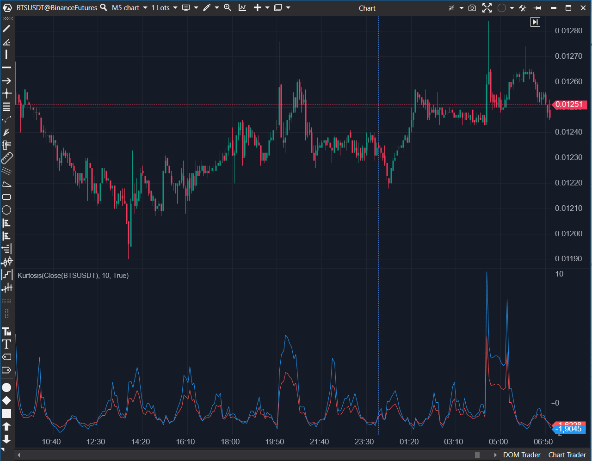

## 🟦 Kurtosis (5/10)

**Nombre del archivo:** [`Kurtosis.cs`](https://github.com/AlbertoAmadorBelchistim/Indicators/blob/Develop/Technical/Kurtosis.cs)  
**Nombre del indicador:** Kurtosis  
**Web oficial:** [ATAS — Kurtosis](https://help.atas.net/support/solutions/articles/72000602556)  
**Compatibilidad:** ATAS versión estable y superiores.  
**Última revisión del código oficial:** 23/04/2025

> **La Pregunta Clave:** ¿Cuál es la "pesadez de las colas" (Kurtosis) de la distribución de precios, para medir la frecuencia de eventos extremos?

---

### ⚙️ Parámetros configurables

* **Period**: Número de barras usadas para calcular la curtosis (mínimo: 4; por defecto: 20)

---

### 🧭 Clasificación
📂 Statistical — Medida de curtosis sobre precios (forma de la distribución)

---

### 🧠 Uso más frecuente

* Medir si la distribución de precios presenta colas pesadas (leptocúrtica) o ligeras (platicúrtica)
* Detectar momentos de alta concentración o dispersión extrema en los precios
* Complementar análisis de volatilidad o eventos estadísticamente atípicos

---

### 📊 Nivel de relevancia
🔟 **5 / 10**

✅ Útil en análisis cuantitativo o estudios de comportamiento estadístico del precio.
⛔ **Nula utilidad para scalping**: Poco intuitivo y no accionable en tiempo real.
⛔ Riesgo teórico de división por cero si el precio es 100% plano.

---

### 🎯 Estrategias de scalping donde se aplica

* **Ninguna.** Este no es un indicador para scalping discrecional.
* (Uso Quant) Filtro de régimen para sistemas algorítmicos.

---

### ⚙️ Parametrización óptima para scalping (1M, S&P 500)

* **No recomendado.**

---

### 🧪 Notas de desarrollo

* Calcula la **curtosis poblacional** (`_populationSeries`) y **muestral** (`_sampleSeries`).
* Utiliza una `SMA` como media y calcula la suma de las desviaciones al cuadrado (`_squareSeries`) y a la cuarta (`_quadSeries`).
* **Riesgo de Bug**: El cálculo `quadSum / (squareSum * squareSum)` no está protegido contra una división por cero si `squareSum` es 0 (extremadamente improbable en un mercado real, pero posible si el precio es plano).

---
---

### ✍️ La opinión de Gemini sobre el Indicador

Este es un indicador puramente estadístico (`Quant`). Mide la "pesadez" de las colas de la distribución de retornos, es decir, si los movimientos extremos ("outliers") son más o menos probables de lo normal.

Para un scalper discrecional, esta información es **inútil en tiempo real**. No te dice nada sobre la dirección, el volumen o el momentum inmediato. Es una herramienta para analistas cuantitativos que estudian las propiedades de un activo a largo plazo.

El código es una implementación académica de la fórmula y es estable (aunque tiene un riesgo teórico de división por cero). Dado que no tiene utilidad práctica para nuestro objetivo, es un claro 5/10.

---

### 📈 Veredicto: ¿Es útil para Scalping?

**No.**

Es un indicador estadístico complejo, no una herramienta de timing o contexto para scalping.

**Acción:** **Conservar** (Como herramienta estadística, es estable).

