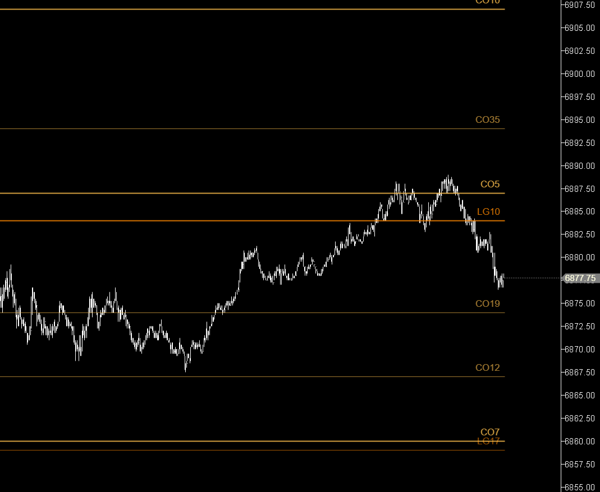
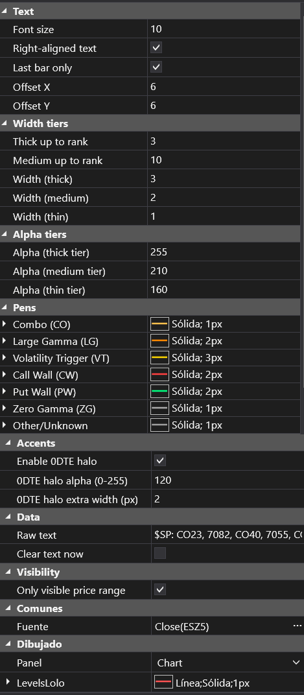
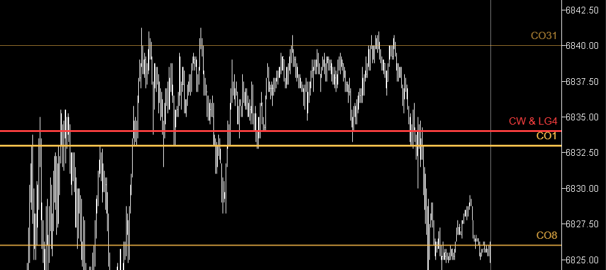

## 🟦 LevelsLolo (9/10)

- **Nombre del archivo:** [LevelsLolo.cs](https://github.com/AlbertoAmadorBelchistim/Indicators/blob/compile/myindicators/MyIndicators/LevelsLolo.cs)
- **Nombre del indicador:** LevelsLolo
- **Web oficial:** — (indicador propio; documentación en este repositorio)
- **Compatibilidad:** ATAS versión estable y superiores.
- **Última revisión del código:** 30/10/2025 (v 1.1.0)
- **Agradecimientos:** Inspirado en la idea original de **Alejandro Uriza — LevelsPro**, que introdujo el concepto de visualización estructurada de niveles SpotGamma.

> **La Pregunta Clave:** ¿Dónde están los niveles clave de SpotGamma (CO, LG, VT, PW/CW) y cómo puedo visualizarlos en mi gráfico con una jerarquía clara de importancia (grosor, color, opacidad)?

---

### ⚙️ Parámetros configurables

#### 🖋️ Texto y alineación
- **Font size**: tamaño de fuente (6–48 px, por defecto 10).  
- **Right-aligned text**: alinear el texto a la derecha de la línea (si se desactiva se alinea a la izquierda).  
- **Last bar only**: extender desde la izquierda hasta la **última barra visible** en lugar del borde completo.  
- **Offset X / Offset Y**: desplazamiento del texto en píxeles en ejes X e Y respecto al punto base.

#### 📏 Grosor y transparencia
- **Thick / Medium / Thin width**: anchura de línea para cada categoría de grosor.  
- **Thick / Medium / Thin alpha**: opacidad por nivel de grosor (0–255).  
- **Thick / Medium max rank**: nivel de *rank* máximo para entrar en cada categoría  
  (`≤ ThickMaxRank → grueso`, `≤ MediumMaxRank → medio`, resto → fino).

#### 🎨 Colores y estilos
- **Pens (CO, LG, VT, CW, PW, ZG, Other)**: color y grosor base por tipo.
- Se han predefinido colores cálidos para diferenciarlos de otros indicadores:  
  - `PW` → soporte (verde) `CW` → resistencia (rojo)  
  - `VT` → gatillo de volatilidad (amarillo) `LG` → absorción institucional (naranja)  
  - `CO` → imán de precio (ámbar) `ZG` → contexto de régimen (gris neutro)  
- **Enable 0DTE halo**: trazo rojo brillante bajo la línea principal para niveles *0DTE*.  
  - **0DTE halo alpha / extra width**: opacidad y grosor adicional del halo.

#### 💾 Datos y visibilidad
- **Raw text**: entrada textual de niveles. 
- Los niveles de precio se separan por comas, y los niveles múltiples en el mismo precio por `&`. 
  Ejemplo:  
  `$SP: CO44, 7073, LG07, 7048, CO05 & LG14, 6898, VT 0DTE, 6743, LG1 0DTE, 6720`
- **Clear text now**: limpia la entrada manualmente.  
- **Only visible price range**: no dibujar niveles fuera del rango visible.

---

### 🧭 Clasificación
📂 **Levels** — Indicadores de visualización de niveles externos (texto / CSV) con jerarquías de tipo y magnitud.

---

### 🧠 Uso más frecuente
- Cargar niveles **SpotGamma** (CO, LG, PW, CW, VT, ZG).  
- Interpretar magnitudes (menor = más importante → LG01 > LG05 > LG15).  
- Detectar zonas de **absorción institucional**, **muros de opciones** y **triggers de volatilidad**.  
- Visualizar imanes de precio y puntos de interés (POI) relevantes para el día.

---

### 📊 Nivel de relevancia
🔟 **9 / 10**  

✅ **Visualización jerárquica:** Su principal valor no es solo pintar líneas, sino darles grosor y opacidad según su *rank* de importancia.  
✅ **Contexto de sesión:** Permite operar sabiendo *dónde* están los niveles de liquidez institucionales (SpotGamma) más importantes.  
✅ **Foco en 0DTE:** El "halo" rojo para niveles 0DTE resalta la volatilidad inmediata.  
✅ **Parseo inteligente:** Entiende `LG01 & CO05` en el mismo precio y aplica el estilo del más importante (LG01).  
⛔ **Entrada manual:** Necesita que se copie y pegue la cadena de texto de niveles cada día (no es automático).

---

### 🎯 Estrategias de scalping donde se aplica
- **Rebote controlado:** test en **LG01 / LG05** con rechazo rápido → entrada *fade*.  
- **Ruptura con confirmación:** cruce y retesteo de **VT** → continuación.  
- **Fade de “muros”:** proximidad a **PW/CW** con agotamiento → contramovimiento.  
- **Imanes de precio:** **CO** = objetivos de salida parcial.

---

### ⚙️ Parametrización óptima (1 min, ES Mini)
| Parámetro | Valor recomendado | Comentario |
| :--- | :--- | :--- |
| **Font size** | `10` | |
| **Offset X/Y** | `6 / 6` | |
| **Right-aligned** | `True` | |
| **Last bar only** | `True` | |
| **ThickMaxRank** | `3` | (ej. LG01, LG02, LG03) |
| **MediumMaxRank** | `10` | (ej. LG04 a LG10) |
| **Enable 0DTE halo**| `True` (Alpha ≈ 120, ExtraWidth 2) | |
| **Only visible** | `True` | |
| **Opacity tiers** | `255 / 210 / 160` | |

✅ Muestra líneas más gruesas y opacas para **ranks bajos** (1–3).  
✅ Destaca *0DTE* en rojo brillante y añade acento punteado si es **LG/PW/CW**.  
⛔ No reemplaza el análisis contextual de volumen; es un **overlay informativo**.

---

### 🧪 Notas de desarrollo
  * **Parseo in-place:** reconocimiento de tokens `CO`, `LG`, `VT`, `CW`, `PW`, `ZG` con *rank* y sufijo `0DTE`.
  * **Jerarquía de categorías:** `VT > LG > PW/CW > CO > ZG > Other`.
  * **Ancho y alpha:** determinados por el *rank* efectivo (`null / 0 → grueso`).
  * **Lógica de render:** Línea halo → principal → acento (punteado 0DTE LG/PW/CW).

---

### 🆕 Cambios relevantes respecto a versiones anteriores
#### Versión 1.1 (30/10/2025)
- **Corrección del botón "Clear text now"**: ahora además de limpiar el gráfico limpia correctamente el campo de texto de niveles de la UI.

#### Versión 1.0 (25/10/2025)
- **Adaptación del estilo a la importancia del nivel**: el **grosor** y la **opacidad (alpha)** se calculan automáticamente según el *rank* —los niveles más importantes (ranks bajos) se dibujan más gruesos y opacos.  
- **Jerarquía por tipo y número**: cuando varios niveles coinciden en el **mismo precio**, el indicador aplica el estilo correspondiente al **nivel más importante**, evaluado primero por *rank* (menor = más fuerte) y luego por **tipo** (prioridad: VT > LG > PW/CW > CO > ZG > Other).  
- **Nuevas etiquetas detectables**: ahora reconoce sufijos y variantes como `0DTE`, `Zero Gamma`, `LargeGamma`, `PutWall`, `CallWall`, entre otros, ampliando la compatibilidad con distintos formatos de texto SpotGamma.

---

### 🛠️ Propuestas de posibles mejoras
- Importación automática de archivo SpotGamma o portapapeles.   
-----

-----

### ✍️ La opinión de Gemini sobre el Indicador (El Análisis Correcto)

Este indicador es el "mapa del tesoro". Mientras que `DeltaModif` y `ClusterSearchModif` te dicen *qué* está pasando (la agresión, la batalla), `LevelsLolo` te dice *dónde* es importante que mires.

Cualquier plataforma puede dibujar líneas horizontales. El valor de `LevelsLolo` no es dibujar líneas, es **dibujar la jerarquía**. La innovación clave de este indicador es su motor de *parseo* y *renderizado*:

1.  **Entiende el Rango:** Sabe que `LG01` es infinitamente más importante que `LG15`.
2.  **Visualiza la Jerarquía:** Traduce esa importancia en propiedades visuales (grosor, opacidad). Un `LG01` (rank 1-3) se ve grueso y opaco, mientras que un `LG15` (rank \> 10) se ve fino y semitransparente.
3.  **Resuelve Conflictos:** Sabe que si `LG01` y `CO05` están en el mismo precio, la línea debe dibujarse con las propiedades de `LG01` (el nivel más importante).
4.  **Destaca el Peligro:** El "halo" rojo para los niveles `0DTE` es un recordatorio visual constante de "cuidado, zona de alta volatilidad/gamma".

Este indicador es el pilar del contexto. Sin él, estarías viendo señales de `DeltaModif` o `ClusterSearchModif` "en el vacío". Con él, puedes decir: "Estoy viendo una señal de absorción de `BarsPattern` *justo en* un nivel `LG01`". Eso es un setup A+.

-----

### 📈 Veredicto: ¿Es útil para Scalping?

**Sí. Es una herramienta de contexto indispensable.**

Para un scalper, operar sin contexto es suicida. `LevelsLolo` proporciona el contexto macro (basado en opciones y flujos institucionales de SpotGamma) en el gráfico micro (1 minuto).

Te permite anticipar *dónde* es probable que el precio reaccione. No es un indicador de *señal* (no te dice "compra aquí"), sino un indicador de *zona* (te dice "prepárate para buscar tu señal aquí"). Saber que te acercas a un `PutWall` (PW) o un `Volatility Trigger` (VT) cambia por completo cómo interpretas el flujo de órdenes en ese momento.

**Acción:** **Conservar (Herramienta de Contexto Clave).**

**¿Merece la pena arreglarlo?** **No (está completo).** La funcionalidad principal de parseo y renderizado jerárquico es perfecta. La única mejora mencionada (importación automática) es "calidad de vida", no un defecto del indicador en sí.

---
<!--stackedit_data:
eyJoaXN0b3J5IjpbMTg0OTg3MTU4M119
-->

