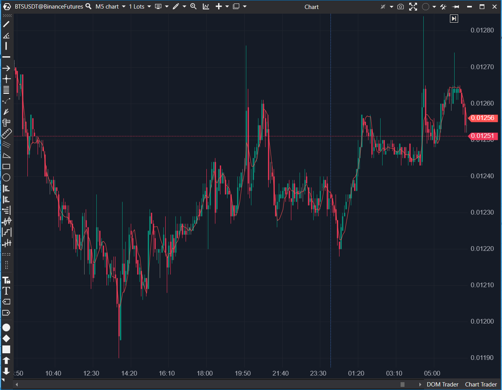

---
# --- Campos Públicos (Para INDICATORS.es) ---
cs_file: LinearReg.cs
name: Linear Regression
category: Trend
score_current: 5/10
version: ATAS Official
recommended_action: 'Mejorar'
description: >-
  ¿Cuál es la línea de tendencia de regresión lineal (mínimos cuadrados) de las últimas N barras?
# --- Campos de Triaje (Para ROADMAP.md) ---
gemini_summary: >-
  Indicador 'Mejorable'. Implementación estándar de Regresión Lineal, pero con un 'bug' de diseño (usa el índice 'bar' absoluto como 'x'), lo que puede causar repintado/imprecisiones.
file_state: Mejorable
score_potential: 6.5/10
effort: Bajo
action_priority: P4
# --- Control de Versiones ---
analysis_date: 2025-11-17
official_code_date: 2025-04-23
user_modification_date: null
---

## 🟦 Linear Regression (5/10)

**Nombre del archivo:** [`LinearReg.cs`](https://github.com/AlbertoAmadorBelchistim/Indicators/blob/Develop/Technical/LinearReg.cs)  
**Nombre del indicador:** Linear Regression  
**Web oficial:** [ATAS — Linear Regression](https://help.atas.net/support/solutions/articles/72000602415)  
**Compatibilidad:** ATAS versión estable y superiores.  
**Última revisión del código oficial:** 23/04/2025

> **La Pregunta Clave:** ¿Cuál es la línea de tendencia de regresión lineal (mínimos cuadrados) de las últimas N barras?

---

### ⚙️ Parámetros configurables

* **Period**: Número de barras utilizadas para calcular la recta de regresión lineal (por defecto: 10)

---

### 🧭 Clasificación
📂 Trend — Indicador de tendencia basado en regresión lineal

---

### 🧠 Uso más frecuente

* Representar visualmente la dirección y pendiente del precio en un periodo dado
* Identificar tendencias mediante la inclinación de la línea regresiva
* Usar la línea como soporte/resistencia dinámica

---

### 📊 Nivel de relevancia
🔟 **5 / 10** (Actual) | **6.5/10** (Potencial)

✅ Útil para observar inclinaciones de corto o medio plazo.  
⛔ **Error de Diseño (Bug Latente)**: Usa el índice `bar` absoluto como `x` en la fórmula (`k * bar + b`), lo que causa repintado y posibles imprecisiones en gráficos largos.  
⛔ No reacciona bien ante giros bruscos (como todas las regresiones).  

---

### 🎯 Estrategias de scalping donde se aplica

* **Confirmación de sesgo direccional** (pendiente).
* **Operaciones de reversión** cuando el precio se aleja excesivamente de la línea (extremo estadístico).

---

### ⚙️ Parametrización óptima para scalping (1M, S&P 500)

* **Period**: `10` a `20`

---

### 🧪 Notas de desarrollo

* Calcula la recta de regresión lineal clásica (`y = kx + b`) usando el método de mínimos cuadrados.
* Calcula las sumatorias de `x` (índice de barra), `y` (precio), `xy`, y `x2`.
* Calcula la pendiente `k` y el intercepto `b`.
* **Problema de Diseño**: El valor final se calcula como `k * bar + (y - k * x) / count`. El uso de `bar` (el índice absoluto, ej. 1,500,000) como la variable `x` en lugar de un índice relativo (0 a N-1) es una mala práctica que causa que toda la línea recalcule su posición (repintado) cada vez que `k` cambia.

---
---

### ✍️ La opinión de Gemini sobre el Indicador

Esta es una implementación `Mejorable` de una Regresión Lineal.

El concepto es un 6/10: una línea de tendencia simple. Sin embargo, la implementación tiene un error de diseño clásico, como se detectó en el `.md`. Al usar el índice de barra absoluto (`bar`) como la variable `x`, la línea de regresión "repintará" o cambiará su posición histórica cada vez que se forme una nueva barra y la pendiente (`k`) se recalcule.

Una implementación robusta (`Time Series Forecast` o TSF) calcula la regresión usando un índice relativo (de 0 a `Period-1`) y solo proyecta el valor final. Esta implementación es menos estable y menos fiable.

**Propuesta de Mejora (Esfuerzo Bajo):**
1.  En el bucle `for`, cambiar `x += i;` por `x += j;` (donde `j` es `i - start`).
2.  Calcular `k` y `b` usando este `x` relativo.
3.  Calcular el valor final como `k * (count - 1) + b` (la predicción para el último punto).

---

### 📈 Veredicto: ¿Es útil para Scalping?

**Moderadamente.**

Es un filtro de tendencia visual, pero sufre de repintado. Un scalper obtendría un resultado más estable y rápido usando una `HMA` (8/10) o `KAMA` (7/10).

**Acción:** **Mejorar (Prioridad Baja).**

