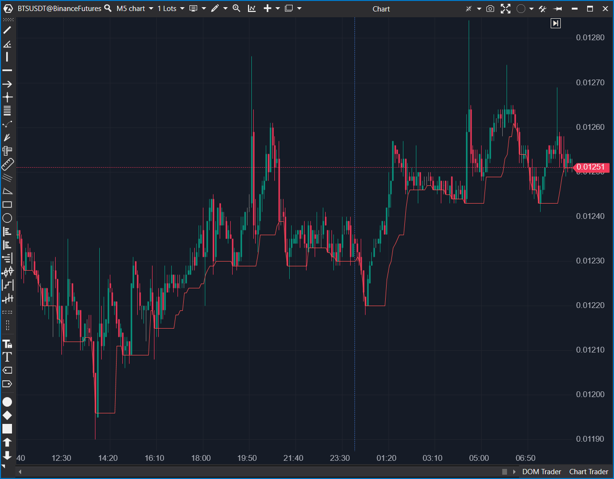

---

# 1. IDENTIFICACIÓN  
cs_file: Lowest.cs  
name: Lowest  
version: ATAS Stable/Latest  

# 2. CLASIFICACIÓN  
group: Market Structure  
subgroup: Extremes & Range Structure  
comparison_group: "Extremes & Range Structure"  

# 3. VALORACIÓN (Score & Priority)  
score_current: 6/10  
score_potential: 7/10  
file_state: Estable  
effort: N/A  
action_priority: Nula  
system_priority: P3  

# 4. DECISIÓN  
recommended_action: Conservar (Reserva)  

# 5. ANÁLISIS  
description: ¿Cuál es el valor mínimo de la serie de entrada (Source) en las últimas N barras?  
gemini_summary: "Rolling min genérico sobre SourceDataSeries: menos útil como canal, pero valioso como bloque para trailing/soportes dinámicos sobre cualquier fuente."  
competitor_notes: "Pierde como estructura de rango frente a Donchian/HighLow. Gana valor como utilidad genérica (mínimos de N) sobre la fuente que el usuario seleccione."  
reusable_code: "Implementación mínima y segura de rolling min con control de ventana (start/count) para evitar out-of-range."  

# 6. METADATOS  
analysis_date: 2025-12-28  
official_code_date: 2025-04-23  

---

## 🟦 Lowest (6/10)

**Nombre del archivo:** [`Lowest.cs`](https://github.com/AlbertoAmadorBelchistim/Indicators/blob/Develop/Technical/Lowest.cs)  
**Nombre del indicador:** Lowest  
**Web oficial:** [ATAS — Lowest](https://help.atas.net/support/solutions/articles/72000602417)  
**Compatibilidad:** ATAS Stable/Latest.  
**Última revisión del código oficial:** 2025-04-23  

> **La Pregunta Clave:** ¿Cuál es el valor mínimo de la serie de entrada (Source) en las últimas N barras?  

---

### ⚙️ Parámetros configurables

* **Period**: Número de barras usadas para buscar el mínimo (por defecto: 10).  

---

### 🧭 Clasificación
**Grupo:** Market Structure  
**Subgrupo:** Extremes & Range Structure  
**Comparison Group:** "Extremes & Range Structure"  

---

### 🧠 Uso más frecuente

* Definir mínimos dinámicos (soporte móvil) sobre la serie seleccionada.  
* Construir trailing stops o filtros de tendencia/rango sobre fuentes no estándar.  

---

### 📊 Nivel de relevancia
🔟 **6 / 10**

✅ Ligero, estable y reutilizable.  
✅ Muy útil como bloque para trailing y filtros (mínimo de N).  
⛔ Como estructura de rango principal, queda detrás de un canal completo (Donchian/HighLow).  

---

### 🎯 Estrategias de scalping donde se aplica

* **Trailing stop estructural**: stop en el mínimo de N (siempre con lógica adicional de mercado).  
* **Filtro de rotación**: evitar cortos si el precio no rompe el mínimo de N, etc.  

---

### ⚙️ Parametrización óptima para scalping (1M, S&P 500)

| Parámetro | Valor recomendado | Justificación |
|---|---:|---|
| Period | 10–20 | 10 para stops cortos; 20 para trailing más “estructural”. |  

---

### 🧪 Notas de desarrollo

* Ventana definida con `start` y `count` para manejar correctamente las barras iniciales.  
* Complejidad O(Period) por barra; adecuada para Period típico.  
* Opera sobre `SourceDataSeries`, aumentando su utilidad fuera del puro precio.  

---

### ❗ Incoherencias o aspectos mejorables detectados

* Ninguna técnica evidente; limitación funcional (solo una banda).  

---

### 🛠️ Propuestas de mejora

* Si se busca canal completo: combinar con Highest o usar directamente Donchian/HighLow.  

---

### 💎 Valor Reutilizable (Código Donante)

* Patrón de rolling min seguro y mínimo (start/count + loop) reutilizable para otras series.  

---

### ✍️ La opinión de ChatGPT sobre el Indicador

Como “indicador de rango” no es competitivo frente a un canal completo, pero como “utility” es valioso: mínimos de N son un ladrillo básico para trailing, filtros y estructuras simples. Mantenerlo como reserva evita reinventar ese cálculo en indicadores más complejos.  

---

### 📈 Veredicto: ¿Es útil para Scalping?

**Sí (como utilidad / reserva)**  

**Acción:** **Conservar (Reserva)**  

