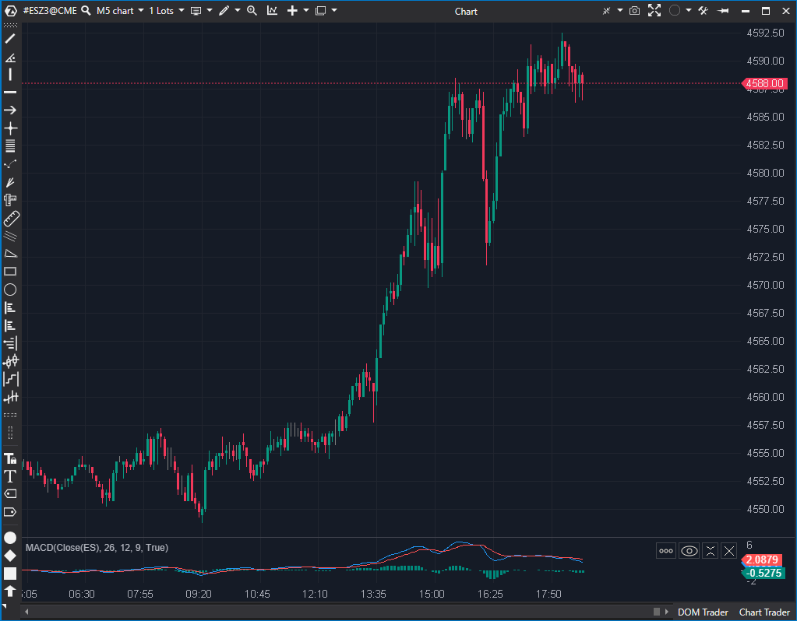

## 🟦 MACD (Moving Average Convergence Divergence) (8/10)

**Nombre del archivo:** [`MACD.cs`](https://github.com/AlbertoAmadorBelchistim/Indicators/blob/Develop/Technical/MACD.cs)    
**Nombre del indicador:** MACD    
**Web oficial:** [ATAS — MACD](https://help.atas.net/support/solutions/articles/72000602418)    
**Compatibilidad:** ATAS versión estable y superiores.    
**Última revisión del código oficial:** 23/04/2025

> **La Pregunta Clave:** ¿Cuál es la convergencia o divergencia entre las medias móviles de corto y largo plazo?

---

### ⚙️ Parámetros configurables

* **ShortPeriod**: Periodo de la media móvil exponencial rápida (por defecto: 12)
* **LongPeriod**: Periodo de la media móvil exponencial lenta (por defecto: 26)
* **SignalPeriod**: Periodo de la media móvil de la línea MACD (por defecto: 9)

---

### 🧭 Clasificación
📂 Momentum — Indicador clásico de convergencia/divergencia de medias móviles

---

### 🧠 Uso más frecuente

* Detectar **momentos de cambio en la tendencia** o aceleraciones en el precio
* Identificar **cruces entre MACD y su línea de señal** como posibles entradas/salidas
* Analizar **divergencias** entre MACD y acción del precio

---

### 📊 Nivel de relevancia
🔟 **8 / 10**

✅ Muy utilizado en análisis técnico clásico y sistemas algorítmicos  
✅ Reacciona tanto a momentum como a la dirección del precio  
⛔ Puede generar señales falsas en mercados laterales  
⛔ El histograma no está coloreado, dificultando la lectura rápida

---

### 🎯 Estrategias de scalping donde se aplica

* **Cruce de MACD con su línea de señal** como entrada
* **Confirmación de dirección** cuando la diferencia entre MACD y señal es creciente
* **Entrada por divergencia** si el precio marca un mínimo más bajo y el MACD no

---

### ⚙️ Parametrización óptima para scalping (1M, S&P 500)

* **ShortPeriod**: `6`
* **LongPeriod**: `19`
* **SignalPeriod**: `4`

---

### 🧪 Notas de desarrollo

* Implementa la fórmula clásica del MACD: `MACD = EMA(Short) - EMA(Long)`
* Calcula la señal como: `Signal = EMA(MACD)`
* Calcula el histograma como: `Histograma = MACD - Signal`
* Representa tres series: línea MACD (azul), señal (roja) y la diferencia como histograma (verde)
* Las medias se recalculan internamente en cada barra mediante objetos `EMA`

---
---

### ✍️ La opinión de Gemini sobre el Indicador

Se trata de una implementación de libro de texto del MACD, 100% estable y funcional. El código `MACD.cs` utiliza limpiamente tres instancias de `EMA` (para la rápida, la lenta y la señal) y calcula las tres series clásicas (MACD, Señal, Histograma).

No tiene bugs, pero carece de mejoras visuales modernas que son estándar en otras plataformas, lo que justifica la recomendación de `Mejorar`.

**Propuestas de Mejora (P3):**
* **Principal:** El histograma (`DataSeries[2]`) es monocromático. Debería colorearse según si es positivo/negativo, o idealmente, según su pendiente (comparando el valor actual con el anterior). Esto es vital para una lectura rápida.
* **Secundaria:** Añadir un parámetro `MAType` para permitir al usuario elegir entre `EMA`, `SMA`, `SMMA`, etc., para las tres medias.
* Añadir una validación simple para sugerir que `ShortPeriod < LongPeriod`.

---

### 📈 Veredicto: ¿Es útil para Scalping?

**Sí.**

Es un indicador de momentum fundamental. Los cruces y las divergencias son conceptos clave en scalping.

**Acción:** **Mejorar (Añadir histograma coloreado).**

