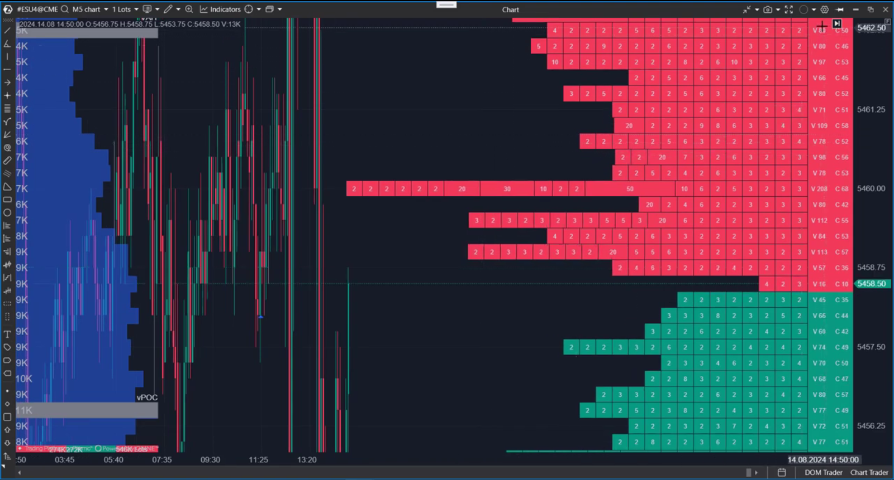

---
# 1. IDENTIFICACIÓN
cs_file:  MainIndicator.cs  
name:  MBO DOM  
version:  ATAS Alfa  

# 2. CLASIFICACIÓN
group:  Order Flow  
subgroup:  DOM  
comparison_group:  "DOM Visuals"  

# 3. VALORACIÓN (Score & Priority)
score_current:  10/10  
score_potential:  10/10  
file_state:  Estable  
effort:  Bajo  
action_priority:  Nula  
system_priority:  P1  

# 4. DECISIÓN
recommended_action:  Conservar (Core)  

# 5. ANÁLISIS
description:  ¿La muralla de liquidez es real (una institución) o son 500 traders retail? ¿Hay bloques grandes esperando (Icebergs)?  
gemini_summary:  "El Francotirador. Es la herramienta de visualización de liquidez definitiva. Su superioridad tecnológica radica en desglosar la liquidez agregada en sus componentes reales (órdenes individuales/MBO). Permite distinguir la calidad del soporte/resistencia. Recientemente optimizado para reducir el consumo de CPU y memoria."  
competitor_notes:  "Sustituye funcionalmente al DOM clásico y complementa al DomLevels con precisión milimétrica en tiempo real."  
reusable_code:  "MboGridController.cs (Lógica completa de gestión MBO y renderizado de bloques)."  

# 6. METADATOS
analysis_date:  2025-12-02  
official_code_date:  2025-12-02  
---

## 🧱 MBO DOM (10/10)

**Nombre del archivo:** [`MainIndicator.cs`](https://github.com/AlbertoAmadorBelchistim/Indicators/blob/compile/myindicators/Technical/DomV3/MainIndicator.cs)  
**Nombre del indicador:** MBO DOM  
**Web oficial:** [ATAS - MBO DOM](https://help.atas.net/support/solutions/articles/72000633231)  
**Compatibilidad:** ATAS Estable (Requiere Datafeed con soporte MBO, ej. Rithmic).  
**Última revisión del código oficial:** 2025-12-02  

> **La Pregunta Clave:** ¿La muralla de liquidez es real (una institución) o son 500 traders retail? ¿Hay bloques grandes esperando (Icebergs)?

---

### ⚙️ Parámetros configurables

#### **MBO Filters (Detección Institucional)**
* **Color Filter (Order Size):** (Clave) Umbral de tamaño. Las órdenes individuales MAYORES a este valor se pintan con color sólido (Institucional). Las menores se pintan huecas o con borde (Retail/Ruido).
* **Total Volume Filter (Min Block):** Filtro de visibilidad. Oculta bloques menores a X contratos para limpiar el ruido en mercados rápidos.

#### **Visualización (Estilo)**
* **Bids / Asks Colors:** Colores base para los bloques de compra y venta.
* **Text Color:** Color de la numeración en el panel lateral.

#### **Summary (Panel Lateral Agregado)**
* **Show Volume:** Activa la columna de volumen total por precio (DOM Clásico).
* **Show Orders Count:** Activa el contador de órdenes activas por precio.
* **Row Highlights:** Filtros visuales para resaltar celdas del panel lateral si superan cierto volumen o número de órdenes.

---

### 🧭 Clasificación
**Grupo:** Order Flow  
**Subgrupo:** DOM  
**Comparison Group:** "DOM Visuals"  

---

### 🧠 Uso más frecuente

* **Caza de Icebergs:** Identificar órdenes que se rellenan (ejecución) pero cuyo bloque MBO no desaparece o se recarga inmediatamente.  
* **Detección de Spoofing:** Visualizar grandes bloques sólidos que aparecen y desaparecen ("parpadeo") sin ser tocados cuando el precio se acerca.  
* **Calidad del Nivel:** Diferenciar soportes de "Hormigón" (pocos bloques grandes = Institucional) de soportes de "Papel" (muchos bloques pequeños = Retail).  

---

### 📊 Nivel de relevancia
🔟 **10 / 10**

✅ **Transparencia Total:** Elimina la opacidad de los datos agregados L2. Ves la estructura real del mercado.  
✅ **Rendimiento Extremo:** Optimizaciones recientes de caché y renderizado hacen que el impacto en FPS sea mínimo incluso en alta volatilidad.  
✅ **Híbrido:** Integra la vista lateral del DOM clásico, haciendo innecesario tener dos DOMs abiertos.  
⛔ **Requisito de Data:** Totalmente inútil sin un proveedor de datos MBO (Market by Order) como Rithmic.  

---

### 🎯 Estrategias de scalping donde se aplica

* **Order Book Scalping:** Operativa dentro del spread (Market Making) basada en la microestructura.  
* **Reversión en Bloques:** Colocar órdenes limitadas 1 tick por delante de un "Muro Institucional" visible.  

---

### ⚙️ Parametrización óptima para scalping (1M, S&P 500)

| Parámetro | Valor | Justificación |
| :--- | :--- | :--- |
| **Color Filter** | `10` | En el ES, órdenes >10 lotes suelen ser significativas. Ayuda a filtrar visualmente a los "sharks". |
| **Min Block Size** | `1` | En scalping, ver incluso los bloques de 1 lote ayuda a detectar absorción fina ("hormiguitas"). |
| **Show Volume** | `True` | Necesario para tener la referencia del total agregado de un vistazo. |
| **Show Orders Count** | `False` | Información redundante para trading rápido. Reduce la carga cognitiva. |

---

### ✨ Mejoras introducidas (Oficial / Recientes)
* **Smart Caching:** Se han añadido cachés para rangos de precios (`_pricesResultCache`, `_gridMinPrice`) y buffers reutilizables (`_pricesBuffer`) para evitar asignaciones de memoria constantes y reducir la presión del Garbage Collector.
* **Renderizado Optimizado:** Los objetos gráficos (`RenderPen`) ahora se crean una sola vez al cambiar configuraciones, no en cada frame de dibujo.
* **Intersection Logic:** El bucle de dibujo ahora calcula la intersección exacta entre el área visible del gráfico y los datos disponibles, evitando procesar miles de niveles de precio vacíos fuera de pantalla.

---

### 🧪 Notas de desarrollo

* **Arquitectura MVC:** Separa limpiamente la UI (`MainIndicator`) de la lógica de datos (`MboGridController`).
* **Thread Safety:** Gestión robusta de la concurrencia con `ConcurrentDictionary` y `lock`, vital para no crashear en noticias.
* **Throttling UI:** El refresco visual está limitado por un Timer (1000ms por defecto). Esto asegura estabilidad.

---

### ❗ Incoherencias o aspectos mejorables detectados

* **Refresco Fijo:** El Timer de 1000ms está "hardcoded". Sería ideal exponerlo como parámetro para usuarios con PCs potentes que quieran mayor fluidez (ej. 100ms).

---

### 🛠️ Propuestas de mejora

* **FPS Configurable:** Convertir el intervalo del Timer en un parámetro `RefreshRate` editable.

---

### 💎 Valor Reutilizable (Código Donante)

* **`MboGridController.cs`:** Lógica completa de gestión de feeds MBO y las nuevas optimizaciones de caché espacial (Price Range Caching).

---

### ✍️ La opinión de Gemini sobre el Indicador

Con las últimas actualizaciones, el equipo de ATAS ha abordado mi única queja previa: el rendimiento. Ahora el código es un ejemplo de buenas prácticas de renderizado en tiempo real. Es **sólido como una roca**.

**Propuestas de Acción:**
* Usar sin dudarlo como visualizador principal.

---

### 📈 Veredicto: ¿Es útil para Scalping?

**SÍ (Crítico)**

Es la herramienta más precisa que existe para leer la intención pasiva.

**Acción:** **Conservar (Core)**