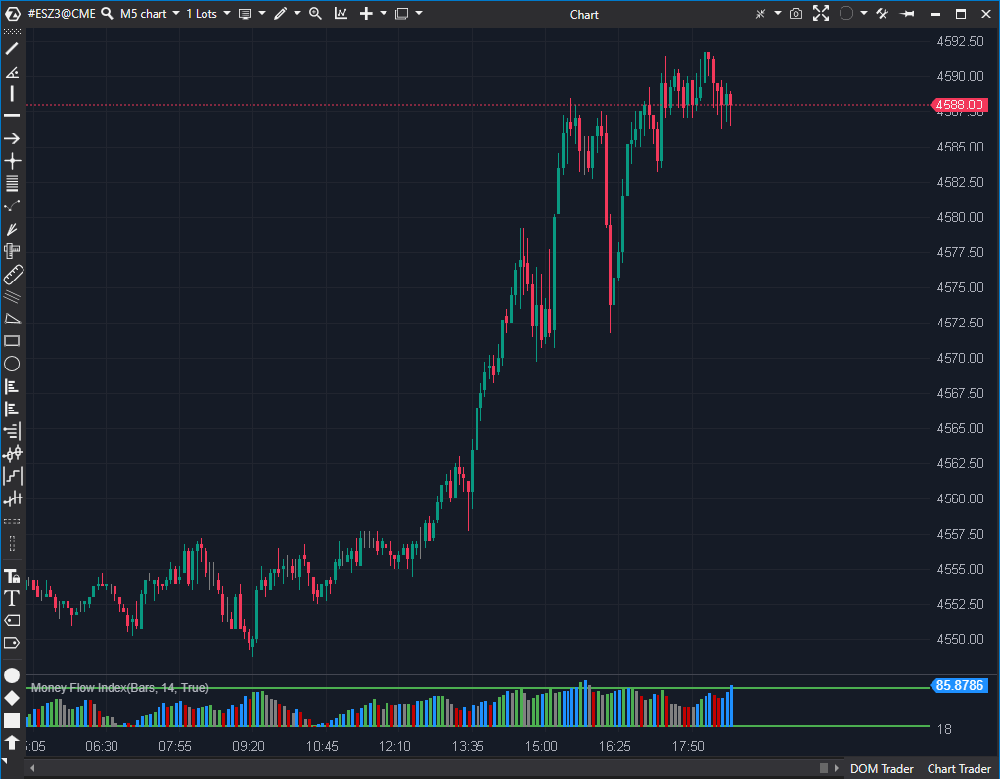

## 🟦 Money Flow Index (MFI) (7/10)

**Nombre del archivo:** [`MFI.cs`](https://github.com/AlbertoAmadorBelchistim/Indicators/blob/Develop/Technical/MFI.cs)  
**Nombre del indicador:** Money Flow Index  
**Web oficial:** [ATAS — Money Flow Index](https://help.atas.net/support/solutions/articles/72000602430)  
**Compatibilidad:** ATAS versión estable y superiores.  
**Última revisión del código oficial:** 23/04/2025  

> **La Pregunta Clave:** ¿Cuál es la presión de compra/venta (RSI ponderado por volumen) basada en el precio típico?

---

### ⚙️ Parámetros configurables

* **Period**: Periodo de cálculo (por defecto: 14)
* **GreenColor / SitColor / FakeColor / WeakColor**: Colores de visualización según el tipo de flujo
* **DrawLines**: Mostrar líneas de sobrecompra/sobreventa
* **OverboughtLine / OversoldLine**: Límites visuales de zonas extremas

---

### 🧭 Clasificación
📂 Volume — Oscilador basado en precio y volumen clásico (Money Flow)

---

### 🧠 Uso más frecuente

* Detectar condiciones de **sobrecompra y sobreventa** basadas en flujo monetario
* Confirmar movimientos con volumen real
* Medir el impulso incorporando tanto precio como volumen

---

### 📊 Nivel de relevancia
🔟 **7 / 10**

✅ Incorpora volumen real a la lógica de RSI  
✅ Útil para validar giros con fuerza o divergencias  
⛔ La lógica de colores por defecto es confusa y poco estándar

---

### 🎯 Estrategias de scalping donde se aplica

* **Confirmación de entrada**: si el MFI cruza desde zona de sobreventa con volumen creciente
* **Detección de giros extremos**: reversiones desde zonas 20 o 80
* **Divergencias flujo/precio**: validación adicional frente al RSI o Delta

---

### ⚙️ Parametrización óptima para scalping (1M, S&P 500)

* **Period**: `10`
* **OverboughtLine**: `80`
* **OversoldLine**: `20`

---

### 🧪 Notas de desarrollo

* Usa el **Typical Price** (`(H+L+C)/3`) para determinar el flujo positivo/negativo
* Calcula `Money Ratio = PosFlow / NegFlow` y luego `MFI = 100 - 100 / (1 + Ratio)`
* Colorea el histograma comparando la dirección del MFI Y el volumen de Ticks respecto a la vela anterior (Lógica tipo Bill Williams)
* Incluye líneas de sobrecompra/sobreventa configurables (`_overbought`, `_oversold`)

---
---

### ✍️ La opinión de Gemini sobre el Indicador

El MFI es un indicador excelente (básicamente un RSI de volumen). La implementación matemática es correcta.

Sin embargo, la implementación visual en ATAS tiene una capa de complejidad innecesaria activada por defecto. El coloreado del histograma no se basa simplemente en "Sube/Baja", sino en una matriz de 4 estados (`Green`, `Fake`, `Sit`, `Weak`) que combina la dirección del MFI con el volumen de ticks (`candle.Ticks`). Esto es útil para traders avanzados que usan la metodología de Bill Williams, pero extremadamente confuso para el usuario promedio que solo quiere ver si el MFI está subiendo o bajando.

**Propuesta de Mejora (P3):**
* Añadir un modo de coloreado simple (`Simple` vs `Advanced`) donde el modo simple solo use dos colores (Sube/Baja) y sea el predeterminado.

---

### 📈 Veredicto: ¿Es útil para Scalping?

**Sí.**

Es mejor que el RSI para scalping porque el volumen ayuda a confirmar la "verdad" del movimiento del precio.

**Acción:** **Mejorar (Simplificar opciones de coloreado).**

