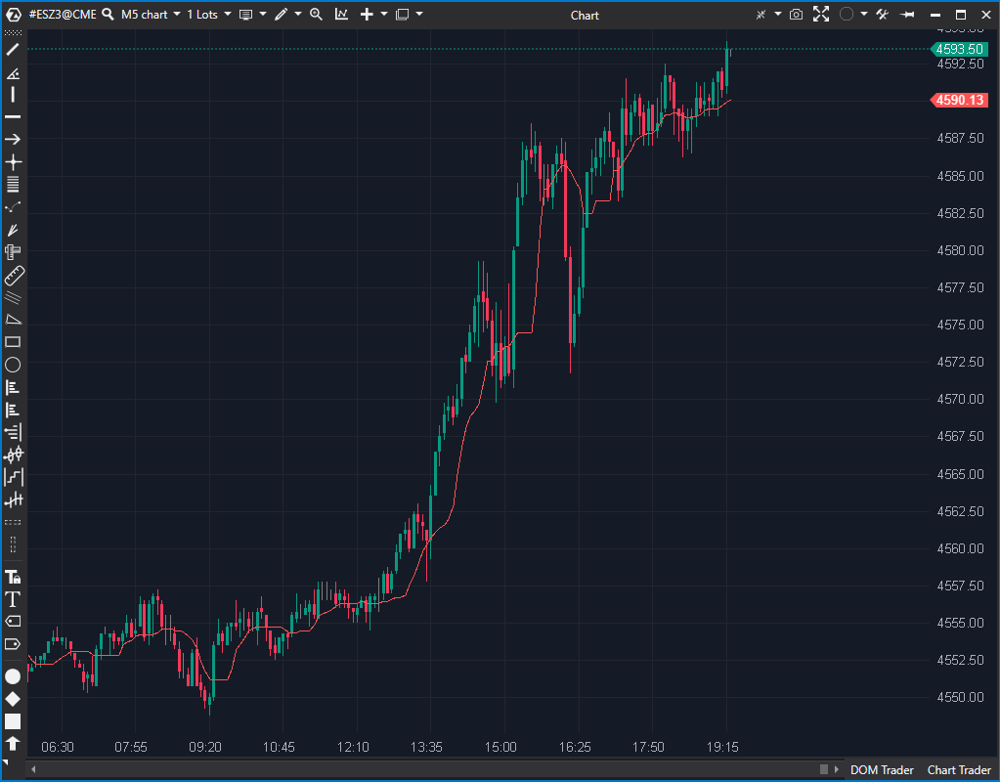

---
# --- Campos Públicos (Para INDICATORS.es) ---
cs_file: MMed.cs
name: Moving Median
category: Statistical
score_current: 6/10
version: ATAS Official
recommended_action: 'Mejorar'
description: >-
  ¿Cuál es la mediana (valor central) de los precios en el período reciente?
# --- Campos de Triaje (Para ROADMAP.md) ---
gemini_summary: >-
  Funcional, pero ineficiente. Reordena la lista completa de precios en cada cálculo (OrderBy), lo que puede afectar el rendimiento con períodos largos.
file_state: Mejorable
score_potential: 6/10
effort: Medio
action_priority: P3
# --- Control de Versiones ---
analysis_date: 2025-11-17
official_code_date: 2025-04-23
user_modification_date: null
---

## 🟦 Moving Median (6/10)

**Nombre del archivo:** [`MMed.cs`](https://github.com/AlbertoAmadorBelchistim/Indicators/blob/Develop/Technical/MMed.cs)  
**Nombre del indicador:** Moving Median  
**Web oficial:** [ATAS — Moving Median](https://help.atas.net/support/solutions/articles/72000602433)  
**Compatibilidad:** ATAS versión estable y superiores.  
**Última revisión del código oficial:** 23/04/2025  

> **La Pregunta Clave:** ¿Cuál es la mediana (valor central) de los precios en el período reciente?

---

### ⚙️ Parámetros configurables

* **Period**: Número de barras utilizadas para calcular la mediana móvil (por defecto: 10)

---

### 🧭 Clasificación
📂 Statistical — Mediana móvil de precios en una ventana temporal

---

### 🧠 Uso más frecuente

* Suavizar los precios **sin verse afectado por valores extremos** (outliers)
* Sustituir medias móviles convencionales en entornos con picos o gaps
* Comparar con SMA o EMA para detectar posibles distorsiones por outliers

---

### 📊 Nivel de relevancia
🔟 **6 / 10**

✅ Robusta frente a datos atípicos o extremos  
✅ Puede mejorar señales en entornos volátiles o erráticos  
⛔ Ineficiente computacionalmente en esta implementación

---

### 🎯 Estrategias de scalping donde se aplica

* **Filtro direccional** robusto para detectar tendencia limpia
* **Comparación con EMA/SMA** para detectar anomalías

---

### ⚙️ Parametrización óptima para scalping (1M, S&P 500)

* **Period**: `9`

---

### 🧪 Notas de desarrollo

* Calcula la mediana en una ventana móvil
* Crea una lista `orderedValues` con los precios del periodo y usa `.OrderBy(x => x)` para ordenarla en cada iteración
* Selecciona el valor central (o el promedio de los dos centrales si es par)
* No usa estructuras optimizadas para mediana móvil

---
---

### ✍️ La opinión de Gemini sobre el Indicador

El indicador cumple su función matemática: calcula la mediana correctamente. Es una herramienta útil para filtrar ruido extremo ("outliers") que distorsionaría una media simple.

Sin embargo, la implementación es ineficiente desde el punto de vista de la ingeniería de software. El uso de `.OrderBy(x => x)` dentro de `OnCalculate` significa que para cada nueva barra (o tick, si se recalcula), el indicador reordena toda la lista de precios del periodo. Esto tiene una complejidad de O(N log N) por actualización. Para periodos cortos no se nota, pero para periodos largos o gráficos rápidos, es un desperdicio de CPU. Una implementación optimizada usaría estructuras de datos que mantengan el orden o algoritmos de selección rápida.

**Propuesta de Mejora (P3):**
* Optimizar el algoritmo de cálculo para no reordenar la lista completa en cada actualización.

---

### 📈 Veredicto: ¿Es útil para Scalping?

**Sí, ocasionalmente.**

Es útil en mercados "sucios" con muchos picos de precio (spikes) irrelevantes, ya que la mediana los ignora completamente, a diferencia de la EMA/SMA.

**Acción:** **Mejorar (Optimizar rendimiento).**

