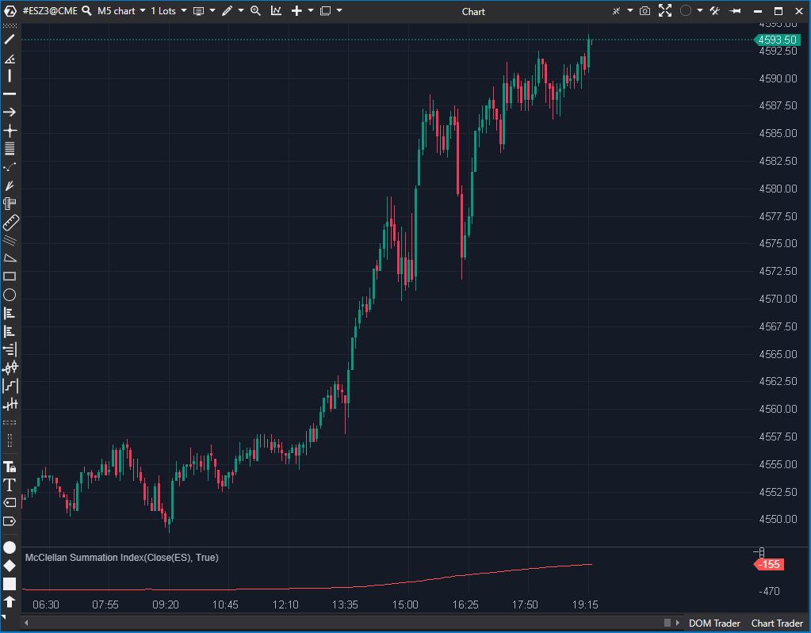

---
# --- Campos Públicos (Para INDICATORS.es) ---
cs_file: MSI.cs
name: McClellan Summation Index
category: Momentum
score_current: 7/10
version: ATAS Official
recommended_action: 'Mejorar'
description: >-
  ¿Cuál es la suma acumulada del Oscilador McClellan (amplitud de mercado a largo plazo)?
# --- Campos de Triaje (Para ROADMAP.md) ---
gemini_summary: >-
  Indicador de amplitud clásico pero rígido. Los períodos (19, 39) son constantes fijas en el código y no se pueden cambiar.
file_state: Mejorable
score_potential: 8/10
effort: Bajo
action_priority: P3
# --- Control de Versiones ---
analysis_date: 2025-11-17
official_code_date: 2025-04-23
user_modification_date: null
---

## 🟦 McClellan Summation Index (MSI) (7/10)

**Nombre del archivo:** [`MSI.cs`](https://github.com/AlbertoAmadorBelchistim/Indicators/blob/Develop/Technical/MSI.cs)  
**Nombre del indicador:** McClellan Summation Index  
**Web oficial:** [ATAS — McClellan Summation Index](https://help.atas.net/support/solutions/articles/72000602427)  
**Compatibilidad:** ATAS versión estable y superiores.  
**Última revisión del código oficial:** 23/04/2025  

> **La Pregunta Clave:** ¿Cuál es la suma acumulada del Oscilador McClellan (amplitud de mercado a largo plazo)?

---

### ⚙️ Parámetros configurables

* **No tiene parámetros configurables.** Los periodos están fijos en 19 y 39.

---

### 🧭 Clasificación
📂 Momentum — Indicador acumulativo derivado del McClellan Oscillator

---

### 🧠 Uso más frecuente

* Evaluar la **fuerza de la tendencia del mercado** en el tiempo
* Confirmar señales de fondo/techo cuando cambia de signo o dirección
* Medir el **impulso acumulado** derivado de la amplitud del mercado

---

### 📊 Nivel de relevancia
🔟 **7 / 10**

✅ Amplifica y suaviza la señal del McClellan Oscillator  
✅ Relevante para análisis de amplitud y fuerza estructural  
⛔ Extremadamente rígido: no permite cambiar los parámetros estándar

---

### 🎯 Estrategias de scalping donde se aplica

* **Filtro de fondo direccional**: operar solo en la dirección del MSI acumulado
* **Confirmación de fondo/techo**: cruce sostenido de la línea cero
* **Divergencias acumulativas**: cuando el MSI y el precio se desacoplan

---

### ⚙️ Parametrización óptima para scalping (1M, S&P 500)

* No aplicable directamente a 1M. Se usa como filtro de contexto diario.

---

### 🧪 Notas de desarrollo

* Calcula dos EMAs manualmente usando constantes: `_shortPeriod = 19`, `_longPeriod = 39`
* La fórmula de la EMA está hardcodeada: `2 * value / (period + 1) + ...`
* El MSI es la suma acumulada de la diferencia: `_renderSeries[bar-1] + (_shortEma[bar] - _longEma[bar])`
* **Code Smell:** Usa constantes privadas `const int` en lugar de propiedades `[Parameter]`, impidiendo la configuración.

---
---

### ✍️ La opinión de Gemini sobre el Indicador

El indicador implementa correctamente la fórmula clásica del MSI. Sin embargo, es una implementación "perezosa" y rígida.

Los períodos de las medias móviles (19 y 39) están definidos como constantes privadas (`private const int _shortPeriod = 19;`), lo que hace imposible que el usuario los ajuste. En el trading moderno, la capacidad de adaptar los parámetros a la volatilidad actual es clave. Además, reimplementa la lógica de la EMA manualmente dentro de `OnCalculate` en lugar de reutilizar la clase `EMA` existente en la plataforma, lo cual es una mala práctica de reutilización de código.

**Propuesta de Mejora (P3):**
* Convertir las constantes `_shortPeriod` y `_longPeriod` en propiedades públicas con el atributo `[Parameter]`.
* Usar objetos `EMA` estándar.

---

### 📈 Veredicto: ¿Es útil para Scalping?

**No directamente.**

Es un indicador de amplitud de mercado a largo plazo. Útil para contexto macro, no para gatillo de entrada.

**Acción:** **Mejorar (Hacer configurables los parámetros).**

