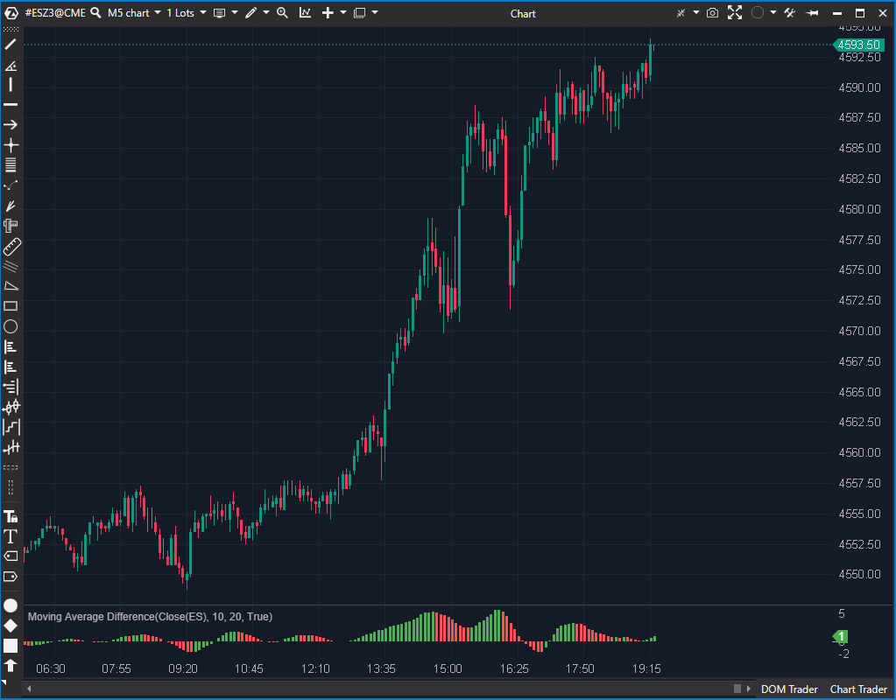

---
# --- Campos Públicos (Para INDICATORS.es) ---
cs_file: MaDifference.cs
name: Moving Average Difference
category: Momentum
score_current: 6/10
version: ATAS Official
recommended_action: 'Mejorar'
description: >-
  ¿Cuál es la diferencia (momentum) entre dos medias móviles y está acelerando o desacelerando?
# --- Campos de Triaje (Para ROADMAP.md) ---
gemini_summary: >-
  Estable, pero su lógica de coloreado (basada en la pendiente, no en el signo) es confusa y debería ser una opción configurable.
file_state: Mejorable
score_potential: 7/10
effort: Bajo
action_priority: P3
# --- Control de Versiones ---
analysis_date: 2025-11-17
official_code_date: 2025-04-23
user_modification_date: null
---

## 🟦 Moving Average Difference (6/10)

**Nombre del archivo:** [`MaDifference.cs`](https://github.com/AlbertoAmadorBelchistim/Indicators/blob/Develop/Technical/MaDifference.cs)    
**Nombre del indicador:** Moving Average Difference    
**Web oficial:** [ATAS — Moving Average Difference](https://help.atas.net/support/solutions/articles/72000602289)    
**Compatibilidad:** ATAS versión estable y superiores.  
**Última revisión del código oficial:** 23/04/2025  

> **La Pregunta Clave:** ¿Cuál es la diferencia (momentum) entre dos medias móviles y está acelerando o desacelerando?

---

### ⚙️ Parámetros configurables

* **Period1**: Periodo de la primera media móvil simple (por defecto: 10)
* **Period2**: Periodo de la segunda media móvil simple (por defecto: 20)
* **PosColor / NegColor**: Colores para valores crecientes o decrecientes del histograma

---

### 🧭 Clasificación
📂 Momentum — Diferencia entre dos medias móviles simples

---

### 🧠 Uso más frecuente

* Identificar el **impulso relativo** entre dos medias móviles
* Evaluar la **aceleración o desaceleración** del precio según el histograma
* Confirmar cruces de medias móviles con visualización continua

---

### 📊 Nivel de relevancia
🔟 **6 / 10**

✅ Muy útil como filtro visual de momentum  
✅ Simple de interpretar  
⛔ El coloreado por defecto se basa en la *pendiente* (aceleración), no en el *signo* (cruce de cero), lo que puede ser confuso

---

### 🎯 Estrategias de scalping donde se aplica

* **Confirmación de entrada**: entrada solo si el histograma es creciente (cambia a `PosColor`)
* **Detección de giros**: cuando el color del histograma cambia (el momentum pierde aceleración)
* **Filtro de tendencia**: operar solo en la dirección de la diferencia dominante

---

### ⚙️ Parametrización óptima para scalping (1M, S&P 500)

* **Period1**: `8`
* **Period2**: `21`
* **Colores**: Verde (positivo), Rojo (negativo)

---

### 🧪 Notas de desarrollo

* Calcula la diferencia entre dos `SMA` y la representa como histograma (`VisualMode.Histogram`)
* Colorea cada barra según si es mayor o menor que la anterior (`diff > _renderSeries[bar - 1]`)
* Usa una única `ValueDataSeries` (`_renderSeries`) para el dibujo
* Limpia las series en `bar == 0` antes de calcular

---
---

### ✍️ La opinión de Gemini sobre el Indicador

El indicador es estable y su código es simple y seguro. Utiliza dos objetos `SMA` y calcula su diferencia, representándola como un histograma.

El principal problema es una decisión de diseño en su lógica de coloreado. El código `_renderSeries.Colors[bar] = diff > _renderSeries[bar - 1] ? _posColor : _negColor;` colorea la barra del histograma basándose en su *pendiente* (si está subiendo o bajando), no en su *signo* (si está por encima o por debajo de cero).

Esto puede ser extremadamente confuso para un trader que espera que "verde" signifique "momentum positivo" (por encima de 0) y "rojo" signifique "momentum negativo" (por debajo de 0). Esta lógica de coloreado basada en la aceleración es una característica válida, pero debería ser una opción configurable, no la única implementación.

**Propuesta de Mejora (P3):**
* Añadir un parámetro tipo `enum` llamado `ColoringMode` con opciones:
    * `OnSlope` (comportamiento actual)
    * `OnZeroCrossover` (comportamiento estándar: `diff > 0 ? _posColor : _negColor;`)

---

### 📈 Veredicto: ¿Es útil para Scalping?

**Sí.**

Es un oscilador de momentum simple y eficaz para medir la fuerza relativa. Es muy útil como filtro de confirmación.

**Acción:** **Mejorar (Añadir opción de coloreado por cruce de cero).**

