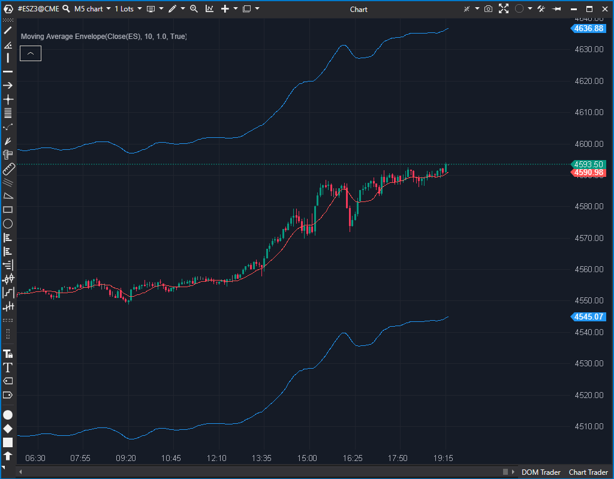

## 🟦 Moving Average Envelope (5/10)

**Nombre del archivo:** [`MaEnvelope.cs`](https://github.com/AlbertoAmadorBelchistim/Indicators/blob/Develop/Technical/MaEnvelope.cs)  
**Nombre del indicador:** Moving Average Envelope  
**Web oficial:** [ATAS — Moving Average Envelope](https://help.atas.net/support/solutions/articles/72000602431)  
**Compatibilidad:** ATAS versión estable y superiores.  
**Última revisión del código oficial:** 23/04/2025

> **La Pregunta Clave:** ¿Cuál es el canal de precios (fijo o porcentual) alrededor de una media móvil simple?

---

### ⚙️ Parámetros configurables

* **Period**: Periodo de la media móvil simple base (por defecto: 10)
* **CalcMode**: Modo de cálculo de la desviación (valor fijo o porcentaje)
* **Value**: Valor de desviación (en puntos si es `FixedValue`, en % si es `Percentage`)

---

### 🧭 Clasificación
📂 Level — Canal basado en media móvil con bandas superior e inferior

---

### 🧠 Uso más frecuente

* Detectar **sobrecompra o sobreventa relativa** al promedio reciente
* Confirmar movimientos extendidos o reversiones hacia la media
* Usar como **canal visual de comportamiento del precio**

---

### 📊 Nivel de relevancia
🔟 **5 / 10**

✅ Canal clásico usado en sistemas de reversión o breakout  
✅ Flexibilidad con dos modos de cálculo (fijo o porcentual)  
⛔ No refleja volatilidad del precio (bandas son fijas)

---

### 🎯 Estrategias de scalping donde se aplica

* **Reversión desde bandas externas**: entrada cuando el precio toca la banda superior o inferior
* **Filtro de rango**: evitar operar fuera del canal si hay sobreextensión
* **Confirmación de breakout** si el precio se mantiene fuera del canal por varias velas

---

### ⚙️ Parametrización óptima para scalping (1M, S&P 500)

* **Period**: `20`
* **CalcMode**: `Percentage`
* **Value**: `0.3`

---

### 🧪 Notas de desarrollo

* El canal se construye a partir de una `SMA` (`_sma`) y una desviación configurable
* Si `CalcMode` es `FixedValue`, se usa un desplazamiento fijo en puntos (`_sma[bar] + _value`)
* Si es `Percentage`, las bandas se calculan como ±% del valor de la `SMA` (`_sma[bar] * (1 + 0.01m * _value)`)
* Usa tres `ValueDataSeries`: banda superior (`_topSeries`), inferior (`_botSeries`) y línea central (`_smaSeries`)

---
---

### ✍️ La opinión de Gemini sobre el Indicador

Este es un indicador de canal clásico, estable y funcional. El código en `MaEnvelope.cs` es simple y seguro. Implementa correctamente los dos modos de cálculo (`FixedValue` y `Percentage`), dando al usuario flexibilidad para definir las bandas.

Su principal debilidad es conceptual: es una herramienta estática. A diferencia de las Bandas de Bollinger, estas envolventes no se adaptan a la volatilidad del mercado. El indicador solo usa una `SMA` (`private readonly SMA _sma = new()`) y no permite otros tipos de medias (como EMA), lo que limita aún más su flexibilidad.

Es un indicador estable, pero ha sido superado en funcionalidad por otros indicadores de canal.

---

### 📈 Veredicto: ¿Es útil para Scalping?

**Moderadamente.**

Puede servir para estrategias de reversión a la media en mercados de rango, pero fallará en mercados volátiles donde las Bandas de Bollinger serían superiores.

**Acción:** **Conservar (Estable, aunque básico).**

