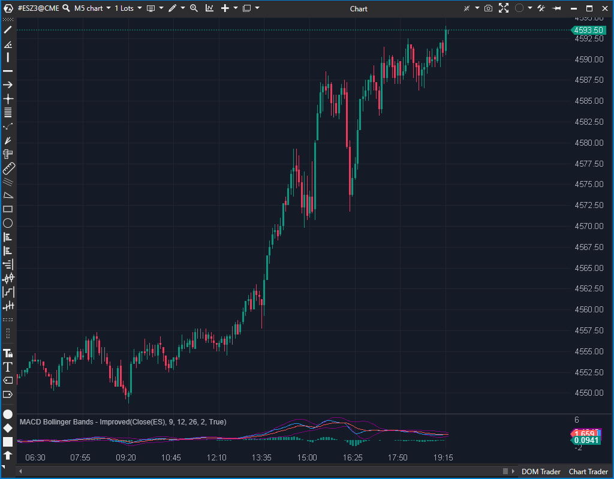

## 🟦 MACD Bollinger Bands - Improved (6/10)

**Nombre del archivo:** [`MacdBbImproved.cs`](https://github.com/AlbertoAmadorBelchistim/Indicators/blob/Develop/Technical/MacdBbImproved.cs)    
**Nombre del indicador:** MACD Bollinger Bands - Improved    
**Web oficial:** [ATAS — MACD Bollinger Bands - Improved](https://help.atas.net/support/solutions/articles/72000602628)    
**Compatibilidad:** ATAS versión estable y superiores.    
**Última revisión del código oficial:** 23/04/2025  

> **La Pregunta Clave:** ¿Cuál es el rango de volatilidad "mejorado" (BB + SMA del histograma) alrededor de la línea de señal del MACD?

---

### ⚙️ Parámetros configurables

* **MacdPeriod**: Periodo para la Señal MACD, SMA del histograma y StdDev (por defecto: 9)
* **MacdShortPeriod**: Periodo corto del MACD (por defecto: 12)
* **MacdLongPeriod**: Periodo largo del MACD (por defecto: 26)
* **StdDev**: Multiplicador de la desviación estándar (por defecto: 2)

---

### 🧭 Clasificación
📂 Momentum — Extensión del MACD con bandas dinámicas basadas en volatilidad

---

### 🧠 Uso más frecuente

* Detectar condiciones de **expansión o contracción del impulso** mediante bandas alrededor del MACD
* Identificar momentos de **divergencia o extremos** en la diferencia entre MACD y su señal
* Confirmar entradas en rupturas con validación del rango del histograma

---

### 📊 Nivel de relevancia
🔟 **6 / 10**

✅ Añade contexto de volatilidad al análisis del MACD  
✅ Lógica más reactiva que la versión "Standard" al incluir el histograma  
⛔ Fórmula de bandas muy compleja y poco intuitiva  
⛔ Mal diseño de parámetros (un período controla tres cálculos diferentes)

---

### 🎯 Estrategias de scalping donde se aplica

* **Reversión en banda extrema**: entrada cuando el histograma alcanza banda superior o inferior
* **Confirmación de ruptura**: si el histograma cruza banda tras consolidación
* **Filtro de entrada**: evitar operar cuando el histograma está dentro de las bandas

---

### ⚙️ Parametrización óptima para scalping (1M, S&P 500)

* **MacdPeriod**: `6`
* **MacdShortPeriod**: `8`
* **MacdLongPeriod**: `21`
* **StdDev**: `2`

---

### 🧪 Notas de desarrollo

* Utiliza un indicador `MACD` clásico interno
* Calcula el histograma (`deltaMacd`)
* Calcula una `SMA` del valor absoluto del histograma (`_sma.Calculate(bar, Math.Abs(deltaMacd));`)
* Calcula una `StdDev` de la línea de señal (`_stdDev.Calculate(bar, macdMa);`)
* La fórmula de la banda es: `Línea Señal + SMA(Abs(Histograma)) + Multiplicador * StdDev(Línea Señal)`
* El parámetro `MacdPeriod` controla `_macd.SignalPeriod`, `_stdDev.Period` y `_sma.Period` simultáneamente

---
---

### ✍️ La opinión de Gemini sobre el Indicador

El código de este indicador es estable y no presenta riesgos de crash. Sin embargo, su lógica es muy confusa y su diseño de parámetros es deficiente.

A diferencia de la versión "Standard", este indicador *sí* usa el histograma (`deltaMacd = ...[0]... - ...[1]...`) y calcula una `SMA` de su valor absoluto.

La fórmula final de la banda es: `_topBand[bar] = macdMa + _sma[bar] + _stdDevCount * stdDev;`. Esto significa que centra las bandas en la línea de señal (`macdMa`), pero su ancho es la suma de una SMA del histograma (similar a un Keltner Channel) Y una desviación estándar de la línea de señal (un Bollinger Band). Es una mezcla poco ortodoxa y difícil de interpretar.

El peor problema es el diseño: el parámetro `MacdPeriod` controla tres cosas a la vez: `_macd.SignalPeriod`, `_stdDev.Period` y `_sma.Period`. Esto es un "code smell" grave que impide una personalización real.

**Propuesta de Mejora (P3):**
* Refactorizar los parámetros. Crear `SignalPeriod`, `SmaPeriod` y `StdDevPeriod` como parámetros independientes.

---

### 📈 Veredicto: ¿Es útil para Scalping?

**Moderadamente.**

Es más reactivo que la versión "Standard" porque incluye el histograma, pero su fórmula es tan compleja que es difícil saber qué se está midiendo.

**Acción:** **Mejorar (Refactorizar parámetros y clarificar lógica).**
