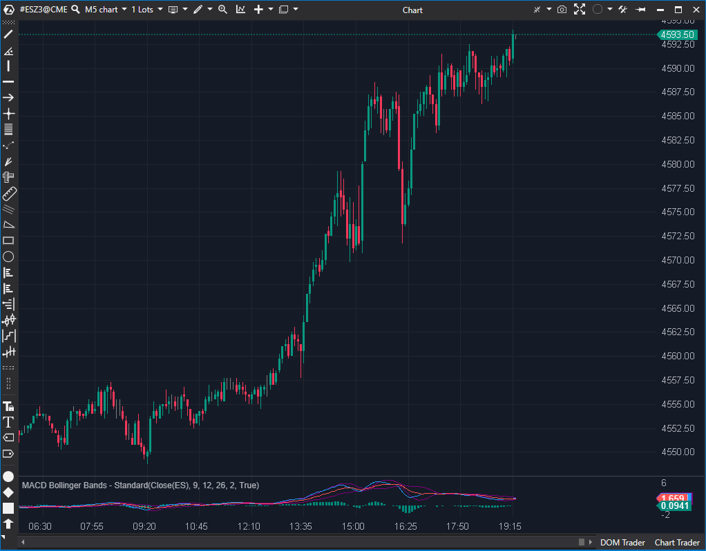

## 🟦 MACD Bollinger Bands - Standard (6/10)

**Nombre del archivo:** [`MacdBbStandart.cs`](https://github.com/AlbertoAmadorBelchistim/Indicators/blob/Develop/Technical/MacdBbStandart.cs)    
**Nombre del indicador:** MACD Bollinger Bands - Standard    
**Web oficial:** [ATAS — MACD Bollinger Bands - Standard](https://help.atas.net/support/solutions/articles/72000602295)    
**Compatibilidad:** ATAS versión estable y superiores.    
**Última revisión del código oficial:** 23/04/2025  

> **La Pregunta Clave:** ¿Cuál es el rango de volatilidad (Bollinger Bands) alrededor de la línea de señal del MACD?

---

### ⚙️ Parámetros configurables

* **MacdPeriod**: Periodo de la señal del MACD y del cálculo de desviación estándar (por defecto: 9)
* **MacdShortPeriod**: Periodo corto del MACD (por defecto: 12)
* **MacdLongPeriod**: Periodo largo del MACD (por defecto: 26)
* **StdDev**: Multiplicador de la desviación estándar (por defecto: 2)

---

### 🧭 Clasificación
📂 Momentum — MACD con envolventes de volatilidad estándar (tipo Bollinger)

---

### 🧠 Uso más frecuente

* Determinar si el MACD se mueve dentro o fuera de un rango normal de desviación
* Medir la **expansión de momentum** mediante la separación de las bandas
* Identificar condiciones de **sobrecompra/sobreventa relativa al MACD**

---

### 📊 Nivel de relevancia
🔟 **6 / 10**

✅ Útil como envolvente para validar condiciones extremas de impulso  
✅ Más simple y limpio que su versión “Improved”  
⛔ Aplica bandas a la línea de señal (lenta), no al histograma (rápido), lo que puede retrasar las señales  

---

### 🎯 Estrategias de scalping donde se aplica

* **Reversión en banda extrema**: entrada si la línea MACD (no el histograma) toca o cruza las bandas
* **Confirmación de ruptura**: si la línea MACD se expande y rompe el canal
* **Entrada segura**: si el MACD vuelve dentro de las bandas tras salida extrema

---

### ⚙️ Parametrización óptima para scalping (1M, S&P 500)

* **MacdPeriod**: `6`
* **MacdShortPeriod**: `8`
* **MacdLongPeriod**: `21`
* **StdDev**: `2`

---

### 🧪 Notas de desarrollo

* Utiliza un indicador `MACD` clásico interno
* Extrae la **línea de señal** del MACD (`_macd.DataSeries[1]`)
* Calcula una `StdDev` (Desviación Estándar) de la línea de señal
* Dibuja bandas (`_topBand`, `_bottomBand`) sumando y restando la `StdDev` multiplicada a la línea de señal
* El parámetro `MacdPeriod` controla tanto el período de la señal del MACD como el período de la `StdDev`

---
---

### ✍️ La opinión de Gemini sobre el Indicador

Esta es la versión "Standard" de las bandas de Bollinger sobre MACD, y su código es estable y seguro.

La lógica clave está en el `OnCalculate`: obtiene la línea de señal del MACD (`var macdMa = ((ValueDataSeries)_macd.DataSeries[1])[bar];`) y luego calcula una desviación estándar *sobre esa línea de señal* (`var stdDev = _stdDev.Calculate(bar, macdMa);`). Por lo tanto, las bandas miden la volatilidad de la propia línea de señal, no la volatilidad del histograma (MACD - Señal).

El principal "code smell" es un diseño de parámetros deficiente. El parámetro `MacdPeriod` está acoplado y controla tanto `_macd.SignalPeriod` como `_stdDev.Period`. Esto impide al usuario configurar, por ejemplo, una señal de 9 períodos pero una desviación estándar de 20 períodos.

**Propuesta de Mejora (P3):**
* Separar los parámetros. Añadir un nuevo parámetro `StdDevPeriod` y dejar que `MacdPeriod` controle únicamente `_macd.SignalPeriod`.

---

### 📈 Veredicto: ¿Es útil para Scalping?

**Moderadamente.**

Aplicar bandas a la línea de señal (que ya es una media) es un indicador muy lento y suavizado. Puede servir para identificar tendencias de momentum a largo plazo, pero es demasiado lento para señales de scalping.

**Acción:** **Conservar (Lógica estable, aunque lenta).**

