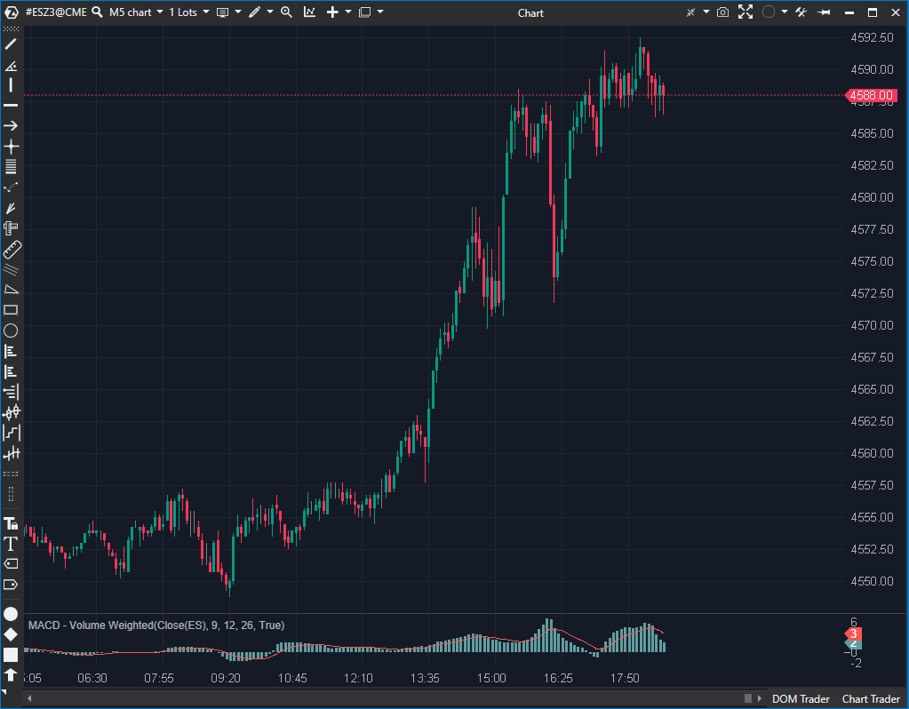

## 🟦 MACD - Volume Weighted (8/10)

**Nombre del archivo:** [`MacdVW.cs`](https://github.com/AlbertoAmadorBelchistim/Indicators/blob/Develop/Technical/MacdVW.cs)    
**Nombre del indicador:** MACD - Volume Weighted    
**Web oficial:** [ATAS — MACD - Volume Weighted](https://help.atas.net/support/solutions/articles/72000602231)    
**Compatibilidad:** ATAS versión estable y superiores.    
**Última revisión del código oficial:** 23/04/2025  

> **La Pregunta Clave:** ¿Cuál es la convergencia/divergencia entre dos medias ponderadas por volumen (VWMAs)?

---

### ⚙️ Parámetros configurables

* **Period**: Periodo de suavizado de la línea de señal (por defecto: 9)
* **ShortPeriod**: Periodo de cálculo de media corta ponderada por volumen (por defecto: 12)
* **LongPeriod**: Periodo de cálculo de media larga ponderada por volumen (por defecto: 26)

---

### 🧭 Clasificación
📂 Momentum — Versión ponderada por volumen del MACD clásico

---

### 🧠 Uso más frecuente

* Identificar cambios en la tendencia ponderando la acción del precio por volumen
* Confirmar movimientos de mayor relevancia al tener en cuenta la participación
* Filtrar señales débiles en sesiones con bajo volumen

---

### 📊 Nivel de relevancia
🔟 **8 / 10**

✅ Refina el MACD clásico incorporando el volumen como peso en el cálculo  
✅ Mejora la fiabilidad de señales en entornos institucionales o con fuerte liquidez  
⛔ El histograma no está coloreado, lo que dificulta la lectura rápida  
⛔ Menos útil en activos o momentos con volumen muy bajo o errático  

---

### 🎯 Estrategias de scalping donde se aplica

* **Entrada por cruce** de MACD y señal, con mayor fiabilidad si el volumen acompaña
* **Divergencia ponderada**: si el MACDVW diverge mientras el volumen es elevado
* **Confirmación de ruptura**: histograma creciente junto con volumen ascendente

---

### ⚙️ Parametrización óptima para scalping (1M, S&P 500)

* **ShortPeriod**: `8`
* **LongPeriod**: `21`
* **Period (signal)**: `5`

---

### 🧪 Notas de desarrollo

* Sustituye las EMAs clásicas del MACD por Medias Móviles Ponderadas por Volumen (VWMA)
* Calcula `VWMA = Sum(Precio * Volumen) / Sum(Volumen)` para un período corto y uno largo
* El MACDVW es la diferencia: `VWMA(Corta) - VWMA(Larga)`
* Usa una EMA adicional para suavizar el resultado (línea de señal)
* Incluye una validación de seguridad para evitar división por cero si la suma de volumen es 0
* Representa el histograma (`MacdSeries`) y la línea de señal (`SignalSeries`)

---
---

### ✍️ La opinión de Gemini sobre el Indicador

Esta es una variación excelente del MACD y su implementación en `MacdVW.cs` es robusta y segura. El concepto de ponderar las medias móviles por el volumen es una mejora lógica sobre el MACD clásico, ya que da más peso a los movimientos de precios que ocurrieron con alta participación.

El código calcula la VWMA (Precio*Volumen / Volumen) para dos períodos y luego calcula su diferencia. Lo más importante es que la implementación incluye una validación de seguridad crucial: `if (volSumShort == 0 || volSumLong == 0) ... return;`. Esto previene un crash por división por cero en barras o instrumentos con volumen nulo, demostrando una codificación defensiva y robusta.

La única debilidad es la misma que la del MACD estándar: el histograma (`_macdSeries`) es monocromático.

**Propuesta de Mejora (P3):**
* Colorear el histograma `_macdSeries` según su signo (positivo/negativo) o su pendiente (subiendo/bajando) para una lectura visual mucho más rápida.

---

### 📈 Veredicto: ¿Es útil para Scalping?

**Sí, mucho.**

Al incorporar el volumen, ayuda a filtrar señales falsas de MACD que ocurren con bajo volumen, lo que es un problema común en el scalping. Es una versión superior al MACD clásico.

**Acción:** **Mejorar (Añadir histograma coloreado).**
