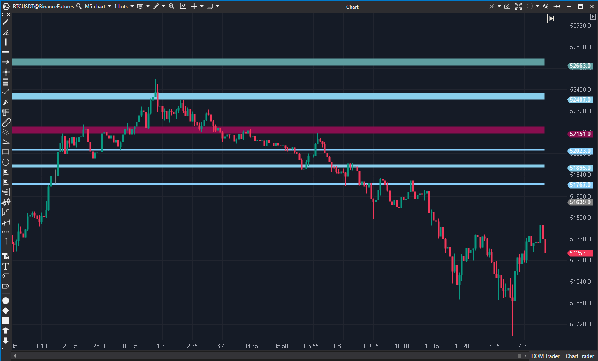

---
# --- Campos Públicos (Para INDICATORS.es) ---
cs_file: MarginZones.cs
name: Margin zones
category: Level
score_current: 3/10
version: ATAS Official
recommended_action: Reparar
description: ¿Dónde están los niveles de margen clave (25%, 50%, 100%...) calculados desde el extremo semanal o un precio fijo?
# --- Campos de Triaje (Para ROADMAP.md) ---
gemini_summary: Indicador ROTO. Concepto excelente para niveles institucionales, pero causa un crash por división por cero si TickCost es 0.
file_state: Roto
score_potential: 9/10
effort: Bajo
action_priority: P1
# --- Control de Versiones ---
analysis_date: 2025-11-17
official_code_date: 2025-04-23
user_modification_date: null
---

## 🟦 Margin Zones (3/10)

**Nombre del archivo:** [`MarginZones.cs`](https://github.com/AlbertoAmadorBelchistim/Indicators/blob/Develop/Technical/MarginZones.cs)  
**Nombre del indicador:** Margin Zones  
**Web oficial:** [ATAS — Margin Zones](https://help.atas.net/support/solutions/articles/72000602421)  
**Compatibilidad:** ATAS versión estable y superiores.  
**Última revisión del código oficial:** 23/04/2025

> **La Pregunta Clave:** ¿Dónde están los niveles de margen clave (25%, 50%, 100%...) calculados desde el extremo semanal o un precio fijo?

---

### ⚙️ Parámetros configurables

* **Margin**: Valor de margen utilizado como base (por defecto: 3200)
* **TickCost**: Valor monetario de un tick (por defecto: 6.25)
* **ZoneWidth**: Número de días de anchura de las zonas (por defecto: 3)
* **CustomPriceFilter**: Permite fijar un precio base manual o dejarlo en automático
* **Direction**: Dirección de la zona (Up / Down)
* **Visualización por zona**: Colores y visibilidad individual para las zonas (25% a 200%) y línea base

---

### 🧭 Clasificación
📂 Level — Niveles de relevancia institucional o técnica en base a zonas de margen

---

### 🧠 Uso más frecuente

* Visualizar zonas de **interés institucional** en base al precio y margen
* Detectar **niveles clave de defensa o presión** en el gráfico
* Medir posibles **objetivos o reversiones** en función de zonas alcanzadas

---

### 📊 Nivel de relevancia
🔟 **3 / 10**

✅ Altamente útil para análisis profesional de contexto institucional (conceptual)  
✅ Visualización muy rica y configurable  
⛔ **BUG CRÍTICO:** Causa un crash de ATAS si `TickCost` se establece en 0  
⛔ Necesita comprensión del concepto de margen y valor por tick

---

### 🎯 Estrategias de scalping donde se aplica

* **Operar reversiones** al llegar a zona 100%, 150% o 200%
* **Confirmar presión compradora/vendedora** si se defiende o rompe una zona
* **Proyectar targets o stops** usando múltiplos del margen (150%, 200%)

---

### ⚙️ Parametrización óptima para scalping (1M, S&P 500)

* **Margin**: `3200`
* **TickCost**: `6.25` (¡No usar 0!)
* **ZoneWidth**: `3`
* **Direction**: `Down`
* **CustomPriceFilter**: desactivado (modo automático)

---

### 🧪 Notas de desarrollo

* Calcula una serie de niveles (`25%` a `200%`) sobre un precio base (`_zonePrice`)
* El precio base puede ser manual (`CustomPriceFilter.Value`) o automático (mínimo/máximo semanal, detectado con `IsNewWeek`)
* Usa `OnRender` y `DrawingRectangle` para dibujar las zonas como rectángulos coloreados (`DrawZone`)
* Se recalcula al detectar `IsNewWeek` o si el precio rompe la zona base (lógica en `OnCalculate`)
* **BUG CRÍTICO:** No hay validación para `_tickCost == 0`, lo que causa una división por cero en `zoneSize = Margin / _tickCost`

---
---

### ✍️ La opinión de Gemini sobre el Indicador

Este indicador tiene un concepto excelente, enfocado en el análisis institucional al trazar zonas basadas en el margen. Su implementación es avanzada, utilizando `OnRender` para dibujar rectángulos y una lógica compleja en `OnCalculate` para determinar el precio base, ya sea automáticamente desde el máximo/mínimo semanal (`IsNewWeek`) or manualmente (`CustomPriceFilter`).

**SIN EMBARGO, EL INDICADOR ESTÁ ROTO.**

El código tiene un bug P1 (crítico) que puede crashear ATAS. El parámetro `_tickCost` se usa como divisor en la línea: `var zoneSize = Margin / _tickCost * (_direction == ZoneDirection.Up ? 1 : -1);`. No hay ninguna validación que impida que `_tickCost` sea `0`. Si un usuario introduce `0` en el parámetro `TickCost`, el indicador generará una excepción de **división por cero** y provocará un crash.

**Propuesta de Reparación (P1):**
* **URGENTE:** Añadir una validación al inicio de `OnCalculate` (o antes del cálculo de `zoneSize`).
* Ejemplo: `if (_tickCost == 0) return;`

---

### 📈 Veredicto: ¿Es útil para Scalping?

**Sí (una vez reparado).**

Los niveles de margen son zonas clave de soporte/resistencia institucional, cruciales para el scalping de contexto. Actualmente, es demasiado peligroso usarlo.

**Acción:** **Reparar (Bug P1 - Crash por división por cero).**

