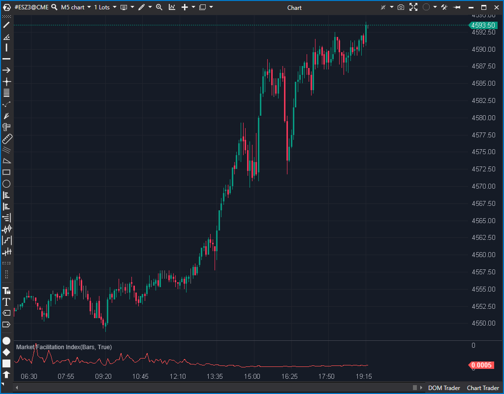

## 🟦 Market Facilitation Index (6/10)

**Nombre del archivo:** [`MarketFacilitation.cs`](https://github.com/AlbertoAmadorBelchistim/Indicators/blob/Develop/Technical/MarketFacilitation.cs)  
**Nombre del indicador:** Market Facilitation Index  
**Web oficial:** [ATAS — Market Facilitation Index](https://help.atas.net/support/solutions/articles/72000602423)  
**Compatibilidad:** ATAS versión estable y superiores.  
**Última revisión del código oficial:** 23/04/2025

> **La Pregunta Clave:** ¿Cuál es la eficiencia del mercado (MFI) para mover el precio en relación con el volumen?

---

### ⚙️ Parámetros configurables

* **Multiplier**: Factor multiplicador aplicado al índice calculado (por defecto: 1)

---

### 🧭 Clasificación
📂 Volume — Indicadores de volumen clásico (basados en volumen total por vela)

---

### 🧠 Uso más frecuente

* Medir la **eficiencia del mercado** en mover el precio usando volumen
* Identificar fases de **expansión o contracción del impulso**
* Evaluar si un movimiento es “barato” o “costoso” en términos de volumen

---

### 📊 Nivel de relevancia
🔟 **6 / 10**

✅ Sencillo y eficaz para detectar cambios en el comportamiento del mercado  
✅ Puede anticipar reversiones si cae tras una expansión  
⛔ Incompleto: no incluye la clasificación estándar de Bill Williams (Green, Fade, etc.)

---

### 🎯 Estrategias de scalping donde se aplica

* **Detección de agotamiento**: si el MFI cae mientras el precio avanza
* **Confirmación de impulso real**: si el MFI sube junto con el volumen y rango
* **Filtro de entrada**: evitar operar si el MFI es muy bajo (ineficiencia)

---

### ⚙️ Parametrización óptima para scalping (1M, S&P 500)

* **Multiplier**: `1`

---

### 🧪 Notas de desarrollo

* Calcula el índice como: `MFI = (High - Low) * Multiplier / Volume`
* Si el volumen es cero, el valor se fuerza a 0 para evitar división por cero (`candle.Volume != 0 ... : 0`)
* Representado mediante un único `ValueDataSeries` (`_renderSeries`)
* No incluye la lógica de comparación de MFI/Volumen de barras adyacentes (Green, Fade, Fake, Squat)

---
---

### ✍️ La opinión de Gemini sobre el Indicador

Este indicador implementa correctamente la fórmula matemática base del Market Facilitation Index: `(candle.High - candle.Low) * _multiplier / candle.Volume`. Crucialmente, incluye una validación de seguridad para evitar un crash (`candle.Volume != 0 ... : 0`), lo que lo convierte en un indicador estable.

Sin embargo, el indicador está funcionalmente incompleto. El verdadero valor analítico del MFI, tal como lo diseñó Bill Williams, proviene de comparar el MFI y el Volumen de la barra actual con la barra anterior para clasificar el mercado en cuatro "cuadrantes" (Green, Fade, Fake, Squat). Este indicador *solo* proporciona el valor MFI en bruto. Deja el 90% del análisis al usuario.

**Propuesta de Mejora (P3):**
* Añadir lógica para comparar `MFI[bar]` con `MFI[bar-1]` y `Volume[bar]` con `Volume[bar-1]`.
* Añadir un parámetro `ColoringMode` para colorear el histograma (`_renderSeries`) basado en esta clasificación de 4 cuadrantes.

---

### 📈 Veredicto: ¿Es útil para Scalping?

**Moderadamente.**

Como está, es un oscilador de volumen más. Si se completara con la lógica de Bill Williams, su utilidad aumentaría significativamente para confirmar la "calidad" de un impulso.

**Acción:** **Mejorar (Incompleto; añadir lógica de BW).**
