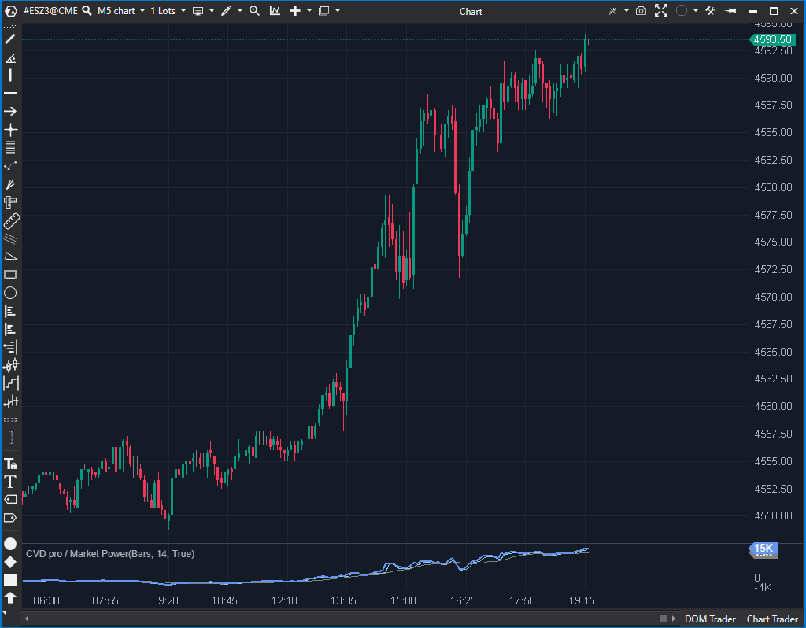

## 🟦 CVD pro / Market Power (9/10)

**Nombre del archivo:** [`MarketPower.cs`](https://github.com/AlbertoAmadorBelchistim/Indicators/blob/Develop/Technical/MarketPower.cs)  
**Nombre del indicador:** CVD pro / Market Power  
**Web oficial:** [ATAS — CVD pro / Market Power](https://help.atas.net/support/solutions/articles/72000602424)  
**Compatibilidad:** ATAS versión estable y superiores.  
**Última revisión del código oficial:** 23/04/2025

> **La Pregunta Clave:** ¿Cuál es el delta acumulado (CVD) filtrado por tamaño de trade, y cómo se compara con su SMA?

---

### ⚙️ Parámetros configurables

* **SmaPeriod**: Periodo para suavizado de la línea CVD (por defecto: 14)
* **CumulativeTrades**: Activar modo de acumulación (CVD real) o tick a tick
* **MinimumVolume / MaximumVolume**: Filtro por volumen mínimo y máximo de cada trade
* **ShowSMA / ShowHighLow / ShowCumulative**: Opciones de visualización de SMA, extremos y acumulación
* **LineColor / HighLowColor / SmaColor / Width**: Configuración de colores y grosor

---

### 🧭 Clasificación
📂 VolumeOrderFlow — Indicador delta acumulado (CVD) con filtros y visualización mejorada

---

### 🧠 Uso más frecuente

* Visualizar el **delta acumulado** o por barra con control avanzado
* Detectar zonas de presión agresiva de compra o venta
* Identificar divergencias delta/precio o aceleraciones de volumen agresivo

---

### 📊 Nivel de relevancia
🔟 **9 / 10**

✅ Altamente configurable y potente para análisis de flujo de órdenes  
✅ Permite trabajar tanto con trades acumulados como tick a tick  
⛔ Exige interpretación precisa y buen filtrado para evitar ruido

---

### 🎯 Estrategias de scalping donde se aplica

* **Entrada por divergencia delta/precio** detectando acumulación silenciosa
* **Confirmación de intención** con rupturas acompañadas de CVD creciente
* **Detección de agotamiento** si el precio sube pero el delta no acompaña

---

### ⚙️ Parametrización óptima para scalping (1M, S&P 500)

* **SmaPeriod**: `14`
* **CumulativeTrades**: `true`
* **MinimumVolume**: `10`
* **MaximumVolume**: `0` (sin límite)
* **ShowCumulative**: `true`
* **ShowSMA / ShowHighLow**: activados

---

### 🧪 Notas de desarrollo

* Soporta dos modos de entrada: `OnCumulativeTrade` (agregado) y `OnNewTrade` (tick a tick)
* Permite filtrar trades por `MinimumVolume` y `MaximumVolume`
* Maneja `MaximumVolume = 0` como "sin límite" (`|| _maxVolume is 0`) en la función `IsTradeValid`
* Calcula `_barDelta` (delta por barra) y `_cumulativeDelta` (delta acumulado)
* Calcula SMA sobre CVD acumulado (`_smaSeries`)
* Usa `ConcurrentQueue` (`_gapTrades`, `_gapTicks`) para gestionar trades que llegan durante la inicialización histórica
* Solicita datos históricos de trades con `RequestForCumulativeTrades`

---
---

### ✍️ La opinión de Gemini sobre el Indicador

Este es un indicador de Flujo de Órdenes de nivel profesional. El código en `MarketPower.cs` es complejo pero muy robusto.

Maneja correctamente múltiples modos de entrada de datos (ticks individuales con `OnNewTrade` o trades agregados con `OnCumulativeTrade`). Su lógica de inicialización es excelente: solicita datos históricos (`RequestForCumulativeTrades`) y utiliza colas concurrentes (`_gapTrades`, `_gapTicks`) para almacenar los datos en tiempo real que llegan *mientras* se cargan los históricos, evitando así "gaps" o saltos en el CVD.

La lógica de filtrado `IsTradeValid` también es robusta, ya que maneja explícitamente `_maxVolume is 0` como "sin límite", una práctica de codificación defensiva que evita errores. Es una herramienta potente y estable.

---

### 📈 Veredicto: ¿Es útil para Scalping?

**Sí, es una herramienta esencial.**

El CVD, especialmente con filtros de volumen, es fundamental para el scalping de flujo de órdenes, permitiendo ver la agresión real detrás de los movimientos.

**Acción:** **Conservar (Herramienta profesional).**