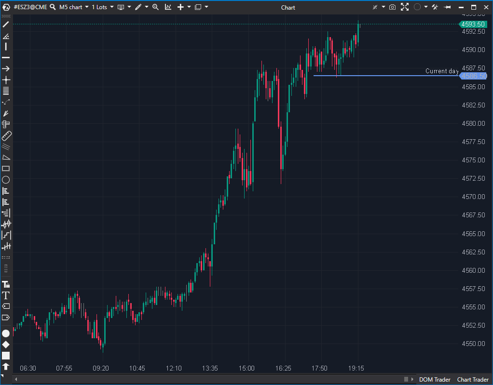

---
# --- Campos Públicos (Para INDICATORS.es) ---
cs_file: MaxLevels.cs
name: Maximum Levels
category: VolumeOrderFlow
score_current: 9/10
version: ATAS Official
recommended_action: Conservar
description: ¿En qué nivel de precio se produjo el máximo Volumen (o Bid, Ask, Delta) para el período seleccionado?
# --- Campos de Triaje (Para ROADMAP.md) ---
gemini_summary: Indicador de perfil robusto y estable. Utiliza correctamente la API asíncrona (GetFixedProfile) para encontrar el nivel máximo (Vol, Delta, etc.).
file_state: Estable
score_potential: 9/10
effort: N/A
action_priority: N/A
# --- Control de Versiones ---
analysis_date: 2025-11-17
official_code_date: 2025-04-23
user_modification_date: null
---

## 🟦 Maximum Levels (9/10)

**Nombre del archivo:** [`MaxLevels.cs`](https://github.com/AlbertoAmadorBelchistim/Indicators/blob/Develop/Technical/MaxLevels.cs)  
**Nombre del indicador:** Maximum Levels  
**Web oficial:** [ATAS — Maximum Levels](https://help.atas.net/support/solutions/articles/72000602426)  
**Compatibilidad:** ATAS versión estable y superiores.  
**Última revisión del código oficial:** 23/04/2025

> **La Pregunta Clave:** ¿En qué nivel de precio se produjo el máximo Volumen (o Bid, Ask, Delta) para el período seleccionado?

---

### ⚙️ Parámetros configurables

* **Period**: Periodo de análisis (día actual, semana, mes, etc.)
* **TradingSession**: Sesión específica a analizar
* **Type**: Tipo de nivel máximo (Volume, Bid, Ask, Delta positivo, negativo, etc.)
* **Color / Width / Length**: Personalización visual de la línea
* **Label**: Configuración del texto, valor, tamaño y color
* **UseAlert / AlertFile**: Activar alertas si el precio alcanza el nivel
* **AlertForeColor / AlertBgColor**: Colores de las alertas

---

### 🧭 Clasificación
📂 VolumeOrderFlow — Detección de niveles máximos de volumen u otros datos de clúster

---

### 🧠 Uso más frecuente

* Detectar **puntos de máximo interés institucional** en un periodo
* Usar los niveles como **referencia clave de soporte/resistencia dinámica**
* Confirmar entrada/salida si el precio interactúa con ese nivel

---

### 📊 Nivel de relevancia
🔟 **9 / 10**

✅ Muy eficaz para marcar niveles técnicos relevantes  
✅ Compatible con alertas automáticas y etiquetas  
⛔ Limitado a un único nivel por tipo y periodo; no muestra evolución

---

### 🎯 Estrategias de scalping donde se aplica

* **Reversión en máximos de volumen** (zona defendida)
* **Entrada tras ruptura con volumen dominante**
* **Confirmación institucional** si el precio se frena en el nivel

---

### ⚙️ Parametrización óptima para scalping (1M, S&P 500)

* **Period**: `CurrentDay`
* **Type**: `Volume`
* **Length**: `300`
* **UseAlert**: `true`
* **ShowText / ShowValue**: activados
* **TradingSession**: `Custom` (para aislar la sesión de cash US)

---

### 🧪 Notas de desarrollo

* Utiliza un objeto `FixedProfileRequest` para solicitar asíncronamente el perfil del período elegido
* El resultado del perfil se recibe en `OnFixedProfilesResponse` y se almacena en `_candle`
* Usa `OnRender` para dibujar la línea (`DrawLine`) y la etiqueta (`DrawLabelOnPriceAxis`)
* Soporta niveles de máximo Volume, Bid, Ask, Delta (positivo/negativo) y Ticks
* El tipo `Time` está correctamente marcado como `[Obsolete]` en el código
* Incluye una función de Alerta (`UseAlert`) que se activa al cruzar el nivel

---
---

### ✍️ La opinión de Gemini sobre el Indicador

Este es un indicador de Flujo de Órdenes de nivel profesional, y su código en `MaxLevels.cs` es un ejemplo de implementación robusta.

Su arquitectura maneja correctamente los datos de perfil, que son pesados. En lugar de calcular en `OnCalculate`, solicita los datos de forma asíncrona usando `GetFixedProfile(new FixedProfileRequest(Period, TradingSession));`. La respuesta se maneja en el callback `OnFixedProfilesResponse`, que almacena los datos en la variable `_candle`.

La lógica de `OnRender` es eficiente: simplemente comprueba si `_candle` existe y luego extrae el `PriceVolumeInfo` relevante según el `Type` seleccionado para dibujar la línea y la etiqueta. Este diseño asíncrono previene que el indicador congele la plataforma. Es una herramienta estable, esencial y bien construida.

---

### 📈 Veredicto: ¿Es útil para Scalping?

**Sí, es una herramienta esencial.**

Conocer el nivel de máximo volumen/delta del día o de la sesión es fundamental para cualquier estrategia de scalping basada en perfiles o OFA.

**Acción:** **Conservar (Herramienta de OFA esencial).**

